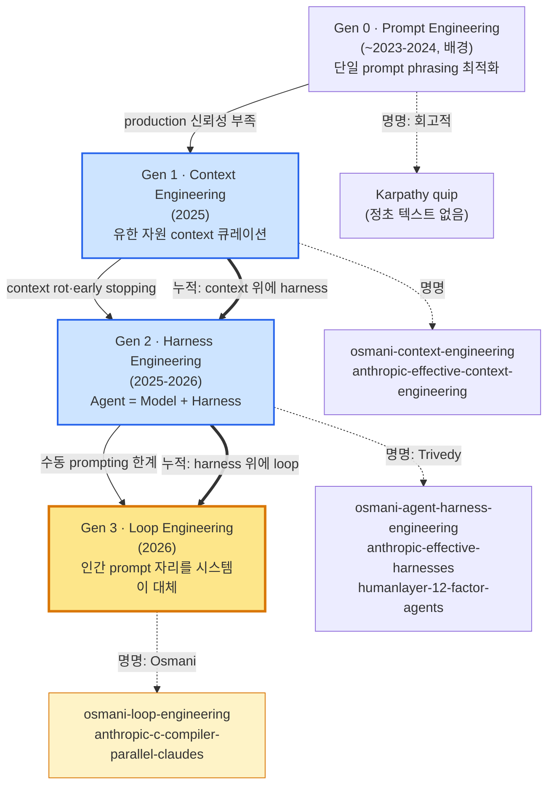

# 00 — Executive Briefing: 에이전트 엔지니어링 원칙·패턴 (2025–2026)

> mode: technology · date: 2026-06-11 · sources: 61 cards (tier 1 web/blog 1차 + tier 2 popularizer + tier 3 practitioner + tier 4 arXiv 보조) + code_search
> 다운스트림: `autopilot-draft --mode doc` — 사용자 매뉴얼 1부 '원칙의 세대사' 근거 자료
> 인용 규칙: 모든 claim 에 카드 `[card-slug]` 표기. 정량 수치는 카드에 명시된 것만. arXiv (tier 4) 는 블로그 1차 주장의 학술 backing — material claim 단독 근거 금지.

---

## 1줄 요약

에이전트 엔지니어링은 **prompt → context → harness → loop** 의 4세대로 진화했고, 이 세대들은 서로를 대체하지 않고 **누적 layer** 로 쌓인다. 그 위에 plan-then-execute·maker-verifier 분리·서브에이전트 분업·golden set 회귀 등 11종의 실무 패턴이 자라났다.

## 핵심 발견 (3–5줄)

- **세대는 배타적 단계가 아니라 누적 layer 다** — loop 는 harness 위에서 돌고, harness 는 context 를 관리하고, context 는 prompt 를 감싼다. 각 세대는 이전 세대의 미해결분(prompt 의 production 신뢰성 부족 → context rot → early stopping/decomposition 실패 → 수동 prompting 한계)을 흡수한다 `[osmani-context-engineering]` `[osmani-agent-harness-engineering]` `[osmani-loop-engineering]`.
- **모든 출처가 합의하는 단 하나의 강한 원칙은 "자기채점 금지"다** — 모델은 자기 산출을 평가할 때 "pathological optimists" `[epsilla-gan-style-agent-loop]` 이며 "confidently praising... obviously mediocre" `[anthropic-harness-design-long-running-apps]` 하므로, maker 와 verifier 를 별도 agent 로 분리하는 것이 강력한 leverage 다.
- **상태는 context 가 아니라 filesystem 에 외부로 빼낸다** — "the agent itself is amnesiac, but the filesystem isn't" `[osmani-long-running-agents]`. 산출물 파일이 세션·프로세스 경계를 넘는 통신·영속 매개다 (12-Factor Agents 의 stateless reducer 철학 `[humanlayer-12-factor-agents]`).
- **명명 권위와 정리 역할은 구분해야 한다** — Greyling(tier 2)은 명명자가 아니라 정리·대중화자다. 매 글이 외부 1차 권위(Osmani/Cherny/Anthropic/Harness-Bench 논문)를 직접 호명하므로, 인용할 때는 원 출처까지 거슬러 가야 한다 `[greyling-loop-engineering]` `[greyling-agent-model-harness]`.

## 1-page 개요

2024-12 Anthropic "Building effective agents" `[anthropic-building-effective-agents]` 가 workflow vs agent 구분 + 6개 조합 패턴으로 harness 세대의 어휘를 정초했다. 2025 년 Addy Osmani 와 Anthropic 이 거의 동시에 **context engineering** 을 명명하며 "유한 자원으로서의 context" 를 전면에 세웠다 `[osmani-context-engineering]` `[anthropic-effective-context-engineering]`. 같은 해 후반 **harness engineering**(Viv Trivedy 명명, Addy·Anthropic canonical 정초)이 "Agent = Model + Harness" 등식으로 scaffolding 을 1급 artifact 로 끌어올렸다 `[osmani-agent-harness-engineering]` `[anthropic-effective-harnesses]`. 2026-06 Addy 가 **loop engineering** 을 명명하며 "인간이 매 turn prompt 하는 자리를 시스템이 대신한다" 는 정점을 선언했고, 16개 Claude 가 자율로 100,000줄 Rust 기반 C compiler 를 짓는 실증이 이를 뒷받침했다 `[osmani-loop-engineering]` `[anthropic-c-compiler-parallel-claudes]`.

각 세대 위에서 실무 패턴 11종이 자랐다 — plan-then-execute, spec-driven, maker-verifier 분리, 서브에이전트 분업(orchestrator-worker), 파이프라인 세분화, golden set·eval 회귀, 오답노트→케이스 승격, 상태 파일·영속성, worktree 병렬 격리, headless·cron 자동화, 컨텍스트 절약. 이 패턴들은 [04_technical_deep_dive.md](04_technical_deep_dive.md)에서 각각 verbatim 근거와 함께 다룬다.

## 세대 지도 (Mermaid)

> 강조 노드: Gen 1·2(누적 layer 의 본체) 파랑, Gen 3·loop 정초 소스(가장 최신·다운스트림 매뉴얼의 정점) 노랑.

## Top-3 actionable insights (매뉴얼 작성 관점)

1. **세대는 대체가 아니라 누적 layer 로 서술하라.** 매뉴얼 1부를 "context 가 prompt 를 죽였다" 식 대체 서사로 쓰면 틀린다. 각 세대는 이전 세대 위에 쌓이고 그 미해결분을 흡수한다는 것이 모든 1차 출처의 일관된 프레임이다 `[osmani-loop-engineering]` `[greyling-loop-engineering]`. → [01_landscape.md](01_landscape.md).
2. **명명 권위와 정리 역할을 인용에서 구분하라.** Greyling 카드를 거쳐 인용할 때는 반드시 원 출처(Osmani/Cherny/Anthropic/논문)로 거슬러 귀속한다. harness=Trivedy 명명, loop=Osmani 명명, "Agent=Model+Harness"=Harness-Bench 논문 `[greyling-agent-model-harness]`. → [02_standards.md](02_standards.md).
3. **tier 4 arXiv 는 단독 인용 금지, 블로그 1차 주장의 정량 backing 으로만 써라.** context collapse 18,282→122 tokens `[arxiv-agentic-context-engineering]`, harness swap 23.8pt `[greyling-agent-model-harness]` 같은 수치는 블로그 1차 주장을 뒷받침하는 보조로만 쓴다. 핵심 수치는 fact-check 단계에서 arXiv 원문·harness-bench.ai 와 verbatim 으로 대조하길 권한다. → [05_deployment.md](05_deployment.md) 의 정량 표.

## 전체 보고서 가이드

| 파일 | 내용 | 답하는 질문 |
|---|---|---|
| [00_briefing.md](00_briefing.md) | Executive briefing, 세대 지도, top-3 insight | "이 분야 전체를 한 장으로?" |
| [01_landscape.md](01_landscape.md) | 세대 taxonomy(verbatim 정의·명명 권위), players 지도, lineage diagram, adoption stage | "세대는 어떻게 나뉘고 누가 무엇을 정초했나?" |
| [02_standards.md](02_standards.md) | 사실상 표준 문서 인벤토리, 문서 간 cross-reference, 매뉴얼이 1차로 따를 우선순위 | "어떤 문서를 canonical 로 따라야 하나?" |
| [03_vendor_comparison.md](03_vendor_comparison.md) | Harness 제품·orchestration framework·eval 도구 비교, capability checklist | "패턴별로 어떤 도구가 지원하나?" |
| [04_technical_deep_dive.md](04_technical_deep_dive.md) | 실무 패턴 11종 deep dive + tensions 4종 + 미해결 과제 (가장 중요) | "각 패턴의 원칙·근거·반론은?" |
| [05_deployment.md](05_deployment.md) | 자율 실행 안전장치, headless/cron, 비용·token 경제, 병렬 운영, failure modes | "자율 운영의 안전·비용·실패는?" |
| [06_implementation.md](06_implementation.md) | 매뉴얼 1부 outline, argument scaffolding, citation map, Next Pipeline | "어떻게 1부를 쓰기 시작하나?" |
| [07_resources.md](07_resources.md) | code_resources tier 1/2/3 표, star caveat, Quick verify command | "패턴이 실제 구현된 곳은?" |

> **누락 디렉터리 알림**: 본 조사 산출물에는 `analysis_project/paper/`·`analysis_project/code/` 가 없다 (research 전용 도메인이라 정상). 결론은 61 cards + code_search + agent memory 에 근거한다. 매뉴얼 2부(우리 실물 매핑)는 draft 작성 시점의 CLAUDE.md·CONVENTIONS·loops/README 를 직접 Read 한다.
