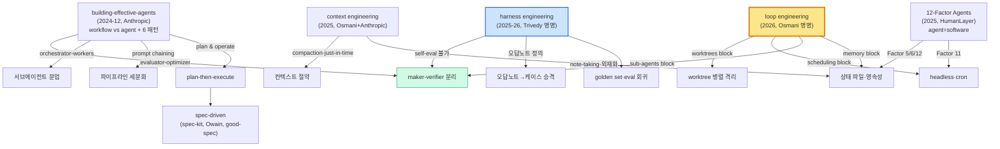

# 01 — Technology Landscape: 세대 taxonomy 와 players

> 모든 verbatim 인용은 카드에서 회수. 세대는 _배타적 단계_ 가 아니라 **누적 layer** 다.

---

## 세대 taxonomy

각 세대는 (1) verbatim 정의 (2) 명명/정초/대중화 권위 (3) 등장 배경(이전 세대의 한계) (4) 대표 소스로 정리한다.

### Gen 0 — Prompt engineering (배경 세대, ~2023–2024)

- **정의 (verbatim)**: 단일 prompt 의 표현(phrasing) 최적화. "Prompt engineering was about cleverly phrasing a question" `[osmani-context-engineering]`.
- **한계 (다음 세대 동력)**: 데모용 일회성 prompt 로는 production 신뢰성을 내지 못했다 — "a witty one-off prompt might have wowed us in demos, but building reliable, industrial-strength LLM systems demanded something more comprehensive" / "As applications grew more complex, the limitations of focusing only on a single prompt became obvious" `[osmani-context-engineering]`.
- **명명 권위**: 하나의 세대로 **회고적으로 명명**된 것이지 정초 텍스트는 없다. Karpathy 인용 "Prompt engineering walked so context engineering could run" `[osmani-context-engineering]`.
- **대표 소스**: `[osmani-context-engineering]` (회고적 서술).

### Gen 1 — Context engineering (2025)

- **정의 (canonical, verbatim)**: "the set of strategies for curating and maintaining the optimal set of tokens (information) during LLM inference, including all the other information that may land there outside of the prompts" `[anthropic-effective-context-engineering]`. Addy 판: "constructing an entire information environment so the AI can solve the problem reliably" `[osmani-context-engineering]`.
- **등장 배경**: agent 가 multi-turn·long-horizon 으로 확장되며 단일 prompt 최적화만으로는 부족해졌다. 핵심 개념 — **context rot**("as the number of tokens in the context window increases, the model's ability to accurately recall information from that context decreases", "this characteristic emerges across all models"), **attention budget**(transformer n² 구조의 유한한 주의), **compaction**, **just-in-time retrieval** `[anthropic-effective-context-engineering]`. window 를 키운다고 풀리지 않는다 — "context windows of all sizes will be subject to context pollution" `[anthropic-effective-context-engineering]`.
- **명명 권위**: **Anthropic**("Effective context engineering for AI agents", 2025-09 — prompt→context 세대 전환을 직접 선언) 과 **Addy Osmani**("Context Engineering: Bringing Engineering Discipline to Prompts", 2025-07)가 공동 canonical.
- **학술 정식화 (tier 4)**: **context collapse** 정량 측정 — monolithic rewrite 시 18,282 tokens(acc 66.7%) → 122 tokens(acc 57.1%) 붕괴, Generator/Reflector/Curator delta update 로 방지 `[arxiv-agentic-context-engineering]`.
- **대표 소스**: `[anthropic-effective-context-engineering]` `[osmani-context-engineering]` (canonical) · `[arxiv-agentic-context-engineering]` (학술).

### Gen 2 — Harness engineering (2025–2026)

- **정의 (verbatim)**: "A coding agent is the model plus everything you build around it. Harness engineering treats that scaffolding as a real artifact, and it tightens every time the agent slips" `[osmani-agent-harness-engineering]`. 학술 정의: "the software layer that surrounds an LLM with tools, APIs, sandboxes, memory, validators, permission boundaries, execution loops, and feedback channels, thereby turning a stateless model into a functional agent" `[arxiv-code-as-agent-harness]`.
- **thesis (verbatim)**: "A decent model with a great harness beats a great model with a bad harness" `[osmani-agent-harness-engineering]`.
- **등장 배경**: "We've spent the last two years arguing about models... That conversation is fine as far as it goes, but it's missing the other half of the system" `[osmani-agent-harness-engineering]`. 모델의 한계가 아니라 scaffolding 의 한계로 문제를 다시 정의한다 — "The gap between what today's models can do and what you see them doing is largely a harness gap". harness 가 메우는 이전 단계의 미해결분은 context rot, early stopping, poor decomposition, incoherence across context windows 다 `[osmani-agent-harness-engineering]`.
- **명명 권위**: **Viv Trivedy 가 "harness engineering" 용어를 만들었다(coined)** `[osmani-agent-harness-engineering]`. **Anthropic**("Effective harnesses for long-running agents", 2025-11) 과 **Addy Osmani** 가 canonical 로 정초했다. **Agent = Model + Harness** 등식은 Harness-Bench 논문에서 나왔다 `[greyling-agent-model-harness]` (단, 이 귀속은 Greyling 해설 경유 2차 — Harness-Bench 원문 verbatim 은 미확인이므로 인용 시 논문 원문 대조 권장).
- **핵심 명제 (self-aware)**: "Every component in a harness encodes an assumption about what the model can't do on its own, and those assumptions are worth stress testing" `[anthropic-harness-design-long-running-apps]` → harness 는 모델이 좋아지면 **줄어든다** (v1 sprint construct → v2 제거).
- **정리·대중화 (tier 2)**: Cobus Greyling 이 harness 를 SDK/Framework/Scaffolding 위의 **4번째 architectural layer** 로 정리한다 (Schmid 의 OS 비유, parallel.ai 6-component) `[greyling-rise-of-harness-engineering]`.
- **대표 소스**: `[anthropic-effective-harnesses]` `[osmani-agent-harness-engineering]` `[anthropic-harness-design-long-running-apps]` `[anthropic-managed-agents]` (canonical) · `[greyling-rise-of-harness-engineering]` `[greyling-agent-model-harness]` (정리) · `[arxiv-code-as-agent-harness]` `[arxiv-inside-the-scaffold]` (학술).

### Gen 3 — Loop engineering (2026)

- **정의 (verbatim)**: "Loop engineering is replacing yourself as the person who prompts the agent. You design the system that does it instead" `[osmani-loop-engineering]`. harness 와의 차이 — "The harness but it runs on a timer, it spawns little helpers, and it feeds itself" → harness **위** 의 계층.
- **등장 배경**: "For like two years the way you got something out of a coding agent was you wrote a good prompt and shared enough context. You type a thing, you read what came back, you type the next thing" — 이 _입력→읽기→입력_ 수동 루프가 끝났다 `[osmani-loop-engineering]`. harness engineering 글의 open problem("agents that run on a timer / self-improving")이 여기서 실현된다.
- **명명 권위**: **Addy Osmani 가 명명자**("Loop Engineering", 2026-06). 실무 슬로건은 **Peter Steinberger**("You should be designing loops that prompt your agents") 와 **Boris Cherny**(head of Claude Code @Anthropic: "I don't prompt Claude anymore. I have loops running that prompt Claude... My job is to write loops")가 내놓았다 `[greyling-loop-engineering]` (Cherny 발언은 Greyling 카드 기준 2차 전언("widely clipped") — 원 발화 출처 미확인, verbatim 인용 시 주의). **Cobus Greyling 은 정리·대중화** 쪽이다 (6-block 구조로 묶은 정리자일 뿐 명명 권위는 아니다).
- **실증 정초**: 16 Claude Opus instance × ~2,000 세션(~$20,000)으로 100,000줄 Rust 기반 C compiler 를 자율 구축했다 — 무한 bash loop + lock 기반 task 조율 + 거의 완벽한 verifier `[anthropic-c-compiler-parallel-claudes]`.
- **경계 (verbatim)**: "The loop changes the work, it does not delete you from it" — verification 은 여전히 인간의 책임이며, comprehension debt·cognitive surrender 위험이 남는다 `[osmani-loop-engineering]`.
- **대표 소스**: `[osmani-loop-engineering]` `[anthropic-c-compiler-parallel-claudes]` (canonical) · `[greyling-loop-engineering]` `[greyling-loop-engineering-playbook]` (정리) · `[osmani-long-running-agents]` (시간 축 확장).

> **세대사 정초 텍스트**: `[anthropic-building-effective-agents]`(2024-12)는 _harness 세대의 정초_ — workflow vs agent 구분 + 6 조합 패턴이 후속 모든 실무 패턴의 어원. `[humanlayer-12-factor-agents]` 는 "agents... are comprised of mostly just software" 로 harness/loop 세대의 software-discipline 측 manifesto.

**Takeaway**: 매뉴얼 1부는 4세대를 누적 layer 로 서술하되, 각 세대 절에서 (a) verbatim 정의 (b) 명명자 귀속 (c) 직전 세대의 어떤 한계가 동력이었나를 명시한다. 세대 간 화살표는 "대체" 가 아니라 "흡수·누적" 이다.

---

## Players 지도

각 player 의 포지션(정초자/명명자/실증자/대중화자/반론자)을 분리한다 — 인용 시 권위 귀속 정확성을 위해.

| Player | 포지션 | 대표 기여 | 카드 |
|---|---|---|---|
| **Anthropic** | 정초자·실증자 | context engineering·harness·managed agents canonical 정의, multi-agent 90.2%, C compiler 실증, evals/sandboxing/auto-mode | `[anthropic-effective-context-engineering]` `[anthropic-effective-harnesses]` `[anthropic-multi-agent-research-system]` `[anthropic-c-compiler-parallel-claudes]` `[anthropic-demystifying-evals]` |
| **Addy Osmani** | 명명자(context/loop) | context/harness/loop/long-running/good-spec 세대 서사의 1차 명명·정리 (named author 영향력 블로그) | `[osmani-context-engineering]` `[osmani-agent-harness-engineering]` `[osmani-loop-engineering]` `[osmani-long-running-agents]` `[osmani-good-spec]` |
| **Cognition** | 실증자·반론자(nuance) | "Don't Build Multi-Agents"(write 분산 반대) ↔ "Multi-Agents Working"(read/review OK)로 서브에이전트 분업의 read/write 축 종합 | `[cognition-dont-build-multi-agents]` `[cognition-multi-agents-working]` |
| **Cobus Greyling** | 대중화자(정리) | harness 4번째 layer·loop 6-block·"Agent=Model+Harness"를 묶어 소개 — **명명 권위 아님, 외부 1차 호명** | `[greyling-rise-of-harness-engineering]` `[greyling-loop-engineering]` `[greyling-agent-model-harness]` `[greyling-configured-not-coded]` |
| **Epsilla / MindStudio** | 대중화자(maker-verifier) | "AI Cannot Judge Itself"(GAN-style loop) / autocomplete bias 메커니즘 + GAN 비유 한계 명시 | `[epsilla-gan-style-agent-loop]` `[mindstudio-planner-generator-evaluator]` |
| **HumanLayer** | 정초자(manifesto) | 12-Factor Agents — agent=stateless reducer/mostly software, 상태 영속성 manifesto | `[humanlayer-12-factor-agents]` |
| **OpenAI** | 정초자(가이드) | Practical Guide — single-agent first, manager/decentralized pattern, layered guardrail | `[openai-practical-guide-agents]` |
| **GitHub** | 정초자(toolkit) | spec-kit — Specify→Plan→Tasks→Implement, "intent is the source of truth" | `[github-spec-kit]` |
| **Braintrust / Factory / Redis** | 대중화자(eval/compaction) | eval-as-spec·frozen core/growing set / tokens-per-task / L1-L2 memory hierarchy | `[braintrust-eval-driven-development]` `[factory-evaluating-compression]` `[redis-context-compaction]` |
| **Simon Willison** | 명명자(pattern catalog) | "Agentic Engineering Patterns" — GoF 식 pattern-as-chapter 포맷, red/green TDD | `[willison-agentic-engineering-patterns]` |
| **학계 (arXiv)** | 실증자·정식화(보조) | harness 정식 정의·taxonomy·context collapse·spec-driven 측정 — material claim 단독 근거 금지 | `[arxiv-code-as-agent-harness]` `[arxiv-inside-the-scaffold]` `[arxiv-agentic-context-engineering]` `[arxiv-harness-bench]` |

> **명명 권위와 정리 역할 (인용 시 구분 필수)**: Greyling(tier 2)은 _명명자가 아니라 정리·대중화자_ 다 — 매 글이 외부 1차 권위를 직접 호명한다 (loop=Osmani 명명·Steinberger·Cherny 슬로건, harness=OpenAI·Anthropic·Fowler·parallel.ai·Schmid, Agent=Model+Harness=Harness-Bench 논문). material claim 을 인용할 때는 Greyling 카드를 거쳐 _원 출처로 거슬러_ 인용한다. 예외: `[greyling-configured-not-coded]` 는 자기 코퍼스 종합이다.

**Takeaway**: 정초자(Anthropic/HumanLayer/OpenAI/GitHub)·명명자(Osmani/Trivedy/Cherny)·실증자(Anthropic C compiler)·대중화자(Greyling/Epsilla/MindStudio)·반론자(Cognition)를 인용에서 섞지 마라. 특히 Greyling 류 tier 2 는 항상 원 출처로 귀속한다.

---

## Lineage diagram (개념 파생 계보)

> 화살표는 "어디서 파생했나". maker-verifier 는 building-effective-agents 의 evaluator-optimizer + harness 의 self-eval 불가 + loop 의 sub-agents block 세 갈래에서 수렴한다 (가장 합의 강한 패턴).

---

## Adoption stage per 개념

| 개념/패턴 | 단계 | 근거 |
|---|---|---|
| context engineering (유한 자원 관리) | **mainstream** | Anthropic·Addy 공동 canonical, 모든 출처 합의 `[anthropic-effective-context-engineering]` |
| maker-verifier 분리 (자기채점 금지) | **mainstream** | tier 1 다수 합의, Cognition 도 clean-context reviewer 동의 `[cognition-multi-agents-working]` |
| 상태 파일·영속성 | **mainstream** | amnesiac agent + durable filesystem 합의 `[osmani-long-running-agents]` `[humanlayer-12-factor-agents]` |
| plan-then-execute / spec-driven | **mainstream** | spec-kit(GitHub toolkit), Anthropic best-practices, owain/good-spec `[github-spec-kit]` `[osmani-good-spec]` |
| golden set·eval 회귀 | **mainstream** | Anthropic demystifying-evals, Braintrust EDD `[anthropic-demystifying-evals]` |
| harness engineering (세대 명명) | **emerging→mainstream** | 2025-26 명명, OpenAI/Anthropic 공식 용어화, 학술 정의(2026-05) 등장 `[arxiv-code-as-agent-harness]` |
| 서브에이전트 분업 (write 분산) | **contested** | Cognition 반대(write) ↔ Anthropic/Cognition 찬성(read/review) — read/write 축 종합 필요 `[cognition-dont-build-multi-agents]` |
| loop engineering | **emerging** | 2026-06 명명, "loops are early"(자기 인정), 실증 1건(C compiler) `[osmani-loop-engineering]` `[greyling-loop-engineering]` |
| 오답노트→케이스 승격 (자동화) | **emerging** | 원칙·구현 사례 있으나 자동 승격 알고리즘은 tier 4 only `[arxiv-agentic-context-engineering]` |
| context file 과다 (역효과) | **contested** | "minimal requirement만" 합의되나 정량 반례는 tier 4 single `[arxiv-evaluating-agents-md]` |

**Takeaway**: mainstream 패턴은 매뉴얼에서 단정적으로 서술해도 되지만, **contested**(서브에이전트 write 분산, context file 과다)와 **emerging**(loop engineering, 오답노트 자동화)은 반드시 tension·caveat 와 함께 서술한다 — 자세한 종합은 [04_technical_deep_dive.md](04_technical_deep_dive.md) 의 Tensions 절.
