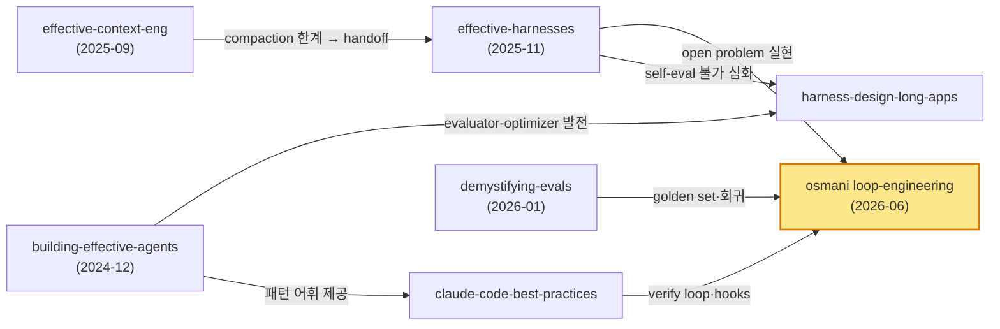

# 02 — Canonical 원칙 문서 인벤토리

> 이 분야엔 ISO 같은 표준 기구가 없다. 대신 vendor 와 named-author 가 만든 **사실상 표준(de facto standard)** 문서들이 어휘와 원칙을 정한다. 이 챕터는 그 문서들의 인벤토리·상호참조·우선순위다.

---

## 인벤토리 표

| 문서 | 발행처 | 연월 | 포지션 | 핵심 섹션 | 카드 |
|---|---|---|---|---|---|
| Building effective agents | Anthropic (Schluntz·Zhang) | 2024-12 | harness 세대 정초 | workflow vs agent, 6 조합 패턴 | `[anthropic-building-effective-agents]` |
| 12-Factor Agents | HumanLayer | 2025 | software-discipline manifesto | 12 factor (state·control flow·context) | `[humanlayer-12-factor-agents]` |
| A Practical Guide to Building Agents | OpenAI | 2025-04 | 실무 가이드 (32p) | model/tool/instruction 3축, manager/decentralized, guardrail | `[openai-practical-guide-agents]` |
| Effective context engineering | Anthropic | 2025-09 | context 세대 canonical | context rot, attention budget, compaction, just-in-time | `[anthropic-effective-context-engineering]` |
| Context Engineering (Bringing Discipline) | Addy Osmani | 2025-07 | context 세대 명명 | prompt vs context 대비, RAG/few-shot/state | `[osmani-context-engineering]` |
| Effective harnesses for long-running agents | Anthropic | 2025-11 | harness 세대 canonical | initializer/coding 2단, 3 artifact 영속화 | `[anthropic-effective-harnesses]` |
| Harness design for long-running apps | Anthropic | 2025(~2026-03) | maker-verifier 1차 | generator-evaluator 분리, harness=가정 집합 | `[anthropic-harness-design-long-running-apps]` |
| Agent Harness Engineering | Addy Osmani | 2025 | harness 세대 명명 | Agent=Model+Harness, 오답노트 정의 | `[osmani-agent-harness-engineering]` |
| Best practices for Claude Code | Anthropic | 2025 | 실무 종합 | explore→plan→code, hooks, subagents, worktree, `-p` | `[anthropic-claude-code-best-practices]` |
| Demystifying evals for AI agents | Anthropic | 2026-01 | eval canonical | Task/Trial/Grader anatomy, pass@k, saturation | `[anthropic-demystifying-evals]` |
| Loop Engineering | Addy Osmani | 2026-06 | loop 세대 명명 | "replacing yourself", self-feeding harness | `[osmani-loop-engineering]` |
| Spec-Driven Development toolkit | GitHub | 2025 | spec-first 제도화 | Specify→Plan→Tasks→Implement 4-phase | `[github-spec-kit]` |

---

## 핵심 문서별 detail

### Anthropic — Building effective agents (2024-12)

후속 모든 실무 패턴의 어원이다. **workflow**("systems where LLMs and tools are orchestrated through predefined code paths")와 **agent**("systems where LLMs dynamically direct their own processes")를 구분하고, 6개 조합 패턴(augmented LLM, prompt chaining, routing, parallelization, orchestrator-workers, evaluator-optimizer + autonomous agents)을 제시한다 `[anthropic-building-effective-agents]`. 핵심 원칙은 "the most successful implementations weren't using complex frameworks... they were building with simple, composable patterns" / "adding complexity _only_ when it demonstrably improves outcomes". → 매뉴얼 매핑: evaluator-optimizer→maker-verifier, orchestrator-workers→서브에이전트 분업, prompt chaining→파이프라인 세분화.

### 12-Factor Agents (2025)

agent 를 "deterministic code with strategic LLM integration points" 로 규정하는 manifesto 다. 12 factor 중 매뉴얼 매핑이 가장 직접적인 것은 **Factor 5**(unify execution + business state), **Factor 6**(Launch/Pause/Resume), **Factor 8**(Own your control flow), **Factor 10**(Small, Focused Agents), **Factor 11**(Trigger from anywhere), **Factor 12**(stateless reducer) `[humanlayer-12-factor-agents]`. 핵심 명제는 "Agents, at least the good ones, don't follow the loop until goal pattern. Rather, they are comprised of mostly just software." caveat: manifesto·opinion 문서이지 empirical 벤치는 아니며, HumanLayer 제품 맥락에서 Factor 7 에 bias 가 있을 수 있다.

### OpenAI — Practical Guide to Building Agents (2025-04)

agent 의 3축(Models·Tools·Instructions), tool 분류(data/action/orchestration), **single-agent first**("evolve to multi-agent only when complexity demands"), manager pattern(agents as tools) / decentralized pattern(handoff), **layered guardrail**(relevance→safety→tool-risk→human escalation) `[openai-practical-guide-agents]`. ⚠ **fetch caveat**: PDF binary parse 실패로 2차 출처를 거쳤다. verbatim 인용은 PDF 원문과 직접 대조해야 한다.

### Anthropic — Effective context engineering (2025-09) + Effective harnesses (2025-11)

세대 전환의 두 canonical 이다. context engineering 은 "context as a finite resource with diminishing marginal returns", compaction("summarizing... and reinitiating a new context window"), just-in-time retrieval("lightweight identifiers... runtime 동적 로드")를 정의한다 `[anthropic-effective-context-engineering]`. effective harnesses 는 initializer/coding 2단 구조 + 세 artifact(`claude-progress.txt`/`feature_list.json` immutable/git history) + 교대 근무 비유("each new engineer arrives with no memory of what happened on the previous shift")를 제시한다 `[anthropic-effective-harnesses]`.

### Anthropic — Demystifying evals (2026-01)

eval anatomy 의 표준 어휘를 정한다 — Task / Trial(non-determinism 대응 다수 trial) / Grader(code/model/human 3종) / Transcript / Outcome / Evaluation harness vs Agent harness. "what proportion of trials an agent succeeds"(pass@k), eval saturation(100% → refresh), 20–50 simple task 로 출발, bug tracker·support queue 를 task 소스로 삼는다 `[anthropic-demystifying-evals]`. → 매뉴얼 golden set·오답노트 패턴의 canonical 출처.

### GitHub — spec-kit (2025)

"We're moving from 'code is the source of truth' to 'intent is the source of truth.'" 4-phase 는 **Specify**(무엇·왜, user journey) → **Plan**(stack·architecture, 비교 variation 포함) → **Tasks**(small isolated chunk, TDD 유사) → **Implement**(focused task 순차) `[github-spec-kit]`. 매뉴얼의 하드 순서 게이트(spec 없이 code 금지)의 외부 근거이자 단계 동형 모델이다.

---

## 문서 간 cross-reference

- `[anthropic-building-effective-agents]` → 모든 실무 문서가 이 6패턴 어휘를 빌린다.
- `[anthropic-effective-context-engineering]` → `[anthropic-effective-harnesses]`: compaction 만으로 부족 → handoff artifact 로 발전.
- `[anthropic-harness-design-long-running-apps]` → maker-verifier 를 generator-evaluator 로 심화, 동시에 "harness 는 모델 개선 시 축소" caveat 추가.
- `[osmani-agent-harness-engineering]` 의 open problem("run on a timer / self-improving") → `[osmani-loop-engineering]` 에서 실현. 명시적 세대 계승.
- 학술 backing: `[arxiv-code-as-agent-harness]`(harness 정식 정의), `[arxiv-inside-the-scaffold]`(13 agent taxonomy), `[arxiv-agentic-context-engineering]`(context collapse 측정)가 위 블로그 1차 주장을 뒷받침.

---

## Takeaway: 매뉴얼이 1차로 따를 문서 우선순위

1. **세대 정의·명명**: `[anthropic-effective-context-engineering]` `[anthropic-effective-harnesses]` `[osmani-loop-engineering]` `[osmani-agent-harness-engineering]` — verbatim 정의를 여기서 회수한다.
2. **패턴 어원**: `[anthropic-building-effective-agents]` — 6패턴 매핑의 단일 출처.
3. **실무 종합**: `[anthropic-claude-code-best-practices]` — harness·loop 실무 패턴 거의 전부의 1차 근거 (CLAUDE.md·hooks·subagents·worktree·`-p`·verify loop).
4. **상태·software 철학**: `[humanlayer-12-factor-agents]` — 우리 시스템 매핑(2부)의 manifesto.
5. **eval·spec**: `[anthropic-demystifying-evals]` + `[github-spec-kit]` — golden set·spec-first 의 canonical.
6. **학술 backing (보조)**: tier 4 는 정량 수치 보강용으로만, 단독 인용 금지.

> 우선순위 원칙: **tier 1 Anthropic + Addy 가 1순위, vendor manifesto(12-factor/spec-kit) 가 2순위, Greyling 류 정리 카드는 원 출처 귀속 후 3순위, arXiv 는 backing 전용.** 자세한 도구·구현 매핑은 [03_vendor_comparison.md](03_vendor_comparison.md)·[07_resources.md](07_resources.md).
