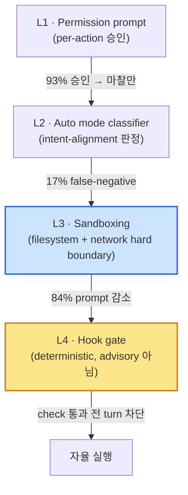

# 05 — 운영 고려사항

> 자율 실행의 안전·비용·실패 운영 관점. 정량 수치는 카드 명시값만.

---

## 1. 자율 실행 안전장치 layer

자율성이 커질수록 hard boundary 와 intent classifier 를 층층이 쌓는다. 네 층이 서로를 보완한다.

| 층 | 역할 | 정량/verbatim | 카드 |
|---|---|---|---|
| L1 Permission | per-action 승인 | "Claude Code users approve **93%** of permission prompts" — 대부분 승인되니 마찰만 | `[anthropic-claude-code-auto-mode]` |
| L2 Auto mode classifier | intent-alignment 판정 | "delegates approvals to model-based classifiers—a middle ground"; "The agent shouldn't be able to hide a dangerous operation behind a benign-looking wrapper" — **17% false-negative** | `[anthropic-claude-code-auto-mode]` |
| L3 Sandboxing | filesystem+network hard boundary | "sandboxing safely reduces permission prompts by **84%**"; "Effective sandboxing requires both filesystem and network isolation" (Linux bubblewrap, macOS seatbelt) | `[anthropic-claude-code-sandboxing]` |
| L4 Hook gate | deterministic 강제 | "Unlike CLAUDE.md instructions which are advisory, hooks are deterministic and guarantee the action happens" — Stop hook 은 check 통과 전 turn 차단(8 block 후 override) | `[anthropic-claude-code-best-practices]` |

> layered guardrail 의 일반형은 relevance→safety→tool-risk→human escalation `[openai-practical-guide-agents]`. 우리 시스템 매핑(2부) — `artifact-guard.sh`/`spec-skill-gate.sh`/`git-state-guard` 가 L4, claim-verify adversarial 검증이 추가 층이다.

**Takeaway**: 자율성이 커질수록 L1(승인)에서 L3(sandbox)·L4(hook)로 무게를 옮긴다. classifier(L2)는 편의(prompt 감소)를 주지만 17% FN 이 있어, sandbox(L3)의 hard boundary 가 안전의 바닥이다.

---

## 2. headless / cron 운영 패턴

- **진입점**: GitHub Actions — `@claude` mention(interactive) / prompt 즉시 실행(automation) / `on: schedule: cron` `[claude-code-github-actions]`. terminal — `claude -p "prompt"` + fan-out(`for file in ...; do claude -p ... done`) `[anthropic-claude-code-best-practices]`.
- **cron 3원칙**: full path(상대경로 금지) / env 명시 / output redirect `[mindstudio-headless-mode]`.
- **비용 통제**: `--max-turns` 제한, workflow timeout, concurrency control. GitHub Actions minutes + API token 이중 비용 — runaway job 방지 필수 `[claude-code-github-actions]`.
- **보안**: API key 는 항상 GitHub Secrets, 최소 권한(Contents/Issues/PRs R&W), merge 전 사람 review. `--dangerously-skip-permissions` 는 격리 환경에서만 `[mindstudio-headless-mode]`.

> ⚠ Gap: cron 운영 디테일의 1차 출처가 tier 3(`mindstudio-headless-mode`, `codewithseb-headless-cicd`)에 의존한다 — verbatim 인용 정밀도가 약하니, 매뉴얼에서 출처 tier 를 명시한다.

**Takeaway**: headless 진입점은 GitHub Actions(`cron`) + `claude -p`(fan-out)가 1차다. 비용 폭주 방지(`--max-turns`/timeout)와 격리 환경 전제(`--dangerously-skip-permissions`)가 운영 불변식이다.

---

## 3. 비용 · token 경제

| 기법 | 정량 절감 | 카드 |
|---|---|---|
| code execution MCP | 150,000 → 2,000 tokens = **98.7% 절감** | `[anthropic-code-execution-mcp]` |
| Tool Search | **85% 절감** | `[anthropic-advanced-tool-use]` |
| programmatic tool calling | 43,588 → 27,297 = **37% 절감** | `[anthropic-advanced-tool-use]` |
| SkillReducer 압축 | 48% description/39% body 압축에 quality **+2.8%** | `[arxiv-skillreducer]` |
| context file 과다 (역효과) | inference cost **+20%** 증가 + success rate 하락 | `[arxiv-evaluating-agents-md]` |

- **최적화 단위**: "tokens per request" 가 아니라 **"tokens per task"** — aggressive 압축은 re-fetch/re-exploration 으로 초기 절감을 상쇄 `[factory-evaluating-compression]`.
- **compaction 우선순위**: raw → reversible compaction → lossy summarization (lossy 는 최후수단, "permanently destroyed") `[redis-context-compaction]`.
- **multi-agent 비용**: chat 대비 **약 15배 token** — "15배 token 을 정당화할 만큼 가치 높은 task 에만" `[anthropic-multi-agent-research-system]`.
- **harness overhead 실례**: v1 harness 가 solo run 대비 **20배**($200 vs $9), v2 도 $124.70(3h50m) `[anthropic-harness-design-long-running-apps]`. C compiler 자율 구축 ~$20,000 `[anthropic-c-compiler-parallel-claudes]`.

**Takeaway**: token 절감의 큰 lever 는 code execution(98.7%)·Tool Search(85%)·progressive disclosure 다. 단 "tokens per task" 로 측정해야 aggressive 압축의 re-fetch 비용까지 잡는다. multi-agent·harness 는 비용 배수가 커서 가치 높은 task 에만 쓴다.

---

## 4. 병렬 운영 (worktree 격리 → merge)

- **격리 원리**: 공유 object store + private HEAD/index/working dir → "four or more concurrent sessions" file-level 충돌 없이 `[zylos-git-worktree-isolation]` `[augmentcode-git-worktrees]`.
- **조율**: lock 파일 task 조율(`current_tasks/parse_if_statement.txt`), git sync 가 두 번째 claim 을 다른 task 로 밀어냄 `[anthropic-c-compiler-parallel-claudes]`.
- **merge 전략**: rebase-before-PR(가장 권장), pre-merge conflict detection(Clash: `git merge-tree`), deferred conflict → PR 단계("visible git conflicts instead of silent runtime overwrites") `[zylos-git-worktree-isolation]` `[augmentcode-git-worktrees]`. "Merge conflicts are frequent, but Claude is smart enough to figure that out" `[anthropic-c-compiler-parallel-claudes]`.
- **전제**: test baseline 먼저 green 확인 후 hand `[augmentcode-git-worktrees]`.

**Takeaway**: 병렬의 뼈대는 worktree(private HEAD/index) + lock 조율 + rebase-before-PR 이다. 충돌은 silent runtime overwrite 가 아니라 visible PR conflict 로 미루는 게 핵심이다.

---

## 5. Failure modes + mitigation

| Failure mode | 증상 | mitigation | 카드 |
|---|---|---|---|
| **Context collapse** | monolithic rewrite 시 18,282→122 tokens(acc 66.7→57.1%) 붕괴 | incremental delta update + grow-and-refine (monolithic rewrite 금지) | `[arxiv-agentic-context-engineering]` |
| **자기채점 skew** | "confidently praising... obviously mediocre" / "skew positive" | maker/verifier 분리, fresh-context reviewer | `[anthropic-harness-design-long-running-apps]` `[osmani-long-running-agents]` |
| **Infrastructure noise** | strict↔uncapped 사이 **6%p swing** — flaky eval 을 회귀로 오인 | enforcement methodology 명시, ~3x headroom calibrate, 여러 날 평균화 | `[anthropic-infrastructure-noise]` |
| **end-to-end 검증 실패** | unit test·curl 통과해도 feature 실제 동작 안 함을 모델이 인지 못 함 | evaluator 가 Playwright/실 interaction 으로 직접 검증 | `[anthropic-effective-harnesses]` `[anthropic-harness-design-long-running-apps]` |
| **회귀 빈발 (long-running)** | "New features and bugfixes frequently broke existing functionality" | 테스트 불가침("unacceptable to remove or edit tests"), golden set | `[anthropic-c-compiler-parallel-claudes]` `[anthropic-effective-harnesses]` |
| **comprehension debt / cognitive surrender** | 코드 안 읽으면 debt 누적, 판단 없는 수동 의존 | "Build the loop. Stay the engineer" — 인간 review 가 상한 | `[osmani-loop-engineering]` |
| **alignment drift** | re-summarization 사이클로 goal fidelity 손실 | structured handoff, anchored iterative summarization(merge) | `[osmani-long-running-agents]` `[factory-evaluating-compression]` |
| **artifact trail 손실 (압축 공통)** | 어떤 파일 읽고 고쳤는지 추적 미해결 (모든 방법 2.19–2.45) | structured/anchored 요약(intent·file mod·decision·next step section) | `[factory-evaluating-compression]` |

**Takeaway**: 운영 실패의 큰 줄기는 (a) context 관리 실패(collapse·drift·artifact 손실) (b) 검증 실패(자기채점·end-to-end·infra noise) (c) 인간 책임 이탈(comprehension debt)이다. mitigation 은 모두 maker/verifier 분리·structured handoff·테스트 불가침·noise 정량화로 수렴한다 — [04_technical_deep_dive.md](04_technical_deep_dive.md) 패턴들이 운영 측면에서 드러난 모습이다.
