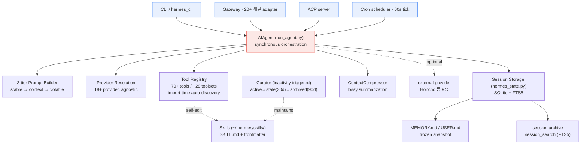

# 00 — Executive Briefing: Hermes Agent vs. 우리 Claude Code 세팅

> deliverable: technology benchmarking (adversarial). 조사일 2026-06-14. 대상 = NousResearch **Hermes Agent** v0.16.0 "The Surface Release" (2026-06-06), MIT.
> 근거 = `cards/axis1_architecture.md` · `cards/axis2_loop_selfimprove.md` · `cards/axis3_memory.md` (1차 소스 우선) + 우리 세팅 실파일.

---

## Level 0 — 한 줄

Hermes 는 **에이전트가 런타임에 스스로 skill·memory 를 고치는** persistent daemon 이고, 우리는 **루프가 발견·제안하고 결정은 사용자가 하는** spec-first governance 파이프라인 — 자율성 vs 거버넌스의 trade-off 가 핵심 대비축이다.

---

## Level 1 — 핵심 발견 (3-5줄)

1. **메커니즘 갭**: Hermes 의 self-improvement 는 `skill_manage` tool 로 에이전트가 *런타임에 자기 절차(SKILL.md)를 직접 고치는* loop 이고, 우리는 `drill`→사용자 승인→수동 지침 수정의 *out-of-band* loop 다 — 같은 목표(절차 개선)에 정반대 거버넌스. (confidence: high)
2. **메모리 갭**: Hermes 는 SQLite **FTS5 cross-session recall**(`session_search`, ~20ms)로 *전 세션을 자동 full-text 검색*하는 반면, 우리 auto-memory 는 *세션 시작 frozen 주입 + 수동 recall* 이고 인덱스(MEMORY.md)가 cwd 마다 얇다. (confidence: high)
3. **우리가 앞선 점**: 하드 순서 게이트 + hook 강제(artifact-guard), 적대 검증층(N-vote claim-verify·fact-check), **L4 메타루프(drill·study)** — *시스템이 자기 지침을 시험하는* 층은 Hermes 에 없다. (confidence: high)
4. **마케팅 주장은 약함**: "40% faster" 는 1차 출처 부재, "140k stars·most used on OpenRouter" 는 NVIDIA 2차 인용(Nous 1차 직접 진술 아님) — Top-tier 결론에 쓰면 안 됨. (confidence: high on the *weakness*)
5. **Atropos 는 self-improvement 가 아니다**: training-time RL environments framework 로, Hermes runtime 과 분리된 *별개 파이프라인* — "Hermes 가 돌면서 자기 weight 를 강화한다"는 명백한 오해. (confidence: high)
6. **보안 — "Hermes 가 OpenClaw 보안 전부 보완" 은 기각**: OpenClaw 는 실제 CVE 다수(CVE-2026-25253 1-click RCE 8.8, log poisoning prompt injection 8.6, .npmrc RCE 3.1, HEARTBEAT backdoor, plaintext .env, AMOS supply chain — 1차 검증). Hermes 는 이 실수들을 설계상 회피하나 "완전 안전" 주장은 **Hermes 제작자 본인 SECURITY.md 가 부정**("in-process 방어는 그 무엇도 containment 가 아니다"). 임의 shell·prompt injection·supply chain·gateway 노출의 잔존 위험은 카테고리상 OpenClaw 와 구조적으로 동일. (confidence: high). 상세 `07_security.md`.

---

## Level 2 — 1페이지 개관

### 브리프 정정 사실 (반드시 인지)

| # | 통념·브리프 표현 | 정정 (1차 근거) | confidence |
|---|---|---|---|
| C1 | "47 built-in tools" | **버전 drift** — 현재 main(v0.16.0) 은 *"70+ registered tools across ~28 toolsets"* (architecture doc). 1차 소스끼리도 40/60/70 으로 흔들림. "47" 은 어느 tag 에도 정확 매칭 안 됨(중간 스냅샷 추정). | medium (개수), high (drift 사실) |
| C2 | "Atropos = 런타임 self-improvement" | **아님 — training-time RL environments framework**. trainer/inference 미포함, weight 학습은 외부 trainer(Axolotl·Tinker). Hermes runtime 에 통합돼 inference 중 돈다는 언급 어디에도 없음. | high |
| C3 | "Honcho = Hermes 내장 기억" | **외부 서비스** — Plastic Labs(`plastic-labs/honcho`)의 FastAPI server(managed `api.honcho.dev` 또는 self-host). `HONCHO_API_KEY` 로 연결되는 optional memory provider(9종 중 1). | high |
| C4 | "40% faster with self-created skills" | **1차 출처 없음** — Nous README/docs/NVIDIA blog 어디에도 "40%" 없음. SEO/2차 블로그에서만 출현. 가장 약한 claim. | high (출처 부재 사실) |
| C5 | "Honcho dialectic = theory of mind" | Hermes 측은 "dialectic" 으로 기술, Honcho README 의 ToM 라벨은 약함. ToM 라벨은 medium. | medium |
| C6 | "Hermes 가 OpenClaw 보안 문제를 *전부* 보완·완전 안전" | **기각** — Hermes 문서는 OpenClaw 무언급(비교 프레임은 SEO/affiliate 산), Hermes SECURITY.md 본인이 "in-process 방어는 그 무엇도 containment 가 아니다"로 완전 안전을 *제작자가 부정*. 설계 자세는 더 낫지만 잔존 위험은 OpenClaw 와 카테고리상 동일. 단 OpenClaw CVE 다수는 1차 검증된 사실. 상세 `07_security.md`. | high |
| C7 | auto-memory 가 빈 레이어처럼 보임 | **정정(live 확인)** — 빈 게 아니라 **메모리 dir 15개 / MEMORY.md 인덱스 14개 / 메모리 .md 파일 58개**. `.claude` config repo cwd 자체만 빈 레이어이고 실작업 cwd 엔 채워짐(per-cwd 라 config repo 만 비어 보였던 것). cwd 마다 비대칭. 갭은 "비어 있음"이 아니라 "얇음·자동 recall 부재". 03/06 과 일관. | high |

### Hermes 아키텍처 (hub-and-spoke)

### 핵심 발견 (numbered)

1. **단일 core, 다중 entry** — `AIAgent`(`run_agent.py`) 하나를 CLI·Gateway·ACP·cron 4 entry 가 공유해 전 플랫폼 동작 일관. (high)
2. **persistent daemon** — gateway 가 long-running, 상태(memory·skills·sessions)는 SQLite 로 재시작에 걸쳐 지속. profile 마다 격리·동시 실행. (high)
3. **provider-agnostic** — Nous Portal·OpenRouter·OpenAI·Anthropic·Bedrock·Gemini·NIM 등 18+ + "your own endpoint". (high)
4. **런타임 self-improvement = skill/memory 축적** — 매 turn 후 background review 가 비자명 workflow 를 `skill_manage` 로 저장. weight 학습 아님. (high; review 메커니즘 위치는 medium)
5. **Curator lifecycle** — inactivity check(7d interval + 2h idle)로 skill 을 active→stale(30d)→archived(90d) 자동 전이. cron 아님. (high)
6. **FTS5 cross-session recall** — `session_search` 가 전 세션을 full-text(unicode61 + trigram CJK) 검색, ~20ms. (high)
7. **Honcho dialectic** — 대화 후 비동기 reasoning 으로 user model 갱신하는 외부 provider(optional). (high)
8. **거버넌스 부재** — Hermes 에는 우리의 산출물 순서 게이트·적대 검증·메타루프에 해당하는 층이 없다. self-improvement 의 품질 판단은 LLM 정성 review 뿐. (high)

### Top-5 actionable 이식 후보 (미리보기 — 상세 `05_implementation.md`)

| # | 후보 | 우리 적용 위치 | 난이도 | 우리 불변식 준수 |
|---|---|---|---|---|
| T1 | auto-memory 에 **FTS5류 자동 recall 층** 추가 (빈/얇은 인덱스부터 채우기) | `projects/<cwd>/memory/` + 주입 경로 | 중 | 읽기 전용 → 무해 |
| T2 | skill self-improvement 를 **drill/study 의 *제안 자동초안* 단계**로 | `loops/study.sh`·`loops/drill/` | 중 | 출구=제안, 결정 사용자 ✓ |
| T3 | post-it sweep 에 **Curator식 시간기반 stale→archive lifecycle** | `skills/post-it` + `loops/` | 하 | 자동 prune 은 "확실한 것만" 기존 정책 강화 ✓ |
| T4 | **periodic self-review nudge** 를 oncall/note 루프에 | `loops/oncall.sh`·`note.sh` | 하 | 보고만 ✓ |
| T5 | memory write **품질 휴리스틱**(write_approval 류 promote/skip 기준) | auto-memory 저장 규칙 | 하 | 품질 게이트, 결정 영향 X ✓ |

**Takeaway**: Hermes 에서 *배울 것은 메모리 자동화·런타임 절차 개선의 빠른 loop*, *지킬 것은 우리의 거버넌스·적대검증·메타루프* — 이식은 "루프 출구는 제안까지, 결정은 사용자" 불변식을 깨지 않는 선에서만.
