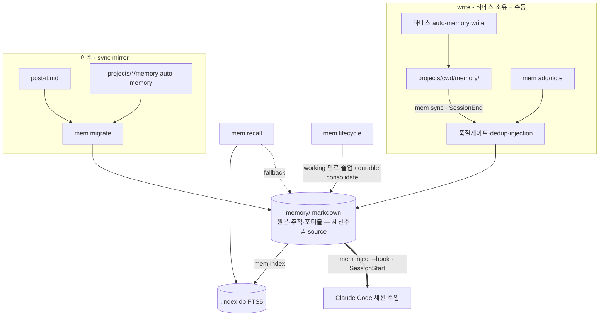

# Unified Memory System — PRD

> mode: **library + cli** · 작성 2026-06-15 · 입력: `research/hermes-agent/{03_memory_system,04_benchmark_gap,07_security}.md` · `VISION.md` · `CONVENTIONS.md §7` · 기존 `tools/memory/*` · `skills/post-it/` · `user_profile/`
> 본 문서는 청사진(PRD). 구현은 autopilot-code (산출물 `plans/`).
> **방향(사용자 확정)**: Hermes 메모리 원칙을 *적극적으로* 결합 + 중복은 잘라냄. 단기·장기 등 메모리를 *하나의 store에 tier로 통합*. post-it(프로젝트 단기)도 store로 흡수.

## 0. 한 줄

흩어진 3개 기억 메커니즘(post-it 단기 · auto-memory 장기 · user_profile 전역)을 **하나의 포터블 store + tier 모델**로 통합하고, **자동 기록 + 자동 정리 + FTS 회상**을 Hermes급으로 붙인다. 단기/장기는 *별도 파일·스킬*이 아니라 *store 안 tier 필드*.

## 1. 통합 모델 — 저장소 1개, tier 여러 개 (수명 × 스코프)

모든 기억은 한 store의 레코드. 두 축으로 구분:

| tier (수명) | scope | 무엇 | 흡수 전 | lifecycle |
|---|---|---|---|---|
| **working** (단기) | project | 진행 중 작업·결정·다음 세션 hint·스레드 | **post-it** | 자동 만료(stale N일) 또는 졸업(→ durable/산출물) |
| **durable** (장기) | project | 프로젝트 사실·교훈·교정·컨벤션 | auto-memory | 영구 + consolidate(dedup·통합) |
| **durable** (장기) | global | cross-project 선호·패턴 | user_profile (raw) | 영구 + consolidate |

- **레코드 = `tier` × `scope` × `type`(user/feedback/project/reference/decision/thread/hint…)** 세 차원 태그.
- post-it의 5 카테고리(Conventions/Resources/Open Threads/Decisions/Next Session Hints) → working tier의 `type` 값으로 흡수. 자기-pruning(졸업/만료/stale) = working lifecycle 규칙.
- user_profile의 *구조화 aspect 문서*(figure/writing/…)는 사람이 읽는 curated 자료라 **view로 유지**(store가 source, aspect md는 생성/동기화) — raw 메모만 store로.

## 2. 잘라내는 것 (cut / merge — 적극)

| 현재 | 통합 후 | 처리 |
|---|---|---|
| `post-it.md` 평문 + 전용 파싱 + 5섹션 마크업 | working tier 레코드 | post-it 파일 메커니즘 **제거**, store로 이주 |
| `skills/post-it/` 스킬 | thin alias → `mem` 명령 | 스킬은 얇은 wrapper로 축소(또는 deprecate) |
| `tools/memory/recall.sh` · `index-check.sh` | `mem` 툴셋 | 흡수 (recall은 진화 유지) |
| T3 post-it 시간 lifecycle · T4 oncall nudge · T5 write 휴리스틱 | store의 working lifecycle · 자동 write · 품질 게이트 | 메커니즘으로 승격(원칙→코드) |
| 3중 분산 위치(post-it.md / projects/cwd/memory / user_profile) | 1 store + projection | 위치 단일화 |

> 원칙: *기능은 남기고 중복 표면을 자른다.* post-it의 *목적*(단기 작업면)은 working tier로 살아남고, 그 *별도 파일·스킬·파싱*만 제거.

## 3. 설계 결정 (locked)

### D1. 저장 단위 — markdown 원본 + 파생 색인 (3중)
| 층 | 위치 | git | 역할 |
|---|---|---|---|
| 원본(SoT) | `~/.claude/memory/` (신규, 추적) | tracked → GitHub 이동 | 사람이 읽고 diff/merge. **포터블 핵심** |
| 검색 색인 | `~/.claude/memory/.index.db` (SQLite FTS5) | gitignored | 원본에서 생성, rebuildable |
| 하네스 주입 projection | `~/.claude/projects/<cwd>/memory/` | gitignored | 원본에서 생성 — 세션 시작 자동 주입 활용(D5) |

### D2. 저장 위치 ↔ 스코프 분리 (핵심)
*per-cwd 폴더 = 스코프*를 버린다. **통합 store + `cwd_origin` 태그** → 스코프는 검색/주입 필터. 포터블 + 격리 동시.

### D3. 자동 write — 전 tier (불변식 의식적 전환, **기억 한정**)
**기억 저장 = 자동. 사람 승인 게이트 없음.** "결정은 사용자"는 *세팅·행동 변경*용 (범주 분리, 사용자 확정).
- working: 세션 중 작업 맥락·결정·hint 자동 기록 (싸고 자동 만료라 적극적으로)
- durable: 품질 게이트(promote/skip §7.1) 통과분 자동 승격
- 여전히 사람 게이트: **세팅·원칙·행동양식 변경** → 원칙 문서, 검토/보고 (불변식 유지)
- 자동 안전장치(사람 승인 아님): 품질 게이트 · dedup(§7.2) · injection 가드(D7)

### D4. Lifecycle — tier별 (Curator 적극 이식)
- **working**: 자동 만료(stale N일 미갱신) + 졸업 감지(durable 가치 있으면 승격) — post-it sweep의 자동화 강화판
- **durable**: 시간 만료 없음 + 자동 consolidate(near-dup 통합, 관련 레코드 병합) — Hermes Curator active→stale→archive 차용
- 완전 삭제(gc)는 D-open-1

### D5. 하네스 주입·회수 (자체 하네스 — SessionStart inject + SessionEnd sync)
세션 주입은 우리 *자체 하네스*가 직접 한다 — `settings.json` 의 SessionStart/SessionEnd hook 으로 store ↔ context 를 직접 잇는다.
- **주입(SessionStart)**: `mem inject --hook` 이 store 에서 *현 cwd working + durable/project + profile/global* 을 SessionStart `additionalContext` JSON 으로 직접 주입. `projects/` projection 경유가 아니라 **store 가 세션 주입의 source**.
- **회수(SessionEnd)**: `mem sync` 가 하네스가 `projects/<cwd>/memory/` 에 쓴 auto-memory 를 store durable 로 멱등 mirror + FTS5 색인 재생성. 하네스가 메모리 *write* 를 소유하므로 store 는 그 *포터블 추적 mirror*.
- **루프**: 하네스 write → `projects/` → SessionEnd `mem sync` → store → SessionStart `mem inject` → context.
- (`mem project` 의 `projects/<cwd>/memory/` projection 은 보조 — 주입 경로는 `inject()` 가 담당.)

### D6. 회상 (recall 진화 = Hermes session_search급)
`mem recall` — store(+FTS5 색인) 검색, tier/scope 필터. 색인 있으면 bm25 랭킹, 없으면 rg fallback. `--sessions`(raw jsonl)·`--all`(전 scope) 유지.

### D7. 보안 (자동 write라 필수)
injection 패턴 스캔 · 비밀정보 마스킹 · 메모리는 *데이터로만*(실행 지시 해석 금지). 07_security 체크리스트.

## [library] 공개 API

```
mem_write(tier, scope, type, body, cwd_origin, tags, links) -> id
mem_recall(query, tier=*, scope=cwd|all, sources=memory|+sessions) -> [hits]
mem_index_build(rebuild=False)
mem_inject(hook=False)                 # store → SessionStart additionalContext (주입의 source 경로)
mem_sync()                             # projects/<cwd>/memory auto-memory → store mirror + 색인 (SessionEnd 회수)
mem_project(cwd)                       # store → projects/<cwd>/memory/ projection (보조 — 주입은 inject 가 담당)
mem_migrate(source=post-it|auto-memory|all, dry_run=True)
mem_lifecycle()                        # working 만료·졸업 + durable consolidate
```

## [cli] `mem` 명령 (post-it·recall·index 흡수)

| 명령 | 동작 | 흡수 |
|---|---|---|
| `mem add <tier> <type> "<body>"` | 수동 기록 (자동과 같은 필터) | post-it add |
| `mem note "<body>"` | working tier 단축 기록 | post-it (단기) |
| `mem recall "<q>" [--tier ..] [--all] [--sessions]` | 회상 | recall.sh |
| `mem index [--rebuild]` | FTS5 색인 | index-check |
| `mem inject [--hook]` | **세션주입 블록** (store → context, SessionStart 경로) | — |
| `mem sync` | **회수 mirror** (projects/ auto-memory → store + 색인, SessionEnd 경로) | — |
| `mem project [--cwd ..]` | projection (보조 — 주입은 `mem inject` 가 담당) | — |
| `mem migrate [--apply]` | post-it + auto-memory 이주 | — |
| `mem lifecycle` | working 만료/졸업 + durable consolidate | post-it sweep |
| `mem gc` | 완전 삭제 (D-open-1) | — |

## 데이터 모델

```markdown
---
id: <slug>
tier: working | durable
scope: project | global
type: user|feedback|project|reference|decision|thread|hint|convention
cwd_origin: <encoded-cwd | global>
created: YYYY-MM-DD
updated: YYYY-MM-DD
expires: YYYY-MM-DD | null      # working 만 (자동 만료)
tags: [..]
links: [[id]]
---
<본문>
```

레이아웃: `~/.claude/memory/<tier>/<scope>/<slug>.md` + `MEMORY.md` 통합 인덱스.
SQLite: `records(id,tier,scope,type,cwd_origin,created,updated,expires,path)` + `records_fts(body)` FTS5(unicode61+trigram CJK), bm25.

## Architecture



> 자체 하네스 루프: SessionStart `mem inject --hook` (store → context 직접 주입) + SessionEnd `mem sync` (projects/ auto-memory → store mirror + 색인). `mem project` projection 은 보조(주입 경로 아님).

## 확정 결정 (사용자 lock 2026-06-15 — 추천 채택)

- **D-1 (삭제 정책)**: working = 자동 만료/졸업. durable = consolidate 자동, 완전삭제(gc)만 플래깅+확인 (비가역만 게이트).
- **D-2 (post-it 스킬)**: `/post-it` → `mem` alias 유지(근육기억 보존), 내부는 store. deprecate 아님.
- **D-3 (user_profile)**: raw 메모만 store로 흡수. 구조화 aspect 문서(figure/writing…)는 사람이 읽는 curated view로 유지(store가 source).
- **D-4 (주입·회수 hook)**: SessionStart `mem inject --hook`(주입) + SessionEnd `mem sync`(회수) 자동 — 자체 하네스. (`mem project` projection·oncall 보정은 보조.)

## Non-goals
- 외부 메모리 서비스(Honcho) 통합 — 로컬 only
- 세팅·원칙 자동 변경 — 기억만 자동, 세팅은 사람 게이트
- weight 학습

## Next
open 1~4 확정 → `autopilot-code --mode dev` 구현 (순서: 스키마·store → migrate → index → recall 진화 → 자동 write → lifecycle → projection·hook → post-it alias 전환). 본 spec이 입력.
