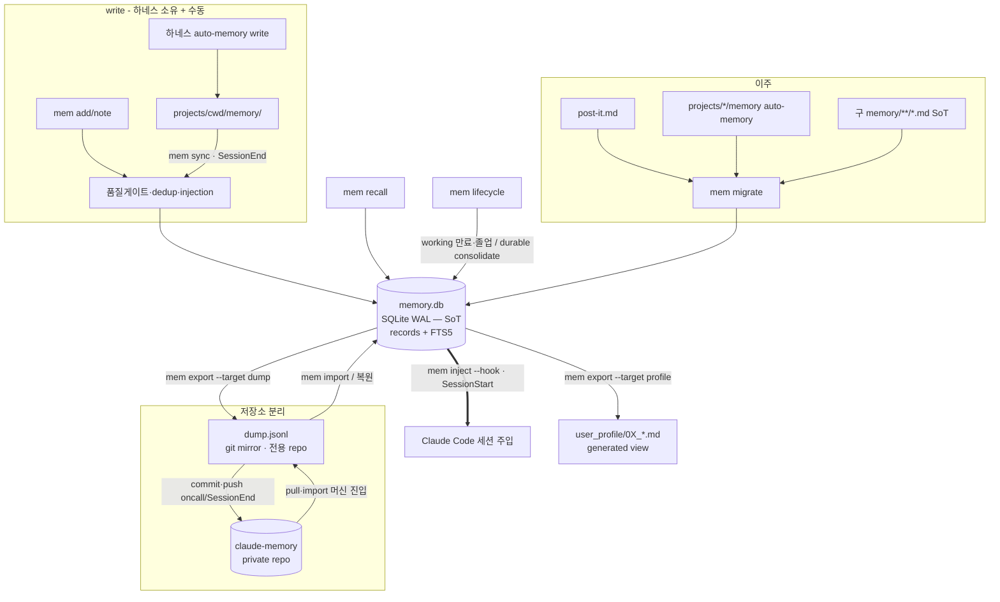

# Unified Memory System — PRD

> mode: **library + cli** · 작성 2026-06-15 · v3 개정 2026-06-15 (Hermes DB화 강화 — D1 반전·저장소 분리·통합 강화)
> 입력: `research/hermes-agent/{03_memory_system,04_benchmark_gap,07_security}.md` · `VISION.md` · `CONVENTIONS.md §7` · 기존 `tools/memory/*` · `skills/post-it/` · `user_profile/`
> 본 문서는 청사진(PRD). 구현은 autopilot-code (산출물 `plans/`).
> **방향(사용자 확정 2026-06-15)**: Hermes 메모리 원칙을 *적극적으로* 결합 + 중복은 잘라냄. 단기·장기·전역 메모리를 *하나의 store*로 통합. **진실원천을 SQLite DB로** (markdown 아님). 메모리 데이터는 config repo 에서 분리해 **전용 repo**로. git 은 텍스트 덤프 mirror.

## 0. 한 줄

흩어진 3개 기억 메커니즘(post-it 단기 · auto-memory 장기 · user_profile 전역)을 **하나의 SQLite store + tier 모델**로 통합하고, **자동 기록 + 자동 정리 + FTS 회상**을 Hermes급으로 붙인다. 진실원천은 로컬 SQLite DB(`memory.db`), git 은 그 텍스트 덤프(`dump.jsonl`)를 mirror 로 추적하는 **전용 저장소**. 단기/장기/전역은 *별도 파일·스킬*이 아니라 *한 DB 안 `tier`×`scope`×`type` 컬럼*.

## 1. 통합 모델 — 저장소 1개(DB), tier 여러 개 (수명 × 스코프)

모든 기억은 한 SQLite DB의 레코드(row). 두 축으로 구분:

| tier (수명) | scope | 무엇 | 흡수 전 | lifecycle |
|---|---|---|---|---|
| **working** (단기) | project | 진행 중 작업·결정·다음 세션 hint·스레드 | **post-it** | 자동 만료(stale N일) 또는 졸업(→ durable) |
| **durable** (장기) | project | 프로젝트 사실·교훈·교정·컨벤션 | auto-memory (Claude 내장) | 영구 + consolidate(dedup·통합) |
| **durable** (장기) | global | cross-project 선호·패턴 | user_profile (raw 메모) | 영구 + consolidate |

- **레코드 = `tier` × `scope` × `type`(user/feedback/project/reference/decision/thread/hint/convention/profile…)** 세 차원 컬럼.
- "하나의 메모리로 묶는다" = **한 DB·한 도구·한 스키마**. 단 `tier/scope/type` 컬럼은 유지 — *주입 행동이 다르기* 때문(§D5). Hermes 가 MEMORY.md(에이전트 노트)/USER.md(프로필)/state.db(아카이브)를 *별도 파일*로 나눈 것과 같은 구분을, 우리는 *파일을 안 나누고 한 DB 안 컬럼*으로 표현 → 더 통합적.
- post-it의 5 카테고리(Conventions/Resources/Open Threads/Decisions/Next Session Hints) → working tier의 `type` 값으로 흡수. 자기-pruning(졸업/만료/stale) = working lifecycle 규칙.
- user_profile의 *raw 메모*는 `durable/global` 레코드로 흡수. *구조화 aspect 문서*(figure/writing/coding_convention/…)는 사람·sub-agent가 경로로 Read 하는 curated **view** → **DB가 source, aspect md는 DB→generated view**(§D3).

## 2. 잘라내는 것 (cut / merge — 적극)

| 현재 | 통합 후 | 처리 |
|---|---|---|
| `post-it.md` 평문 + 전용 파싱 + 5섹션 마크업 | working tier 레코드(DB row) | post-it 파일 메커니즘 **제거**, DB로 이주 |
| `skills/post-it/` 스킬 | thin alias → `mem` 명령 | 스킬은 얇은 wrapper로 축소(deprecate 아님 — 근육기억 보존, D-2) |
| `tools/memory/recall.sh` · `index-check.sh` | `mem` 툴셋 | 흡수 (recall은 진화 유지) |
| **markdown 원본 186개 파일** (구 SoT) | **SQLite DB 1개** (신 SoT) + git 텍스트 덤프 | 파일→row 이주, config repo 이력에서 제거(§D8) |
| `memory/.index.db` (파생 FTS5 색인) | **DB 본체에 내장**(FTS5 가상테이블) | 파생물이 아니라 store 자체의 일부로 승격 |
| 3중 분산 위치(post-it.md / projects/cwd/memory / user_profile raw) | 1 DB + projection/view | 위치 단일화 |

> 원칙: *기능은 남기고 중복 표면을 자른다.* post-it의 *목적*(단기 작업면)은 working tier로, *별도 파일·스킬·파싱*만 제거. markdown SoT 의 *가독성·diff*는 텍스트 덤프(`dump.jsonl`)가 대신 — git 위생은 오히려 개선.

## 3. 설계 결정 (locked)

### D1. 저장 단위 — **SQLite DB 가 진실원천** + 텍스트 덤프 mirror (v3 반전)
| 층 | 위치 | git | 역할 |
|---|---|---|---|
| **원본(SoT)** | `~/.claude/memory/memory.db` (SQLite, WAL) | **gitignore** | write 의 진실원천. records + FTS5 가상테이블. Hermes `state.db` 정렬 |
| **git mirror** | `~/.claude/memory/dump.jsonl` (레코드당 1줄, id 정렬) | **tracked** (전용 repo) | DB→deterministic 텍스트 export. diff 의미있음·bloat 없음·복원 source |
| **하네스 주입 projection** | `~/.claude/projects/<cwd>/memory/` | gitignore | 보조 — 주입은 `mem inject`(§D5)가 담당 |

- **왜 DB 를 SoT 로**: 메모리는 세션마다 갱신(write 빈도 높음). markdown 파일 N개를 매번 rewrite + 별도 색인 재빌드보다, 단일 DB 에 직접 write + FTS5 내장이 단순·빠름. Hermes 의 `state.db`(로컬 런타임 SQLite WAL)와 동형.
- **왜 git 에 .db 바이너리가 아니라 텍스트 덤프**: 바이너리 SQLite 는 매 write 마다 내부 page 재배치 → git delta 거의 안 먹고 repo bloat. `dump.jsonl`(레코드당 한 줄, id 정렬)은 *변경된 줄만* diff → delta 잘 먹음 + 사람/에이전트 audit 가시성은 덤이다. 복원 = 덤프 replay → `.db` 재생성.
- **왜 git 인가(외부 동기화 아님)**: 단일 사용자·외부 의존 0 가 핵심 가치. 라이브 멀티머신 동시 write 가 비목표(§Non-goals)라 git mirror(한 머신씩 pull→work→push)로 충분. Turso/libSQL 류는 외부 token·네트워크 의존 추가라 채택 안 함.

### D2. 저장 위치 ↔ 스코프 분리 (유지)
*per-cwd 폴더 = 스코프*를 버린다. **단일 DB + `cwd_origin` 컬럼** → 스코프는 검색/주입 필터(WHERE 절). 포터블 + 격리 동시.

### D3. user_profile 통합 깊이 — raw=레코드, aspect=generated view (locked, v3 정련)
- **raw 메모** → `durable/global` `type=…` 레코드로 흡수(자동 기록 대상).
- **구조화 aspect 문서**(`user_profile/0X_*.md` — coding_convention/domain/analysis/…): sub-agent 들이 CLAUDE.md 도메인 트리거에서 *경로로 직접 Read*. 이를 깨지 않으려 **DB가 source, aspect md는 DB→generated view** 로 유지. `mem export --profile` 류가 view 갱신.
- 순수 DB(aspect 문서도 DB only)로 가면 모든 read site 를 쿼리로 갈아야 함(배선 대공사) → 채택 안 함. "하나의 메모리" 의도엔 어긋나지 않음(데이터는 한 DB, md 는 그 투영일 뿐).

### D4. 자동 write — 전 tier (불변식 의식적 전환, **기억 한정**)
**기억 저장 = 자동. 사람 승인 게이트 없음.** "결정은 사용자"는 *세팅·행동 변경*용 (범주 분리, 사용자 확정).
- working: 세션 중 작업 맥락·결정·hint 자동 기록 (싸고 자동 만료라 적극적으로)
- durable: 품질 게이트(promote/skip §7) 통과분 자동 승격
- 여전히 사람 게이트: **세팅·원칙·행동양식 변경** → 원칙 문서, 검토/보고 (불변식 유지)
- 자동 안전장치(사람 승인 아님): 품질 게이트 · dedup · injection 가드(D7)

### D5. Lifecycle — tier별 (Curator 적극 이식)
- **working**: 자동 만료(stale N일 미갱신) + 졸업 감지(durable 가치 있으면 승격) — post-it sweep의 자동화 강화판
- **durable**: 시간 만료 없음 + 자동 consolidate(near-dup 통합) — Hermes Curator active→stale→archive 차용
- 완전 삭제(gc)는 비가역만 플래깅+확인

### D6. 하네스 주입·회수 (자체 하네스 — SessionStart inject + SessionEnd sync)
세션 주입은 우리 *자체 하네스*가 직접 한다 — `settings.json` 의 SessionStart/SessionEnd hook 으로 DB ↔ context 를 직접 잇는다.
- **주입(SessionStart)**: `mem inject --hook` 이 DB 에서 *현 cwd working + durable/project + profile/global* 을 SessionStart `additionalContext` JSON 으로 직접 주입. **DB 가 세션 주입의 source**. (tier/scope/type 컬럼이 *무엇을 어떻게 주입할지* 결정 — profile=항상, working=현 cwd, durable/project=현 프로젝트.)
- **회수(SessionEnd)**: `mem sync` 가 하네스가 `projects/<cwd>/memory/` 에 쓴 auto-memory(Claude 내장 메모리)를 DB durable 로 멱등 흡수 + FTS5 색인 갱신 + `dump.jsonl` 재export. 하네스가 메모리 *write* 를 소유하므로 DB 는 그 *통합 store*.
- **루프**: 하네스 write → `projects/` → SessionEnd `mem sync` → DB → SessionStart `mem inject` → context.

### D7. 회상 (recall 진화 = Hermes session_search급)
`mem recall` — DB(FTS5) 검색, tier/scope 필터. FTS5 bm25 랭킹(unicode61 + trigram CJK). `--sessions`(raw jsonl)·`--all`(전 scope) 유지.

### D8. 보안 (자동 write라 필수)
injection 패턴 스캔 · 비밀정보 마스킹 · 메모리는 *데이터로만*(실행 지시 해석 금지). 07_security 체크리스트.

### D9. 저장소 분리 + config repo 이력 정리 (v3 신규)
- **전용 repo**: `~/.claude/memory/` 를 자체 private git repo(`claude-memory`)로 init. 추적 대상 = `dump.jsonl` + 스키마/README. `memory.db`·WAL·`.index.db` 류는 gitignore.
- **config repo 이력 제거**: 부모 `claude_setting` 에서 `git filter-repo --path memory/ --invert-paths` 로 *전체 커밋 이력*에서 `memory/` 제거 → force-push. 실행 전 `git bundle` 백업 필수.
- **부모 gitignore**: `claude_setting/.gitignore` 에 `memory/` 추가(전용 repo 이므로 부모는 무시). 중첩 git repo (부모가 ignore 하는 자식 repo) 형태 — submodule 미사용(개인 단일 사용자라 ceremony 불필요).
- **동기화 트리거**: `dump.jsonl` export→commit→push 는 기존 oncall 일일 루프 / SessionEnd. 머신 진입 시 pull→import. 한 머신씩 write 전제.

## [library] 공개 API

```
mem_write(tier, scope, type, body, cwd_origin, tags, links) -> id   # DB insert (게이트·dedup·injection)
mem_recall(query, tier=*, scope=cwd|all, sources=db|+sessions) -> [hits]   # FTS5 bm25
mem_index_rebuild()                    # FTS5 가상테이블 재구축 (덤프 import 후 등)
mem_inject(hook=False)                 # DB → SessionStart additionalContext (주입 source 경로)
mem_sync()                             # projects/<cwd>/memory auto-memory → DB + 색인 + dump 재export (SessionEnd)
mem_export(target=dump|profile)        # DB → dump.jsonl (git mirror) / user_profile aspect md (generated view)
mem_import(dump.jsonl)                 # 텍스트 덤프 → DB 복원 (replay)
mem_migrate(source=post-it|auto-memory|md-files|all, dry_run=True)   # 구 markdown SoT 포함 이주
mem_lifecycle()                        # working 만료·졸업 + durable consolidate
mem_project(cwd)                       # DB → projects/<cwd>/memory/ projection (보조)
```

## [cli] `mem` 명령 (post-it·recall·index 흡수)

| 명령 | 동작 | 흡수 |
|---|---|---|
| `mem add <tier> <type> "<body>"` | 수동 기록 (자동과 같은 필터) → DB | post-it add |
| `mem note "<body>"` | working tier 단축 기록 → DB | post-it (단기) |
| `mem recall "<q>" [--tier ..] [--all] [--sessions]` | 회상 (FTS5 bm25) | recall.sh |
| `mem index [--rebuild]` | FTS5 가상테이블 (DB 내장) | index-check |
| `mem inject [--hook]` | **세션주입 블록** (DB → context, SessionStart 경로) | — |
| `mem sync` | **회수** (projects/ auto-memory → DB + 색인 + dump 재export, SessionEnd 경로) | — |
| `mem export [--target dump\|profile]` | DB → `dump.jsonl` (git mirror) 또는 aspect md (view) | — |
| `mem import <dump.jsonl>` | 덤프 → DB 복원 (replay) | — |
| `mem migrate [--apply]` | post-it + auto-memory + **구 md 파일** → DB | — |
| `mem lifecycle` | working 만료/졸업 + durable consolidate | post-it sweep |
| `mem gc` | 완전 삭제 (비가역만 게이트) | — |
| `mem project [--cwd ..]` | projection (보조 — 주입은 `mem inject`) | — |

## 데이터 모델

**SQLite (`memory.db`) — 진실원천:**
```sql
CREATE TABLE records(
  id          TEXT PRIMARY KEY,   -- <type>_<slug>_<hash6>
  tier        TEXT NOT NULL,      -- working | durable
  scope       TEXT NOT NULL,      -- project | global
  type        TEXT NOT NULL,      -- user|feedback|project|reference|decision|thread|hint|convention|profile
  cwd_origin  TEXT,               -- encoded-cwd | global
  created     TEXT, updated TEXT,
  expires     TEXT,               -- working 만 (자동 만료), 그 외 NULL
  source      TEXT,               -- 이주 출처 (auto-memory:… / post-it:… / md-file:… / user-profile:…)
  tags        TEXT,               -- JSON array
  links       TEXT,               -- JSON array ([[id]])
  body        TEXT NOT NULL
);
CREATE VIRTUAL TABLE records_fts USING fts5(
  id UNINDEXED, body, tokenize='unicode61');   -- + trigram(CJK substring) 보조 테이블
CREATE INDEX idx_records_scope ON records(scope, cwd_origin, tier);
```

**git mirror (`dump.jsonl`) — 레코드당 한 줄, id 정렬:**
```jsonl
{"id":"feedback_…_a1b2c3","tier":"durable","scope":"project","type":"feedback","cwd_origin":"…","created":"2026-…","updated":"…","tags":[],"links":[],"body":"…"}
```
> deterministic: id 정렬 + 키 순서 고정 + 한 줄 한 레코드 → git diff = 변경/추가/삭제된 줄만. 복원: `mem import dump.jsonl` 가 줄별 upsert.

## Architecture



> 자체 하네스 루프: SessionStart `mem inject --hook`(DB→context 직접 주입) + SessionEnd `mem sync`(projects/ auto-memory→DB + 색인 + dump 재export). config repo(`claude_setting`)는 `memory/` 이력 제거 후 gitignore — 메모리는 전용 repo 가 소유.

## 확정 결정 (사용자 lock 2026-06-15)

- **D-1 (삭제 정책)**: working = 자동 만료/졸업. durable = consolidate 자동, 완전삭제(gc)만 플래깅+확인 (비가역만 게이트).
- **D-2 (post-it 스킬)**: `/post-it` → `mem` alias 유지(근육기억 보존), 내부는 DB. deprecate 아님.
- **D-3 (user_profile)**: raw 메모만 DB로 흡수. 구조화 aspect 문서는 DB→generated view 유지.
- **D-4 (주입·회수 hook)**: SessionStart `mem inject --hook`(주입) + SessionEnd `mem sync`(회수) 자동 — 자체 하네스.
- **D-5 (SoT = SQLite, v3)**: 진실원천을 markdown → 로컬 SQLite `memory.db`. git 은 `dump.jsonl` 텍스트 mirror. 바이너리 .db 는 비추적.
- **D-6 (저장소 분리, v3)**: 메모리를 전용 private repo(`claude-memory`)로. config repo `memory/` 이력은 filter-repo 제거 + force-push (백업 후).
- **D-7 (통합 깊이, v3)**: user_profile + post-it + Claude 내장 auto-memory 를 한 DB로. tier/scope/type 컬럼으로 주입 행동 구분 유지.

## Non-goals
- 외부 메모리 서비스(Honcho / Turso / libSQL 원격 동기화) 통합 — **로컬 only**. 근거: 단일 사용자 + 외부 의존 0. 라이브 멀티머신 동시 write 비목표(git mirror 한 머신씩으로 충분).
- 세팅·원칙 자동 변경 — 기억만 자동, 세팅은 사람 게이트
- weight 학습

## Next
구현 순서(autopilot-code --mode dev, 본 spec 입력):
1. **DB 스키마·store** — `memory.db` records + FTS5, write/read DB 직결
2. **이주** — 구 markdown SoT(186 파일) + post-it + auto-memory → DB (`mem migrate --apply`)
3. **export/import** — `dump.jsonl` deterministic export + replay import, `--profile` view export
4. **recall 진화** — FTS5 bm25 + trigram CJK
5. **lifecycle** — working 만료/졸업 + durable consolidate
6. **hook 갱신** — inject/sync 를 DB 직결로
7. **post-it alias 전환** — `/post-it` 내부를 mem DB 로
8. **저장소 분리(인프라)** — git bundle 백업 → `claude-memory` repo init → config repo filter-repo `memory/` 제거 + force-push → gitignore
