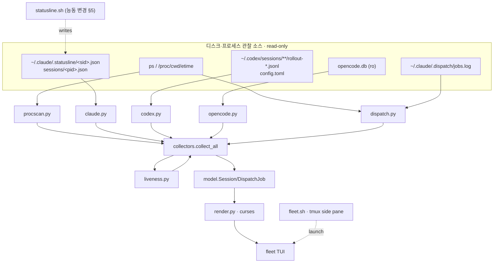

# agent-fleet-dashboard — Spec (PRD)

> mode: **cli** (터미널 TUI 도구) · 작성 2026-07-01 · v1
> 컴포넌트: `agent_setting` repo 의 **별도 내부 도구** — 기존 `spec/prd.md`(Unified Memory System)와 무관, 이 폴더(`spec/agent-fleet-dashboard/`)가 자체 청사진.
> 입력(1순위 근거): `research/agent-fleet-dashboard/00_prior_art.md`(build-vs-adopt·herdr·렌더스택) · `research/agent-fleet-dashboard/01_tap_mechanics.md`(하네스별 tap·discovery·liveness, file-cited)
> 본 문서는 청사진(PRD). 구현은 autopilot-code (산출물 `plans/`). skeleton 은 lean 유지 위해 autopilot-code 로 이월(§9 module 구조만 확정).

## 0. 한 줄

여러 하네스(Claude Code·Codex·opencode)의 **활성 세션 전부** + **프로젝트별 headless dispatch 잡**을, 어떤 하네스 TUI 에도 주입하지 않고 **외부에서 관찰**해 htop/nvtop 스타일 라이브 터미널 대시보드로 모아 보여준다. zero-dep python curses, tmux 세로 사이드 페인 배치.

## 0.5 설계 원칙 — 외부 관찰자 (zero-injection) ★ cross-cutting

**대시보드는 어떤 하네스의 TUI·hook·프로세스에도 아무것도 주입하지 않는다.** 이미 디스크에 존재하는 신호(프로세스 테이블·transcript·statusline JSON·SQLite row·jobs.log)만 읽어 렌더한다. 유일한 예외 = 우리가 _소유한_ Claude statusLine 을 세션별 파일도 쓰게 하는 것(§5) — 이건 우리 자산이라 주입이 아니다.

- **왜**: codex·opencode 의 TUI/hook 은 우리가 못 건드림(그리고 건드리면 안 됨). 관찰자로만 두면 하네스 버전 업그레이드·재시작과 무관하게 동작하고, 대시보드 크래시가 세션에 영향 0.
- **적용**: 새 데이터가 필요하면 "이 하네스가 이미 어디에 남기나?"를 먼저 묻는다(§2 tap 매트릭스). 없으면 프로세스 스캔(universal 백본)으로 fallback. 새 emit 경로를 하네스에 심지 않는다.

## 1. 아키텍처 — 3계층, 2섹션

```
[발견 계층·universal 백본]  프로세스 스캔: comm ∈ {claude,codex,opencode} + /proc/<pid>/cwd + ps etime
        ↓  (모든 하네스의 모든 활성 세션을 무조건 열거 — 유일하게 100% 보장되는 tap)
[보강 계층·하네스별 passive enrichment]  세션당 상세를 디스크에서 read-only 로 부착
        · claude   → ~/.claude/.statusline/<session_id>.json (신규 per-session tap, §5) · fallback: ~/.claude/sessions/<pid>.json
        · codex    → 최신 rollout jsonl 의 마지막 token_count 이벤트 tail + config.toml (model/effort)
        · opencode → opencode.db `session` row (ro) — model/agent/tokens/cost
        · dispatch → statusline 잡스캔 로직(재사용) + .dispatch/jobs.log 병합
        ↓
[렌더 계층]  curses TUI — (A) fleet 그리드 + (B) dispatch 리스트, 1~2초 tick 라이브 갱신
```

- **백본이 세션 목록의 진실**: enrichment 가 실패/결손이어도 세션은 프로세스 스캔으로 항상 잡힌다. enrichment 는 "칸 채우기"일 뿐, 세션 존재 판정 아님.
- **pid ↔ session 매핑**: claude=`~/.claude/sessions/<pid>.json` 또는 statusline 파일의 session_id; codex=broker `--cwd`/leaf `/proc/cwd`; opencode=`/proc/cwd` == `session.directory`(argv 에 세션 id 없음).

## 2. Discovery & tap 매트릭스 (근거: 01_tap_mechanics.md)

| Need | Claude Code | Codex CLI | opencode |
|---|---|---|---|
| process comm | `claude` | `codex`(`app-server`/`exec`) | `opencode` |
| /proc/cwd + etime | ✅ | ✅ | ✅ |
| 세션 id | UUID | UUID | `ses_…`(+slug) |
| model / cwd | statusline JSON | rollout `session_meta.cwd` + config model | DB `session.model`/`directory` |
| token / context% | statusline `context_window.*` | rollout `token_count.info.*` | DB `tokens_*`(ctx% 유도) |
| **rate limit** | ✅ 5h/7d | ✅ primary/secondary | ❌ 없음 |
| **effort** | ✅ | ✅ config | ❌ 없음 |
| cost | ✅ | 토큰서 유도 | ✅ `session.cost` |
| liveness | transcript mtime + `sessions/<pid>.json` | rollout mtime | DB `MAX(time_updated)` |

**Takeaway**: 세션 _존재_ 는 프로세스 스캔으로 100% 균질. _상세_ 는 하네스별 비대칭 — opencode 는 rate-limit·effort 칸이 구조적으로 빈다(UI 가 결손 칸을 `—` 로 허용해야 함, §4). Codex telemetry 는 rollout jsonl 마지막 `token_count` 한 줄 tail 로 취득.

## 3. [cli] 명령·옵션·I/O

> **[minor edit · render v2 cycle, 2026-07-01]** 아래 옵션 표·키·런처 설명은 render v2 재구성 반영(cwd-group 레이아웃·스크롤·stale 토글). v1 원본은 `plans/2026-07-01_agent-fleet-dashboard/` 참조.

단일 진입 명령. 서브명령 없음(모니터 도구).

| 옵션 | 기본 | 의미 |
|---|---|---|
| `--interval <sec>` | `2` | 라이브 tick 주기(초). 백본 프로세스 스캔·enrichment 재수집 주기. |
| `--once` | off | 1회 스냅샷 렌더 후 종료(스크립트·디버그용, curses 미진입 시 plain 출력). |
| `--no-tmux` | off | tmux split 없이 현재 터미널에서 직접 실행(런처가 아니라 TUI 직접). |
| `--section <fleet\|dispatch\|both>` | `both` | **(v2 의미 변경)** 더 이상 화면 전체를 2섹션으로 쪼개지 않는다 — project(cwd) 그룹 _안에서_ 어떤 row-type 을 보여줄지 필터한다. `fleet`=그룹 안 세션 행만, `dispatch`=그룹 안 dispatch 행만, `both`=전체(기본). 필터 후 행이 0개가 된 그룹은 헤더째 생략(빈 그룹 미출력). |
| `--harness <list>` | all | 특정 하네스만(예: `claude,codex`). |
| `--json` | off | curses 대신 수집 결과를 JSON 으로 stdout(파이프·디버그·테스트). |
| `--all` | off | fleet 리스트에 stale/dead 세션도 표시. **기본은 숨김**(활성 working/idle 만; 헤더 카운트·`+N hidden` 요약은 유지). |

**(v2 신설) 라이브 조작 키**:

| 키 | 동작 |
|---|---|
| `↑`/`↓`, `j`/`k` | 1줄 스크롤 |
| `PgUp`/`PgDn` | 페이지 단위 스크롤 |
| `Home`/`g`, `End`/`G` | 맨 위 / 맨 아래로 이동(뷰포트는 항상 맨 아래까지 도달) |
| `a` | stale/dead 세션 + codex app-server companion 표시↔숨김 토글(`--all` 과 동일 효과, 라이브 재토글 가능) |
| 마우스 클릭(`+N hidden` 줄) | `a` 와 동일한 토글. `tmux set -g mouse on` 필요 |
| `q` | 종료 |
| `r` | 즉시 새로고침 |

- **마우스 트레이드오프(1줄 메모)**: 키보드 스크롤(`jk`/`PgUp,Dn`/`g,G`)이 기본(primary) 조작 경로다. tmux 마우스(`set -g mouse on`)를 켜면 `+N hidden` 클릭 토글이 되지만, 그 대가로 터미널 네이티브 클릭-선택·복사가 막힌다 — 그래서 마우스는 opt-in.
- **Input**: 없음(디스크·프로세스 관찰만). 환경변수 `AGENT_HOME`/`CLAUDE_HOME`(기본 `~/.claude`), `AGENT_DISPATCH_JOBS`(기본 `<AGENT_HOME>/.dispatch/jobs.log`) 존중.
- **Output**: curses full-screen(기본) / `--once`·`--json` 시 plain stdout.
- **Exit code**: `0` 정상 종료(q/Ctrl-C) · `1` 초기화 실패(터미널 아님·의존 누락) · `2` 인자 오류.
- **런처 (v2: normal-terminal 비율)**: 세로 사이드 페인 강제 배치는 폐기(retire). `fleet.sh` 기본 동작은 현재 터미널에서 `fleet.py` 를 **전체 크기(full-terminal)** 로 직접 실행. `--window` 옵션 시 tmux 안이면 새 tmux 창(역시 full-size)으로 열고, tmux 밖이면 direct 실행으로 degrade.

## 4. UI — project(cwd) 그룹 레이아웃 + 렌더 모델

> **[minor edit · render v2 cycle, 2026-07-01]** 아래는 v1 의 "(A) fleet 섹션 / (B) dispatch 섹션" 2섹션 분리 모델을 **project(cwd) 그룹** 모델로 대체한다. v1 원본 레이아웃은 `plans/2026-07-01_agent-fleet-dashboard/`(v1 빌드 사이클) 참조. §1 아키텍처 다이어그램의 "2섹션" 표기는 개념상 이 그룹 모델로 대체된 것으로 읽는다(다이어그램 자체는 미변경, §9-11 도 동일).

### project(cwd) 그룹 — 부모 repo 당 그룹 1개
세션과 그 프로젝트의 dispatch 잡을 **같은 그룹**에 묶는다. 그룹핑 키 = 부모 repo:
- worktree cwd (`<repo>-wt/<slug>`, `<repo>_worktrees/<slug>`) → 부모 repo 이름으로 역매핑.
- loops 잡(cwd 없음, key ∈ {oncall,note,study,drill}) → `loops` 그룹.
- 그 외 → cwd basename(`.broken*` 접미사는 제거).

각 그룹은 **세션 행 먼저, 그 다음 dispatch 행** 순서로 구성된다. 그룹 정렬은 활동도(working 포함 그룹 우선) → 최근성 → 이름순.

### 세션 행 — harness 배지 + 1줄 패널
```
[Claude] <slug>  ✨<model> ·<effort>  🧠<ctx%>  5h<r>/7d<r>  ⏳<elapsed>  <liveness>
```
- **harness 배지(v2: 풀네임 로고, 단일 문자 C/X/O 폐기)**: `[Claude]`/`[Codex]`/`[opencode]` 텍스트를 하네스별 색상 + reverse-video 블록으로 표시. codex app-server companion 프로세스는 배지 옆에 `⚙app-server` 마커를 추가로 붙인다.
- **결손 칸 규칙(불변)**: 하네스가 안 주는 값(opencode 의 rate-limit·effort 등)은 `—` 로 표시(빈칸 아님 — "없음"을 명시).
- liveness: herdr 4-상태 어휘 재사용 — `idle`/`working`/`blocked`/`done`(+ `stale`/`dead`, §7). 색: working=녹, idle=dim, blocked=황, stale/dead=적.
- 정렬(그룹 내): working→idle→stale→dead→최근성.

### dispatch 행 — 그룹 안 `dispatch:` 서브 라벨 아래
statusline 잡스캔 로직 재사용하되 **top-3 cap 제거**(전부 표시) + `.dispatch/jobs.log` 병합. 세션 행과의 시각적 구분을 위해 dim `dispatch:` 서브 라벨 + `▸` 로 들여쓴다:
```
dispatch:
  ▸<pipe-key>▸<stage>  (<mode>·<qa>)  ⏳<elapsed>  <liveness>  <slug>
```
- stage = `live_stage()` 재사용(plan→exec→test→done, `statusline.sh:131-171`).
- 소스 = (a) 프로세스 스캔의 Claude autopilot/loops 잡 + (b) jobs.log 의 running/open 행(codex/opencode dispatch 는 여기서만 보임 — §6).
- 그룹에 dispatch 잡이 없으면 `dispatch:` 서브 라벨 자체를 생략(v1 의 "no active dispatch" 문구는 그룹 모델에서 그룹 단위 생략으로 대체).

### stale/companion 표시 비대칭 (v2 신설 — 세션 ≠ dispatch)
- **세션**: stale/dead 상태 또는 codex app-server companion 은 그룹별로 **기본 숨김**, 그룹 하단에 `+N stale/companion hidden` 요약 행(클릭·`a` 토글 가능). 표시로 전환 시 telemetry(모델/ctx%/rl/effort/cost)는 **dim(어둡게)** 처리 — last-observed 값이며 라이브 값이 아님을 시각적으로 구분. codex app-server 는 표시 전환 시 ctx%/rl 이 대시(`—`)로 남는다(companion 오귀속 문제 — §7 참조).
- **dispatch**: stale/dead 잡은 `--all` 여부와 무관하게 **항상 표시**(숨김 폴드 없음) — 잡 실패·중단 신호를 놓치지 않기 위함.

### 렌더 모델 (zero-dep curses)
- 단일 `curses` 루프, `--interval` 마다 재수집→재그림. `KEY_RESIZE` 처리(폭/높이 재계산, 스크롤 위치는 재클램프만 하고 리셋하지 않음). flicker 는 이 규모에서 무시(전체 지우고 다시 그림, 또는 `erase()`+`noutrefresh()`).
- **뷰포트 스크롤(v2 핵심 수정)**: 전체 라인이 화면 높이를 넘으면 v1 은 `+N more (resize)` 로 잘려 맨 아래에 도달할 수 없었다(핵심 버그). v2 는 offset 기반 뷰포트 렌더러로 교체 — 스크롤(§3 키 표)로 **항상 맨 아래까지 도달**. 푸터에 `↑{above}`/`↓{below}` 인디케이터 + 키 힌트 표시.
- 키: `q`=종료, `r`=즉시 새로고침, 스크롤/`a`/마우스는 §3 참조.
- 폭이 아주 좁으면(<~70열) cost/rl → effort → model 순으로 필드를 줄인다(배지·slug·liveness 는 정체성·상태 앵커라 항상 유지). 2열 그리드 승격은 MVP 밖(변경 없음).

## 5. 능동 변경 — Claude per-session statusline tap (유일한 write)

현재 `statusline.sh:10` 이 **모든 세션을 `~/.claude/.statusline-last.json` 한 파일에 덮어씀**(last-writer-wins) → 멀티세션 대시보드가 세션별 telemetry 를 못 얻음. 해결:

- statusLine 실행 시 stdin JSON 을 **세션별 파일**로도 dump: `~/.claude/.statusline/<session_id>.json`(디렉토리 신설). 기존 `.statusline-last.json` 단일 파일은 하위호환으로 유지.
- **stale 청소**: 대시보드 또는 statusline 이 오래된(예: mtime > 1일) 세션 파일 정리(디렉토리 폭증 방지). 또는 SessionEnd hook 이 해당 파일 삭제.
- 구현 위치 후보: (a) `statusline.sh` 에 `<session_id>.json` 추가 write 한 줄(가장 간단, 60s 주기라 최신성 충분), (b) SessionStart/UserPromptSubmit/Stop hook — 단 hook stdin 엔 telemetry 없음(§01_tap 1b), 그래서 **(a) statusline.sh 확장이 정답**. 결정: **(a)**.
- 하위호환·drift: statusline.sh 은 이 repo 소유 파일이라 변경이 곧 배포(심링크). 세션별 파일 추가는 기존 렌더 무영향.

## 6. 알려진 버그 동시 정리 (scope 포함)

`.dispatch/jobs.log` 실제 status 어휘 = `running`/`done`/`killed`/`cancelled`(`open` 0개)인데, `harness-status.sh:209`·`utilities/dispatch-liveness.sh:19` 는 `$2=="open"` 만 필터 → **현재 라이브 파일에 매칭 0**(Claude 수동 write 가 `open` 대신 `running` 을 씀).

- **대시보드 측**: live 판정에 `{open, running}` 둘 다 수용. malformed 행(field ≠ 6, `worktree`=`-`/`(main-tree)`) tolerant — skip 하되 카운트만.
- **동반 수정(권고, autopilot-code 가 판단)**: `harness-status.sh`·`dispatch-liveness.sh`·`dispatch-liveness.py`(codex/opencode) 의 `open` 필터를 `{open,running}` 으로 통일하거나, 쓰기 측(Claude 수동 append 규약)을 `open` 으로 통일. **canonical 은 `core/OPERATIONS.md:95`** — 어휘 단일화는 그 문서 갱신과 함께(대응 동기화). 대시보드 자체는 어느 쪽이든 tolerant 하게 읽어 회귀 안전.

## 7. Liveness 모델 (재사용)

기존 3 스크립트 로직 재사용(15min stale 창):
- claude/codex = transcript(또는 rollout) mtime; opencode = DB `MAX(time_updated)`. `age ≤ 15min` → live, 초과 → `stale`, 없음 → `dead`.
- 추가 신호: pid `kill -0`(프로세스 생존), cwd symlink `(deleted)` 접미사 = orphan(worktree 지워짐), claude `sessions/<pid>.json.status`(idle/shell/busy).
- 4-상태(herdr) 매핑: `busy`/최근 write=working, `idle`=idle, (blocked 은 herdr 소켓 있을 때만 — 스코프 밖), stale/dead 는 별도.

## 8. herdr 계약 재사용 (채택 X)

`herdr`(github.com/ogulcancelik/herdr, Rust 멀티플렉서, ~9.1k★, AGPL 듀얼)은 **채택 안 함** — 터미널을 소유하는 멀티플렉서라 "zero-injection 관찰자" 목표와 상충하고 우리 dispatch(jobs.log)를 모름(00_prior_art.md).

- **재사용하는 것**: 4-상태 어휘(idle/working/blocked/done) — 세션 상태 표준으로. 이 repo 가 이미 가진 emitter(`hooks/herdr-agent-state.sh`)·liveness(`dispatch-liveness.*`).
- **옵션(스코프 밖, 후순위)**: `HERDR_ENV=1` 로 herdr 소켓이 떠 있으면 대시보드가 그 소켓의 push 상태를 _옵션 소스_ 로 구독(blocked 상태를 정확히 얻는 유일 경로). MVP 는 미포함.

## 9. Module 구조 (확정 — 코드 생성은 autopilot-code)

```
tools/fleet/
  fleet.py          # 진입 — 인자 파싱, curses 루프 or --once/--json
  collectors/
    __init__.py     # collect_all() → [Session...] (백본 프로세스 스캔 + 하네스별 enrich 디스패치)
    procscan.py     # comm ∈ {claude,codex,opencode} + /proc/cwd + etime  (universal 백본)
    claude.py       # ~/.claude/.statusline/<sid>.json + sessions/<pid>.json enrich
    codex.py        # rollout jsonl 최신 token_count tail + config.toml
    opencode.py     # opencode.db session row (sqlite3 ro)
    dispatch.py     # statusline 잡스캔 로직 포팅(uncapped) + jobs.log 병합
    liveness.py     # 15min stale + kill -0 + (deleted) orphan → 4-state
  render.py         # curses 레이아웃(fleet 그리드 + dispatch 리스트), 결손칸 —, 색
  model.py          # Session/DispatchJob dataclass (하네스 무관 정규화 스키마)
  fleet.sh          # tmux 세로 사이드 페인 런처 → fleet.py
```
- 의존성: python3 표준 라이브러리만(`curses`,`sqlite3`,`json`,`os`,`subprocess`,`re`,`time`). 외부 pip 0.
- 설치: `~/.claude/tools/fleet/` 심링크(statusline.sh 선례). 실행 = `bash ~/.claude/tools/fleet/fleet.sh` 또는 alias.

## 10. Component diagram



## 11. MVP 경계

**MVP(이번 사이클)**: (A) fleet 세로 스택 + (B) dispatch uncapped 리스트 + 1~2초 tick 라이브 갱신 + §5 per-session tap + §6 jobs.log tolerant 읽기. 하네스 3종 collector + liveness 4-state. `--once`/`--json`(테스트용).

**후순위 (스코프 밖 — 명시)**:
- 시계열 sparkline(context%·usage 히스토리 — nvtop 그래프).
- herdr 소켓 구독(blocked 정확화, §8).
- 색·정렬·필터 커스터마이즈, 2열 그리드 승격.
- §6 동반 스크립트 수정(대시보드 tolerant 읽기로 회귀 없음 — 별도 결정).

## Non-goals

- 하네스 TUI·hook·프로세스에 주입(§0.5) — 오직 관찰.
- 세션 제어(kill·attach·resume) — herdr/tmux 영역, 우리는 모니터.
- 원격·웹 대시보드 — 로컬 터미널 only.
- 새 telemetry 파이프 신설 — 하네스가 이미 남긴 것만 읽음.

## 확정 결정 (locked, v1)

- **F-1 (외부 관찰자)**: zero-injection. 유일 write = 우리 소유 statusline 의 per-session tap(§5). (§0.5)
- **F-2 (3계층·2섹션)**: 프로세스 스캔 백본(세션 존재 진실) + 하네스별 passive enrichment(칸 채우기) + curses 렌더. fleet + dispatch 2섹션. (§1)
- **F-3 (하네스 비대칭 허용)**: opencode rate-limit·effort 결손 칸 `—`. Codex telemetry = rollout `token_count` tail. (§2,§4)
- **F-4 (per-session Claude tap)**: statusline.sh 이 `~/.claude/.statusline/<sid>.json` 도 write(단일 파일 덮어쓰기 해소). 구현=statusline.sh 확장. (§5)
- **F-5 (dispatch uncapped + jobs.log tolerant)**: statusline 잡스캔 재사용·top-3 cap 제거, jobs.log `{open,running}` 수용·malformed tolerant. jobs.log 어휘 버그 동반 정리 권고. (§6)
- **F-6 (재사용)**: herdr 4-상태 어휘 + 기존 liveness(15min stale). herdr 자체는 채택 X. (§7,§8)
- **F-7 (zero-dep curses)**: python 표준 라이브러리만. tmux 세로 사이드 페인 런처. (§9)
- **F-8 (MVP 경계)**: sparkline·herdr 소켓·커스터마이즈는 후순위 스코프 밖. (§11)

## Next (구현 순서 — autopilot-code, 본 v1 입력)

`/autopilot-code --mode dev "agent-fleet-dashboard 구현"` (worktree 브랜치). 권장 순서:
1. **model.py + procscan.py** — 정규화 스키마 + universal 백본(먼저 `--json` 으로 세션 열거 검증).
2. **collectors/{claude,codex,opencode}.py + liveness.py** — 하네스별 enrichment + 4-state. `--json` 으로 결손 칸·비대칭 확인.
3. **dispatch.py** — statusline 잡스캔 포팅(uncapped) + jobs.log tolerant 병합.
4. **render.py + fleet.py** — curses 2섹션 레이아웃 + tick 루프 + resize.
5. **§5 statusline.sh 확장** — per-session tap(+ stale 청소). 멀티세션 실측.
6. **fleet.sh** — tmux 세로 사이드 페인 런처.
7. (선택) **§6 동반 수정** — jobs.log 어휘 단일화(OPERATIONS.md 동기화) — 별도 결정.

테스트: `--json` 스냅샷으로 각 collector 단위 검증(라이브 세션 3종 있을 때 결손 칸·liveness 대조) + `--once` 렌더 smoke.
