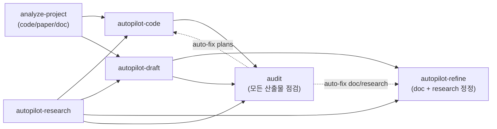
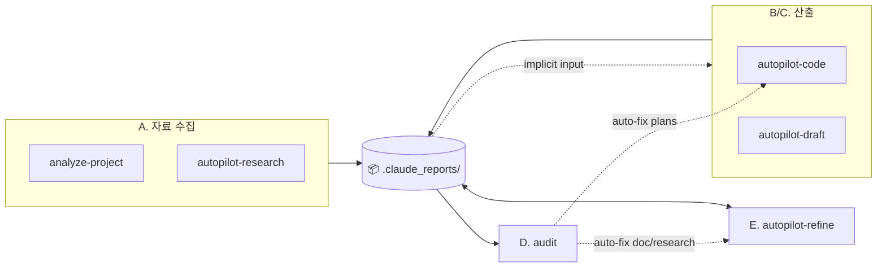

<h1 align="center">Claude Setting</h1>

<p align="center">🇺🇸 <a href="README.md">English</a></p>

> Source: `~/.claude/skills/*/SKILL.md` + `~/.claude/agents/*.md` (`/sync-skills` 자동 갱신 — 직접 편집 금지)
> Notion 대문: [Agents/Skills](https://www.notion.so/34987c2bb75380d68df4d6ce4d469bff)  ·  운영 가이드: [`notion_guide.md`](notion_guide.md)

---

## 📊 워크플로우

> Claude 는 프로젝트 루트에서 실행. `.claude_reports/` 는 현재 dir 에 생성. cross-project 는 `cd <other>` 후 별도 세션. 외부 `--refs` flag 없음 — 모든 입력은 `.claude_reports/` 영속 산출물에서 자동 발견.

### Skill 호출 흐름



5 카테고리 — **A. 사전 조사 & 분석** (`analyze-project` / `autopilot-research`) / **B. 코드 개발 & 디버그** (`autopilot-code`) / **C. 문서 작성** (`autopilot-draft`) / **D. 사후 점검** (`audit`) / **E. 사후 정정** (`autopilot-refine`).

### 산출물 I/O (`.claude_reports/` 관점)



모든 자료는 `.claude_reports/` 하위 (`analysis_project/{code,paper,doc}/`, `research/{topic}/`, `documents/{date}_{name}/`, `plans/{date}_{name}/`) 에 누적. 후속 skill 은 점선 (implicit) 으로 자동 발견. **D (audit)** 는 OUT 을 _읽기만_ 하고 (점검 + 자동 fix dispatch), **E (refine)** 는 OUT 을 _read+write_ 양방향 (수정 + 버전 누적).

> **3-tier 산출물 컨벤션** ([CONVENTIONS.md §5](CONVENTIONS.md#5-skill-output-convention-3-tier-t1t2t3)): T1 root = 메인 산출물 / T2 named subdir = 검토 자료 / T3 `_internal/` = audit·raw·versions. 사용자는 보통 T1 만 보면 됨.

산출물 위치 / scope 경계 / 자주 빠지는 함정은 글로벌 [`CLAUDE.md`](CLAUDE.md) "Drift-Free Essentials" 섹션.

---

## 🗣️ 사용 방식

입구는 두 갈래 — _자연어_ 와 _slash_. 동작은 동일.

### (1) 자연어 발화로 부르기

발화가 들어오면 메인 Claude 는 turn 첫 단계로 _skill 호출 후보 vs 직접 처리_ 를 분기 판단한다 (글로벌 [`CLAUDE.md`](CLAUDE.md) §6 Pre-check). skill 후보면 컨텍스트 (cwd / `.claude_reports/` 산출물 / 발화) 를 읽고 skill + 옵션 + task description 을 조립, **한 줄 요약 + 옵션 펼침 + 선택 근거** 로 컨펌을 묻는다. yes / 수정 ("qa thorough 로", "X 빼고") / cancel. 무응답이면 10-30 분 뒤 추천안으로 자율 진행.

ceremony 가 큰 4 개 (`autopilot-code` / `autopilot-draft` / `autopilot-research` / `autopilot-refine`) 만 컨펌 의무. `audit` / `notes` / `analyze-project` 는 즉시 invoke. 상세 룰은 글로벌 [`CLAUDE.md`](CLAUDE.md) §6.

| 사용자 발화 | 메인 Claude 컨펌 (자연어 요약) |
|---|---|
| "ICML camera-ready 마무리 도와줘" | autopilot-draft paper 모드로 camera-ready 본문 다듬기 (qa standard) |
| "이 에러 디버그해봐" | autopilot-code debug 모드로 root-cause 분석 + 수정 (qa light) |
| "diffusion 분야 최근 동향 조사해줘" | autopilot-research academic 모드, depth medium, 최근 1년 (qa light) |
| "이 문서 v2 로 정리" | autopilot-refine major-level (qa quick, 자동 apply) |
| "X 기능 새로 만들어줘" | autopilot-code dev 모드로 plan→execute→test→report (qa standard) |
| "이번 발표 자료 만들어줘" | autopilot-draft presentation 모드로 슬라이드 markdown 작성 (qa standard) |

### (2) slash 명령 직접 입력

옵션을 직접 명시하거나 컨펌을 건너뛸 때는 slash 를 그대로 친다. 직접 입력은 _의도 명시_ → 컨펌 없이 즉시 invoke. 옵션 조합·default·QA level 의미는 각 SKILL.md 의 `argument-hint` / `## Usage` (아래 §4 Skills 표 링크).

```
/autopilot-code     --mode dev|debug --qa quick|light|standard|thorough|adversarial "<task>"
/autopilot-draft    --mode paper|presentation|doc [--user-refine] "<task>"
/autopilot-research <topic> --mode academic|technology|market --depth shallow|medium|deep
/autopilot-refine   "<prompt>" [--qa ...] [--review-only | --memo <file>]
/audit              <artifact> [--scope facts|style|structure|cross-ref|coverage]
/notes              [show | add <category> <text> | resolve <hint> | decide <text>]
```

QA 5 단계 (quick / light / standard / thorough / adversarial) 정의는 [`CONVENTIONS.md`](CONVENTIONS.md) §1.

---

## 📋 Skills

| Skill | 역할 |
|---|---|
| [`analyze-project`](skills/analyze-project/SKILL.md) | code/paper/doc 자료 → `analysis_project/` 영속화 |
| [`autopilot-research`](skills/autopilot-research/SKILL.md) | 분야 조사 — mode 별 보고서 (academic/technology/market) |
| [`autopilot-code`](skills/autopilot-code/SKILL.md) | 코드 dev/debug — plan → execute → test → report |
| [`autopilot-draft`](skills/autopilot-draft/SKILL.md) | 문서 strategy + draft (paper/presentation/doc, markdown 만) |
| [`autopilot-refine`](skills/autopilot-refine/SKILL.md) | doc/research 사후 정정 — major ceremony, prompt + memo 통합 entry |
| [`audit`](skills/audit/SKILL.md) | 산출물 multi-aspect 점검 + 기본 auto-fix chain |
| [`notes`](skills/notes/SKILL.md) | per-project 메모 — `.claude_reports/NOTES.md` 단일 파일 |
| [`sync-skills`](skills/sync-skills/SKILL.md) | 본 README + 노션 대시보드 동기화 |

> sub-skill (`init-plan`, `refine-plan`, `init-doc-strategy`, `refine-doc`, `execute-plan`, `run-test`, `final-report`) 은 autopilot 내부에서 자동 호출. 사용자가 직접 부르지 않음.

세부 옵션 (`--mode`, `--qa`, `--from`, `--user-refine` 등) 은 각 SKILL.md. QA 5단계 단일 정의는 [`CONVENTIONS.md`](CONVENTIONS.md) §1.

---

## 🤝 Agents

| Agent | 모델 | 역할 |
|---|---|---|
| [기획팀](agents/plan-team.md) | opus | 구현 plan 문서 작성·갱신 (source code 기반 step-by-step) |
| [품질관리팀](agents/qa-team.md) | opus (light: sonnet) | 코드/문서/plan diff 리뷰 — 구조적 한국어 feedback (🔴/🟡/🟢) |
| [연구팀](agents/research-team.md) | opus (fact-check: sonnet) | user proxy — paper knowledge + 도메인 cross-check + audit-aligned axes |
| [테스트팀](agents/test-team.md) | opus | graduated verification tests (syntax → import → smoke → functional → integration) |
| [탐색팀](agents/browser-team.md) | sonnet | Playwright fetch (paywall/SPA) + PDF figure 추출 + reference 그림 |
| [codex-review-team](agents/codex-review-team.md) | Codex CLI (GPT-5) + opus orchestrator | 외부 hostile reader 관점 review (`--qa adversarial` 자동) |
| [개발팀](agents/dev-team.md) | sonnet | refactor / rename / cleanup — 기능 보존 우선 |
| [편집팀](agents/editorial-team.md) | opus | 사용자 영역 문서 점검·수정 (옮기기 / 다듬기 / 점검만) |

**직접 호출** — 작은 작업 / 단발성 검토는 `Agent(개발팀)` / `Agent(품질관리팀)` / `Agent(연구팀)` / `Agent(편집팀)` 등으로 autopilot 우회. plan/log 가 안 남으므로 추적 필요한 작업은 autopilot 으로.

> Notion 작업은 sub-agent 위임 X (MCP 도구 접근 제약). 메인 Claude 가 `mcp__claude_ai_Notion__*` 직접 호출 — [`notion_guide.md`](notion_guide.md).

---

## ⚙️ 운영 룰

자동 호출 패턴은 글로벌 [`CLAUDE.md`](CLAUDE.md) 가 단일 source of truth:

- **§6 autopilot-\* 호출 Pre-check** — turn 첫 단계 분기 판단 + 옵션 자동 구성 + 자연어 요약 컨펌 + §5 자율 진행 적용
- **도메인 트리거 표** — Notion 작업 / doc·research major-level 수정 / QA·model invariant 작업 / 세션 시작

ceremony 큰 autopilot-* 4 개의 자연어 trigger 신호 한눈에:

| Skill | Trigger 신호 (자연어 발화) | Default 옵션 권장값 |
|---|---|---|
| `autopilot-code` | "X 기능 만들어줘" / "X 디버그해봐" / "이 에러 고쳐줘" / 코드 변경 의도 | `--mode dev/debug` 자동 추론 · `--qa standard` (default) |
| `autopilot-draft` | "발표 자료 만들어줘" / "논문 본문 작성" / "rebuttal 응답 작성" / "보고서 작성" | `--mode paper/presentation/doc` 자동 추론 · `--qa standard` |
| `autopilot-research` | "X 분야 조사" / "동향 알려줘" / "literature review" / "표준 비교" | `--mode academic/technology/market` 자동 추론 · `--depth medium` · `--qa light` |
| `autopilot-refine` | doc/research artifact 의 major-level 수정 (3-criteria — 사용자 명시 "major"/"v{N+1}"/"전면 재작성" / 구조 ≥200 줄 / 외부 검토 직전 ceremony) | `--qa quick` (default) · 자동 apply (STRUCT 만 halt) |

각 skill 의 _상세 trigger·override 1순위·skip 조건_ 은 SKILL.md `## Default Invocation Rule` 섹션 single source — `/sync-skills` 자동 동기화.

---

## 🔁 동기화

- `/sync-skills` — 본 README + 노션 대시보드 갱신
- `/sync-skills --check` — drift 확인만

GitHub: [dmlguq456/claude_setting](https://github.com/dmlguq456/claude_setting)
