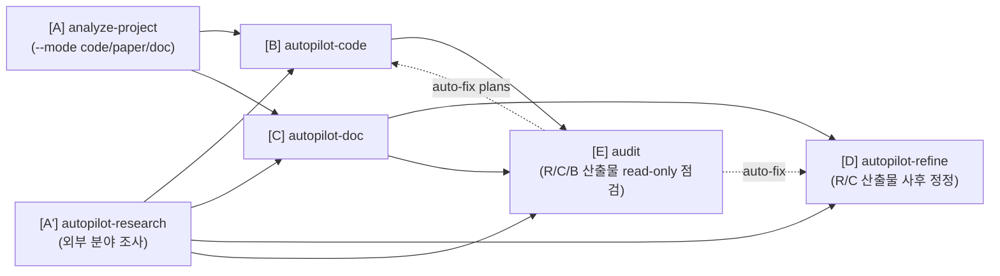
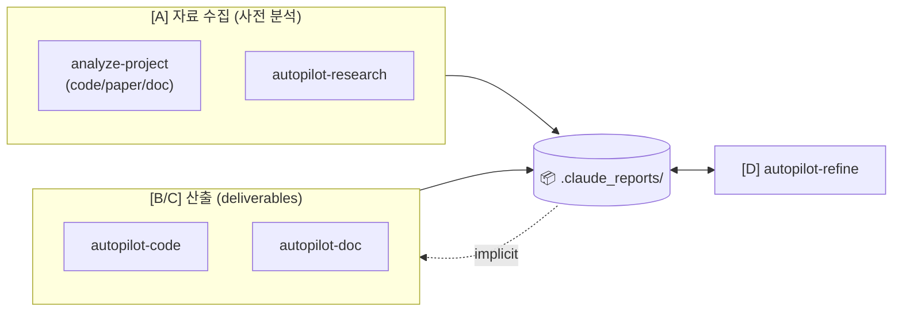
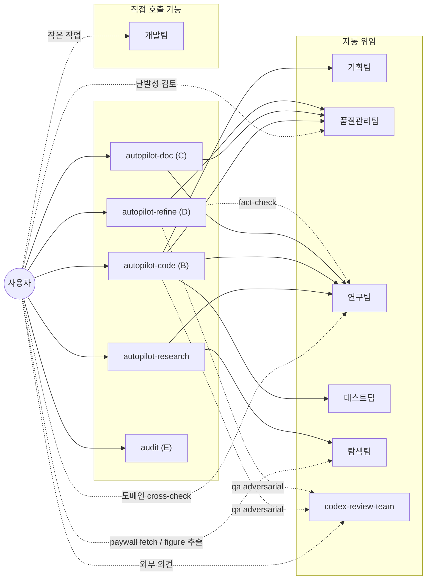

# Claude Setting

> Source: `~/.claude/skills/*/SKILL.md` + `~/.claude/agents/*.md` (`/sync-skills` 자동 갱신 — 직접 편집 금지)
> Notion 대문: [Agents/Skills](https://www.notion.so/34987c2bb75380d68df4d6ce4d469bff) (본 README와 동일 콘텐츠)
> Notion 운영 가이드: [`notion_guide.md`](notion_guide.md) (페이지 타입 템플릿 + workspace 구조)

---

## 📊 워크플로우

### Skill 호출 흐름 (어떤 skill이 어떤 skill에 자료를 넘기나)

> **Workspace 전제**: Claude는 프로젝트 루트에서 실행. `.claude_reports/`는 현재 dir에 생성. cross-project 작업은 `cd <other>` 후 별도 세션. `--refs <folder>` 같은 외부 폴더 flag는 **family에서 제거됨** — 모든 입력은 `.claude_reports/` 하위 영속 산출물에서 자동 발견.

`analyze-project`는 사전 분석을 _세 종류_로 단일 skill에서 처리:
- `--mode code` (default if 코드베이스 감지) → 모듈 매핑·interface
- `--mode paper` (명시 필요) → 논문 PDFs cards + overview
- `--mode doc` (default if doc-only 자료 감지) → reviewer comments / format templates / past samples 분류

`autopilot-research`는 _외부_ 새 조사 (검색 + 분석). `autopilot-code` / `autopilot-doc`은 위 _영속 산출물_을 implicit 자동 발견. **`autopilot-refine`은 research/doc 산출물의 사후 정정 루프(D) — prompt 또는 사용자 메모를 단일 entry로 일괄 처리**. 실제 작업 시간의 상당 부분이 여기에 들어가므로 A/B/C와 동등한 first-class 갈래로 취급. **`/audit`는 D의 read-only counterpart** — 수정 없이 facts / style / structure를 점검만 하고 보고서를 남긴다. drift 누적 후 sanity check 또는 인계 전 검수에 사용.

### 산출물 I/O (`.claude_reports/` 관점)

> 모든 skill 산출물은 `.claude_reports/` 하위에 누적: `analysis_project/{code,paper,doc}/`, `research/{topic}/`, `documents/{date}_{name}/`, `plans/{date}_{name}/`. 후속 skill은 점선(implicit)으로 자동 발견. **D(autopilot-refine)** 만 read+write 양방향 — research/doc 산출물에 prompt 또는 사용자 메모를 반영해 버전+history를 누적.
>
> **산출물 폴더 컨벤션 (3-tier)**: 각 artifact는 [SKILL_OUTPUT_CONVENTION.md](SKILL_OUTPUT_CONVENTION.md) 기준 **T1 (root)** = entry/메인 산출물 (`pipeline_summary.md`, `draft/`, `00_briefing.md`, research chapters `01_*.md~NN_*.md`은 root flat 배치) / **T2 (named subdir)** = 필요 시 검토 (`strategy/`, `analysis/`, `cards/`, `dev_logs/`, `test_logs/`) / **T3 (`_internal/` 격리)** = audit·raw·versions (reviewer 로그, search_results.json 같은 raw metadata, 버전 스냅샷). 사용자는 보통 T1만 보면 됨.

> **산출물 사후 수정 (D)**: research/doc 산출물의 routine 정정·refine은 모두 `/autopilot-refine`이 단일 진입. **prompt-driven** — `/autopilot-refine "<prompt>"`로 자연어 요청, artifact는 키워드 fuzzy match로 자동 식별, diff preview 후 적용. **memo-driven** — 산출물에 직접 적어둔 `<!-- memo: ... -->` 또는 별도 memo 파일을 `/autopilot-refine --memo <file>`로 일괄 반영 (deferred review용). 적용 시 버전 스냅샷 + `pipeline_summary.md`에 통합 history 누적. 기본 `--qa quick`. code 산출물은 D 대상이 아님 — `/refine-plan` / `/autopilot-code` 사용.

---

## 🧭 활용 갈래 — 5 카테고리

네 갈래는 **독립적으로** 사용. "논문 한 줄짜리 라이프사이클"이 아니라 다양한 코드·문서 산출물을 각각 만들고, 그중 **C 산출물(과 A의 research 보고서)** 은 **D**로 반복 polish (B의 code는 `/refine-plan`, A의 `analyze-project`는 같은 명령 재실행으로 갱신). 갈래 간 chaining은 `.claude_reports/` 영속 산출물의 _implicit_ 인지로 처리 (`--refs` flag 없음).

### A. 사전 조사 & 분석 (input gathering)

조사·분석 결과는 후속 갈래(B/C)에서 _implicit_으로 자동 인지.

| 입력 | skill | 산출 |
|---|---|---|
| 외부 분야 조사 — 논문 / 기술표준 / 시장 동향 | `/autopilot-research <주제> --mode academic\|technology\|market` | `research/{topic}/` — 9 / 7 / 5개 markdown 보고서 |
| 보유한 논문 PDF 정독 | `/analyze-project --mode paper` | `analysis_project/paper/` — 논문별 cards + overview |
| 기존 코드베이스 파악 | `/analyze-project [--mode code]` | `analysis_project/code/` — 모듈 매핑 + 구조 분석 |
| 기타 doc 자료 (리뷰어 코멘트, 템플릿, 회의록 등) | `/analyze-project --mode doc <folder>` | `analysis_project/doc/{name}/` — 분류된 인덱스 |

### B. 코드 개발 & 감사 (code deliverables)

**연구 실험뿐 아니라 실제 서비스 / 제품 / 라이브러리 / 사이드 프로젝트 / CI·빌드 도구** 개발에도 동일하게 사용. task description만 명확하면 도메인 무관.

| 작업 | skill | 산출 |
|---|---|---|
| 새 기능 / 신규 모듈 개발 (plan → execute → test) | `/autopilot-code --mode dev --user-refine "<task>"` | `plans/{date}_{name}/` — 코드 + dev/test logs |
| 사후 감사 (지난 변경의 risk / quality 점검) | `/audit <plan> --scope all` (또는 `--report-only`로 점검만) | audit log + auto-fix chain (plans → `autopilot-code --mode dev`) |
| 디버그 (에러·로그 기반 root-cause 추적) | `/autopilot-code --mode debug "<error>"` | debug log + 원인 + fix |

### C. 문서 작성 (document deliverables)

모든 모드 공통 패턴: **strategy + draft markdown** 산출 → 사용자가 최종 작성·빌드·디자인 마무리. 산출물은 `documents/{date}_{name}/`. **첫 positional arg = `<task description>`** (research/code와 동일하게 작업의 _구체적 의도·목표·범위_를 한 줄로). 입력 자료는 `analyze-project --mode {paper,doc}` 또는 `autopilot-research`로 사전 분석된 `.claude_reports/` 영속 산출물에서 _implicit 자동 발견_.

| 모드 | 용도 (예시) | 명령 |
|---|---|---|
| `write` | 논문 / camera-ready / 백서 / 기술 블로그 / 책 챕터 / 일반 글쓰기 | `/autopilot-doc "<task: 무슨 글, 어떤 청중, 어떤 메시지>" --mode write [--format-ref <venue_paper_template>] --user-refine` |
| `presentation` | 논문 발표 / 사내 세미나 / 컨퍼런스 키노트 / 데모 데이 / 강의 | `/autopilot-doc "<task: 발표 주제, 청중, 시간>" --mode presentation [--format-ref <slide_template>] --user-refine` |
| `rebuttal` | 학회 reviewer 응답 (사전 `/analyze-project --mode doc <reviewer_folder>` 필수) | `/autopilot-doc "<task: paper 제목, 학회·라운드, 강조점>" --mode rebuttal [--format-ref <venue_rebuttal_guidelines>] --user-refine` |
| `review` | 본인이 reviewer 입장 (peer review) — venue review form REQUIRED | `/autopilot-doc "<task: paper 제목, 평가 관점>" --mode review --format-ref <venue_review_template> --user-refine` |
| `proposal` | 연구 grant (NRF/NSF) / 사업 제안 / 내부 프로젝트 제안 | `/autopilot-doc "<task: 무엇을 제안, 누구에게>" --mode proposal [--format-ref <funding_body_template>] --user-refine` |
| `report` | 기술 보고서 / 시장 분석 / 분기 보고 / 사고 분석 (post-mortem) | `/autopilot-doc "<task: 무엇에 대한 보고, 청중>" --mode report [--format-ref <internal_template>] --user-refine` |

> **`--format-ref <path>`**: 학회·저널·랩별 가이드라인/템플릿/샘플 path. 생략 시 `analysis_project/doc/{matching}/formats/`에서 자동 탐색. `review`만 hard-fail, 나머지는 generic 진행. 상세는 [autopilot-doc/SKILL.md](skills/autopilot-doc/SKILL.md).

### D. 사후 정정 & refine (post-production polish)

**C로 만든 문서가 한 번에 끝나는 일은 거의 없다** — 챕터 톤 다듬기, 표/숫자 교정, reviewer-style 의견 반영, 부분 wording 수정 같은 _routine한 사후 정정_이 실제 작업 시간의 큰 비중. D는 **C 산출물**과 **A의 `autopilot-research` 보고서** 사후 정정 루프로, `/autopilot-refine` 단일 entry가 prompt와 사용자 메모 두 입력을 모두 받음.

| 입력 형태 | 명령 | 비고 |
|---|---|---|
| chat에서 자연어 prompt | `/autopilot-refine "<prompt>"` | artifact는 prompt 키워드 fuzzy match로 자동 식별. diff preview 후 confirm. |
| 산출물에 직접 적어둔 메모 (`<!-- memo: ... -->` 또는 별도 file) | `/autopilot-refine --memo <file>` | deferred review — 산출물 읽으며 적어둔 메모를 일괄 반영. |
| 적용 없이 검수만 | `/autopilot-refine "<prompt>" --review-only` | 제안 diff만 보고 종료. |

- **D 대상**: `.claude_reports/documents/*` (C 산출물) + `.claude_reports/research/*` (A의 `autopilot-research` 산출물).
- **D 비대상** — 다른 갈래는 다른 메커니즘으로 사후 수정:
  - **A의 `analyze-project`** — 입력 자료가 바뀌면 _같은 명령을 한 번 더 돌리면 자동 재생성·업데이트_. 별도 refine 루프 불필요.
  - **B (autopilot-code)** — code 산출물의 사후 수정은 `/refine-plan` 또는 `/autopilot-code`로.
- **버전 + 이력**: 적용 시 `_internal/versions/v{N}/` 스냅샷 + `pipeline_summary.md`에 통합 history 누적 (별도 CHANGELOG 없음).
- **QA**: 기본 `--qa quick` (1-pass, 가장 빠름). 중요한 산출물은 `light` (reviewer 1×) → `standard` (+ fact-checker) → `thorough` (reviewer 2× parallel + fact-checker).

> **왜 first-class인가**: C/A-research의 "초안 생성"과 D의 "정련"은 작업 성격·시간 비중 모두 다름. 실무에서는 D를 5-20회 반복하는 게 일반적이므로 autopilot family의 4번째 갈래로 격상. memo든 prompt든 진입점은 `/autopilot-refine` 하나로 통일 — `refine-doc`은 그 sub-skill로 흡수됨.

### E. 사후 점검 — 읽기만 (post-production audit)

`/audit`는 산출물을 **수정하지 않고** facts / style / structure / cross-ref 다각도 점검만 수행. 누적 drift가 의심되거나 인계 전 sanity check가 필요할 때.

| 입력 형태 | 명령 | 비고 |
|---|---|---|
| 산출물 경로 또는 fuzzy 이름 | `/audit <artifact_path>` | type 자동 인식 (plans/research/documents). 보고서를 `_internal/audit/`에 기록. 🔴/🟡 issue 발견 시 Stage E에서 fix skill 자동 트리거. |
| 특정 측면만 | `/audit <artifact> --scope facts\|style\|structure\|cross-ref\|coverage` | facts = 모델·venue·year cards 대조 (section-context cross-check) / style = 양식 일관성 / structure = T1/T2/T3 컨벤션 / cross-ref = 인용 깨짐 / coverage = cards 중 한 번도 인용되지 않은 orphan 검출 (omission 방지) |
| Code plan static-only 점검 | `/audit <plan> --read-only` | 테스트 실행 없이 정적 점검만 (test_report.md 읽기만) |
| 점검만, auto-fix chain 없이 | `/audit <artifact> --report-only` | Stage E skip — 보고서만 출력하고 종료. 인계 전 검수 등 즉시 수정 없이 확인만 할 때 사용. |

- **D vs E 차이**: `autopilot-refine` = 수정 흐름 (diff → confirm → apply + version). `/audit` = 점검 후 기본값 auto-fix chain. Stage A-D는 read-only; Stage E는 🔴/🟡 issue 발견 시 fix skill 자동 트리거. 점검만 하려면 `--report-only`.
- **언제 사용**: (a) C 산출물을 20회+ refine한 후 누적 drift 점검 / (b) 다른 사람이 만든 artifact 인계 전 검수 / (c) plan 종료 후 가벼운 static-only 점검.

> **Auto-fix chain (default)**: `/audit` 호출 시 🔴/🟡 issue 발견되면 _자동으로_ 다음 skill 트리거 — plans는 `autopilot-code --mode dev`, research/documents는 `autopilot-refine`. 점검만 하려면 `--report-only` 옵션 추가.

### 자주 쓰는 chaining 패턴

- **A → C**: `autopilot-research <topic>` → `research/{topic}/` 생성 → autopilot-doc이 implicit 인지
- **A → B**: 코드베이스 분석(`analyze-project [--mode code]`) + 외부 표준 조사 → autopilot-code plan 단계 자동 인지
- **B → C**: autopilot-code dev/audit 결과 → autopilot-doc `report`/`write`로 narrative화 (plans/dev_logs 자동 인지)
- **외부 (사용자 본인 자료)**: 실험 결과·표·그림·데이터를 _분석 가능한 형태_로 폴더에 모은 뒤 `analyze-project --mode doc <folder>` 1회 → autopilot-doc이 자동 인지

> **`--user-refine` 패턴**: dev/doc 모드에서 연구팀 메모 직후 pause → 사용자가 직접 `<!-- memo: ... -->` 추가 → 출력된 `--from <stage>` 명령으로 재개. 미세 컨트롤이 필요할 때.

---

## 🎯 Agent 직접 호출 — autopilot 우회 패턴

매번 autopilot 풀파이프를 돌릴 필요는 없습니다. 작은 작업·단발성 검토는 agent를 직접 부르는 게 빠릅니다.

| 상황 | 직접 호출 | autopilot 대비 |
|---|---|---|
| 코드 한 블록 정리·rename | `Agent(개발팀)` | plan 안 만들어도 됨 |
| 작성 중인 발표자료/논문 초안 **타당성·논리 검토** | `Agent(연구팀)` | research artifact 안 만들고 cross-check만 |
| 코드/문서 **diff 단발성 리뷰** | `Agent(품질관리팀)` | run-test loop 없이 리뷰만 |
| 외부 의견(Codex) 빠른 추가 | `Agent(codex-review-team)` | `--qa adversarial`보다 가볍게 |
| **노션 페이지·DB 갱신, 실험 결과 로깅** | 메인 컨텍스트에서 Notion MCP 도구 직접 호출 ([`notion_guide.md`](notion_guide.md) 참조) | sub-agent X (MCP 도구 접근 제약) |
| 특정 paywall 논문 1편 fetch | `Agent(탐색팀)` | autopilot-research 안 돌리고 단발성 |
| **PDF figure 일괄 추출** (paper PDFs → PNG figures) | `Agent(탐색팀, mode="extract_pdf_figures")` | research/{topic}/figures/ 또는 documents/{...}/assets/figures/에 PNG + figure_index.md 적층 |
| **인터넷 reference 그림 검색** (스타일 참고용) | `Agent(탐색팀, mode="web_reference")` | URL + caption + (옵션) image binary fetch. 저작권 fair use 안내 |
| **산출물 다각도 read-only 점검** (facts/style/structure cross-check, 수정 없음) | `/audit <artifact>` skill | autopilot-refine과 달리 _수정 없음_. 누적 drift 점검·인계 전 검수에 사용 |
| 단계별 테스트만 실행 | `/run-test <plan>` skill | autopilot-code 전체 X |
| **이미 만든 research/doc 산출물 정정 (D)** | `/autopilot-refine "<prompt>"` 또는 `/autopilot-refine --memo <file>` skill | prompt·memo 동일 entry. diff preview 후 confirm, 버전+history 자동 누적. artifact는 prompt fuzzy match로 식별. |

**원칙**: agent 단독 호출은 **plan/log 산출물이 남지 않으므로** 그때그때만 쓰고, 추적이 필요한 작업은 autopilot으로. 기획팀은 직접 호출 거의 X — `/init-plan` 사용.

---

## 📋 Skills

| Skill | 역할 | 주요 옵션 |
|---|---|---|
| `analyze-project` | 사전 분석 — code/paper/doc 자료를 `analysis_project/`에 영속화 (모든 후속 autopilot의 implicit input source) | `--mode code/paper/doc` (생략 시 code/doc 자동 감지; paper는 명시 필요) · `[<scope/target/input-folder>]` · `--skip-qa` |
| `autopilot-research` | 분야 조사 — mode별 보고서 (academic 9 / technology 7 / market 5) | `--mode academic/technology/market` · `--depth shallow/medium/deep` · `--qa quick/light/standard/thorough` · `--from search/analyze/report` · `--no-clarify` |
| `autopilot-code` | 코드 dev/debug | `--mode dev/debug` · `--qa quick/light/standard/thorough/adversarial` · `--from plan/refine/execute/test/report` · `--user-refine` |
| `autopilot-doc` | 문서 strategy + draft (markdown). 입력은 `analysis_project/{paper,doc}/` + `research/{topic}/` 자동 발견 | `--mode rebuttal/write/review/report/proposal/presentation` · `--format-ref <path>` (생략 시 `analysis_project/doc/{matching}/formats/`에서 자동 탐색) · `--qa quick/light/standard/thorough` · `--from analyze/strategy/strategy-refine/draft/draft-refine/finalize` · `--user-refine` · `--no-clarify` |
| `autopilot-refine` | **갈래 D** — research/doc 산출물 사후 정정. prompt와 사용자 메모 두 입력을 통일된 entry로 처리. artifact는 fuzzy match로 자동 식별. | `"<prompt>"` 또는 `--memo <file>` · `--qa quick(default)/light/standard/thorough/adversarial` · `--review-only` (검수만) |
| `audit` | **갈래 E** — multi-aspect 점검 + 기본 auto-fix chain. plans/research/documents 자동 인식, type별 aspect set (facts/style/structure/cross-ref/coverage or cards 정합성/Tier/coverage/cross-card or test/lint/code-review/TODO). Stage A-D read-only; Stage E는 issue 발견 시 자동으로 fix skill 트리거. | `<artifact_path>` · `--scope facts/style/structure/cross-ref/coverage/all` (default all) · `--read-only` (plans 정적-only) · `--report-only` (Stage E skip, 점검만) |
| `sync-skills` | 본 README + 노션 대시보드 동기화 | `--check` · `--readme-only` · `--notion-only` · `--force` |

> sub-skill (`init-plan`, `refine-plan`, `init-doc-strategy`, `refine-doc`, `execute-plan`, `run-test`, `final-report`)은 autopilot 내부에서 자동 호출 — 직접 사용은 pause 재개 시점에만. `autopilot-refine`은 autopilot family의 **4번째 갈래(D)** — 사후 정정 전용 top-level skill로, prompt와 memo 두 입력 형태를 단일 entry로 처리 (`refine-doc`은 그 sub-skill로 흡수).

### 핵심 옵션 4가지

- **`--user-refine`** (autopilot-code dev / autopilot-doc) — 연구팀 메모 직후 pause. 같은 문서에 `<!-- memo: ... -->`를 직접 추가한 뒤 출력된 `--from <stage>` 명령으로 재개.
- **`--from <stage>`** — pause 또는 중간 실패 후 특정 단계부터 재개. stage 이름은 위 표.
- **`--qa quick/light/standard/thorough/adversarial`** — 리뷰 강도.
  - `quick` (NEW): **fastest path** — refine 단계 전부 skip + QA review loop **1라운드** 강제 종료 (issue 잔존 시에도 unresolved.md / 미해결 이슈 섹션에만 기록 후 통과). autopilot-code는 test-failure 시 retry도 skip. `--user-refine`은 silently ignored. autopilot 종료 후 `/autopilot-refine`으로 따로 사후 수정 권장. (`autopilot-refine`의 default qa도 quick.)
  - `light`: quality reviewer 1× (sonnet) 단독.
  - `standard`+: doc/research 파이프라인은 quality reviewer (opus) **+ fact-checker (sonnet, parallel)** — fact-checker는 cards/PDFs verbatim 대조로 venue/year/metric/citation 검증을 narrow하게 수행. autopilot-code는 fact-checker 없음.
  - `thorough`: doc은 quality 2× parallel + fact-checker 1× / research도 동일 / code는 quality 2× parallel.
  - `adversarial` (autopilot-code, autopilot-refine): standard + Codex 외부 리뷰 추가 (`Agent(codex-review-team)`이 제안된 변경에 대해 hostile reader 역할). camera-ready / grant / public rebuttal 같이 외부 검증이 강한 산출물 전용.
- **`--no-clarify`** (autopilot-research / autopilot-doc) — Step 0 Scope Clarification 강제 skip. 모호한 query라도 사전 질문 없이 즉시 진행.
- **`/audit <artifact>`** — 사후 점검 (read-only). facts/style/structure 다각도 lint, 보고서만, 수정 X. autopilot-refine 호출 _전_에 한 번 돌려 drift 파악 권장.

> **Step 0 Scope Clarification**: query가 모호하거나 mode multi-match일 때 autopilot이 2-4개 sharp question을 던지고 사용자 답변을 받아 진행. 충분히 구체적인 query는 자동 skip. 매번 묻지 않으니 부담 없음.

---

## 🤝 Agents

| Agent | 모델 | 자동 호출자 | 사용자 직접 호출 시 |
|---|---|---|---|
| 기획팀 (plan-team) | opus | init-plan / refine-plan | 거의 없음 (init-plan 통해서) |
| 품질관리팀 (qa-team) | opus | 모든 autopilot의 review loop | 단발성 코드/문서 diff 리뷰 |
| 연구팀 (research-team) | opus | autopilot-research / -code / -doc / -refine (standard+ fact-check) | 단발성 도메인 cross-check, 발표자료 타당성 검토 |
| 테스트팀 (test-team) | opus | run-test | 보통 `/run-test` skill로 |
| 탐색팀 (browser-team) | sonnet | autopilot-research | 단발성 paywall 페이지 fetch · PDF figure 일괄 추출 (`extract_pdf_figures`) · reference 그림 검색 (`web_reference`) |
| codex-review-team | opus | `--qa adversarial` | 단발성 Codex 외부 의견 |
| 개발팀 (dev-team) | sonnet | (autopilot 내부) | **작은 리팩토링/정리** ("이 함수 이름 바꿔줘") |

> **Notion 작업**은 sub-agent로 위임하지 않음 — sub-agent runtime의 MCP 도구 접근 제약 때문. 메인 컨텍스트에서 `mcp__claude_ai_Notion__*` 도구를 직접 호출하고, 운영 가이드는 [`notion_guide.md`](notion_guide.md) 참조.

호출 구조 다이어그램

---

## 🔁 동기화

- `/sync-skills` — README + 노션 대시보드 갱신
- `/sync-skills --check` — drift 확인만 (쓰기 X)

GitHub: [dmlguq456/claude_setting](https://github.com/dmlguq456/claude_setting)
