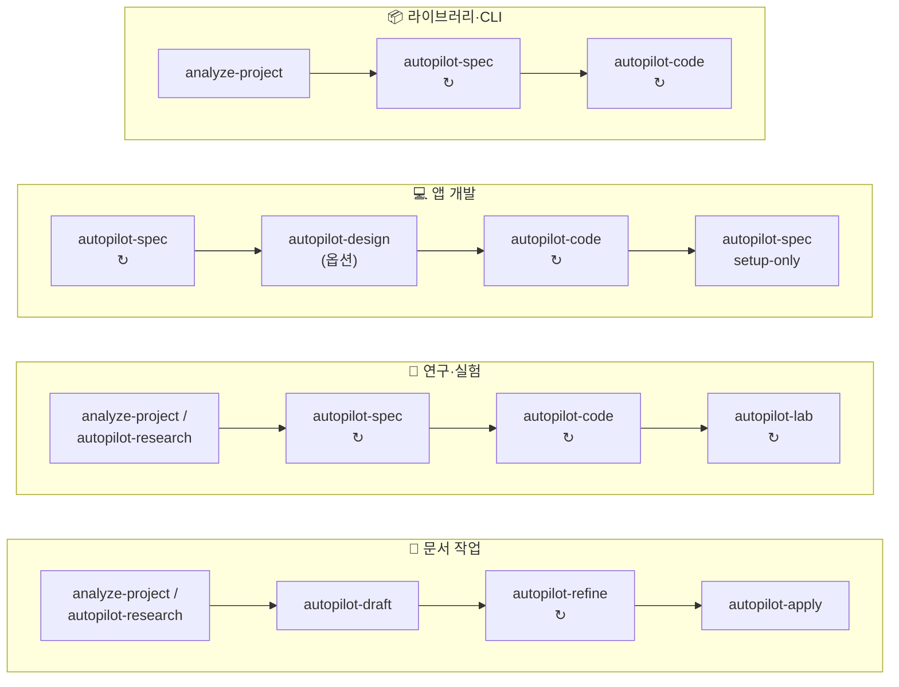
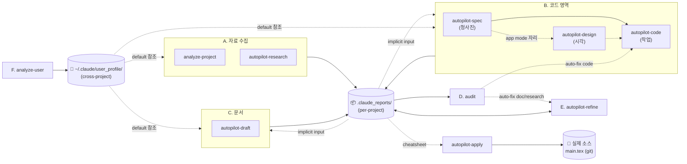

<div align="center">

# ⚙️ Claude Setting

**Claude Code 워크플로우 — skill · agent · 운영 규칙의 단일 출처**

[워크플로우](#-워크플로우) · [사용 방식](#-사용-방식) · [Skills](#-skills) · [Agents](#-agents) · [운영 룰](#-운영-룰) · [동기화](#-동기화)

<sub>Notion 대문: <a href="https://www.notion.so/34987c2bb75380d68df4d6ce4d469bff">Agents/Skills</a> &nbsp;·&nbsp; 운영 가이드: <a href="notion_guide.md"><code>notion_guide.md</code></a></sub>

</div>

---

## 📊 워크플로우

> Claude 는 프로젝트 루트에서 실행. `.claude_reports/` 는 현재 dir 에 생성. cross-project 는 `cd <other>` 후 별도 세션. 외부 `--refs` flag 없음 — 모든 입력은 `.claude_reports/` 영속 산출물에서 자동 발견.

### 🧭 처음이라면 — 도메인별 트랙

이름만으로 문서용인지 코드용인지 헷갈릴 때, 작업 종류별 _순서_ 로 보면 빠르다.

| 트랙 | 단계 순서 (왼쪽 → 오른쪽) | 각 단계가 만드는 것 |
|---|---|---|
| **📄 문서 작업** (논문·보고서·발표·rebuttal) | `analyze-project`/`autopilot-research` → `autopilot-draft` → `autopilot-refine` → `autopilot-apply` | 자료 영속화 → markdown 초안·cheatsheet → 정정 (반복) → 실제 `main.tex` 반영 + 컴파일 |
| **🔬 연구·실험** (ML 실험·연구 코드) | `analyze-project`/`autopilot-research` → `autopilot-spec` (ref ckpt inference 검증 포함) → `autopilot-code` (baseline 학습 가능 코드 완성) → `autopilot-lab` (baseline 학습 + variation 실험 반복) | 자료 → 청사진·skeleton → 실제 logic 구현 → baseline + variation 실험 (반복) |
| **💻 앱 개발** | `autopilot-spec` → `autopilot-design` (옵션) → `autopilot-code` → `autopilot-spec --mode setup-only` | PRD·skeleton → 시각 → 앱 코드 (반복) → 배포 셋업 |
| **📦 라이브러리·CLI 정돈·공개** | `analyze-project` → `autopilot-spec` → `autopilot-code` | 분석 → 청사진·skeleton → 공개용 코드 (반복) |
| **🔍 점검·정정** (모든 트랙 공통, 사후) | `audit` (읽기 전용 점검) · `autopilot-refine` (markdown 정정) · `autopilot-apply` (cheatsheet → 실제 소스) | 점검 보고 / 버전 정정 / 소스 적용 |
| **👤 사용자 프로필** (cross-project) | `analyze-user` · `notes --scope user` | `~/.claude/user_profile/` — 모든 트랙이 default 로 참조 |



**이름 읽는 법** — prefix·동사로 도메인 구분:
- `analyze-project` / `analyze-user` — _사전 분석_ (입력 자료·사용자 자료 영속화)
- `autopilot-research` — _분야 조사_ (어느 트랙이든 공통 사전)
- `autopilot-draft` — 문서 _초안_ (markdown·cheatsheet) / `autopilot-apply` — 그 cheatsheet 를 _실제 소스_ (`main.tex`) 에 적용
- `autopilot-refine` — `.claude_reports/` markdown _정정_ (제자리 수정)
- `autopilot-spec` — 코드 _청사진_ / `autopilot-code` — 코드 _작업_ (생성·디버그) / `autopilot-lab` — _실험_ prototype
- `autopilot-design` — _시각_ 산출물 / `audit` — 읽기 전용 _점검_

<details>
<summary>📐 <b>전체 Skill 호출 그래프</b> &nbsp;— A→F 6 카테고리 의존 관계 (펼치기)</summary>

```mermaid
flowchart LR
    subgraph UP["F. 사용자 프로필 (cross-project)"]
        AU["analyze-user<br/>(figure/writing/...)"]
        NT["notes --scope user"]
    end
    ANA["analyze-project<br/>(code/paper/doc)"]
    RES["autopilot-research<br/>(academic/tech/market)<br/>↻"]
    SPEC["autopilot-spec<br/>(app/library/api/cli/research)<br/>↻"]
    CODE["autopilot-code<br/>(spec mode 자동 분기)<br/>↻"]
    LAB["autopilot-lab<br/>(실험 prototype)<br/>↻"]
    DOC["autopilot-draft"]
    DES["autopilot-design<br/>(시각)<br/>↻"]
    REF["autopilot-refine<br/>(doc + research 정정)"]
    APP["autopilot-apply<br/>(cheatsheet → 실제 소스)"]
    AUD["audit<br/>(모든 산출물 점검)"]
    ANA --> SPEC
    ANA --> DOC
    ANA -->|실험 자료 4 종| LAB
    RES --> SPEC
    RES --> DOC
    RES --> REF
    SPEC --> CODE
    SPEC -.->|research scaffold (옵션)| LAB
    SPEC -.->|app mode 자리| DES
    DES -.->|컴포넌트·토큰| CODE
    LAB -->|졸업·라이브러리화| CODE
    CODE -.->|영향 큰 자리 자동 incremental| ANA
    DOC --> REF
    DOC -->|cheatsheet| APP
    REF -.->|정정된 cheatsheet| APP
    RES --> AUD
    DOC --> AUD
    CODE --> AUD
    SPEC --> AUD
    LAB --> AUD
    AUD -.->|auto-fix doc/research| REF
    AUD -.->|auto-fix code| CODE
    AU -.->|user_profile 참조| CODE
    AU -.->|user_profile 참조| SPEC
    AU -.->|user_profile 참조| DOC
    AU -.->|user_profile 참조| RES
    NT -.->|append 사용자 메모| AU
```

6 카테고리 — **A. 사전 조사 & 분석** (`analyze-project` / `autopilot-research`) / **B. 코드 영역** (`autopilot-spec` 청사진 + `autopilot-code` 작업) / **C. 문서 작성** (`autopilot-draft`) / **D. 사후 점검** (`audit`) / **E. 사후 정정** (`autopilot-refine`) / **F. 사용자 프로필** (`analyze-user` / `notes --scope user`, cross-project).

F 는 _현 프로젝트 산출물_ 이 아닌 _사용자 cross-project 자료_ 를 만든다 (`~/.claude/user_profile/`). A-E 의 모든 skill 과 sub-agent 가 _작업 시작 자리_ 에서 user_profile 을 Read 해 default 로 따름. 본 폴더는 점선 (implicit reference) 으로 표시.

</details>

<details>
<summary>📦 <b>산출물 I/O 그래프</b> &nbsp;— per-project vs cross-project (펼치기)</summary>



**per-project (`.claude_reports/`)** — `analysis_project/{code,paper,doc}/`, `research/{topic}/`, `documents/{date}_{name}/`, `plans/{date}_{name}/` 에 누적. 후속 skill 은 점선 (implicit) 으로 자동 발견. **D (audit)** 는 OUT 을 _읽기만_ (점검 + 자동 fix dispatch), **E (refine)** 는 OUT 을 _read+write_ 양방향.

**cross-project (`~/.claude/user_profile/`)** — analyze-user 가 6 aspect 파일 (`01_paper_figure_style.md` ~ `06_collaboration_style.md`) 누적. 모든 sub-agent 가 작업 시작 자리에서 default 로 Read (점선). 사용자 짧은 메모는 `/notes --scope user <aspect>` 가 같은 파일의 `## 사용자 수동 메모` 절에 append (별도 NOTES.md 두지 않음).

</details>

> **3-tier 산출물 컨벤션** ([CONVENTIONS.md §5](CONVENTIONS.md#5-skill-output-convention-3-tier-t1t2t3)): T1 root = 메인 산출물 / T2 named subdir = 검토 자료 / T3 `_internal/` = audit·raw·versions. 사용자는 보통 T1 만 보면 됨.

산출물 위치 / scope 경계 / 자주 빠지는 함정은 글로벌 [`CLAUDE.md`](CLAUDE.md) "Drift-Free Essentials" 섹션.

---

## 🗣️ 사용 방식

입구는 두 갈래 — _자연어_ 와 _slash_. 동작은 동일.

### (1) 자연어 발화로 부르기

발화가 들어오면 메인 Claude 는 turn 첫 단계로 _skill 호출 후보 vs 직접 처리_ 를 분기 판단한다 (글로벌 [`CLAUDE.md`](CLAUDE.md) §6 Pre-check). skill 후보면 컨텍스트 (cwd / `.claude_reports/` 산출물 / 발화) 를 읽고 skill + 옵션 + task description 을 조립, **한 줄 요약 + 옵션 펼침 + 선택 근거** 로 컨펌을 묻는다. yes / 수정 ("qa thorough 로", "X 빼고") / cancel. 무응답이면 10-30 분 뒤 추천안으로 자율 진행.

ceremony 가 큰 9 개 (`autopilot-code` / `autopilot-spec` / `autopilot-lab` / `autopilot-draft` / `autopilot-design` / `autopilot-research` / `autopilot-refine` / `autopilot-apply` / `analyze-user`) 만 컨펌 의무. `audit` / `notes` / `analyze-project` 는 즉시 invoke. 상세 룰은 글로벌 [`CLAUDE.md`](CLAUDE.md) §6.

| 사용자 발화 | 메인 Claude 컨펌 (자연어 요약) |
|---|---|
| "ICML camera-ready 마무리 도와줘" | autopilot-draft paper 모드로 camera-ready 본문 다듬기 (qa adversarial — high-stakes ceremony) |
| "이 에러 디버그해봐" | autopilot-code debug 모드로 root-cause 분석 + 수정 (qa standard) |
| "diffusion 분야 최근 동향 조사해줘" | autopilot-research academic 모드, depth medium, 최근 1년 (qa thorough) |
| "이 문서 v2 로 정리" | autopilot-refine major-level (qa thorough, 자동 apply) |
| "X 기능 새로 만들어줘" | autopilot-code dev 모드 (specs/ 자리면 spec mode 별 분기 — app/library/cli/research 자동) |
| "할 일 앱 만들고 싶어, PRD 부터" | autopilot-spec app 모드 (PRD + 스택 + scaffolding + skeleton) |
| "TF-Restormer 학회 공개 코드로 정돈" | autopilot-spec auto → research,cli 추론 (PRD + scaffold 통일 — train.py / eval.py / config skeleton, 중간 컨펌 default) |
| "Conformer ASR baseline 시작" / "Whisper fine-tuning 환경 잡아줘" | autopilot-spec research,cli (외부 ref repo 자동 fetch + Phase 1.5 pretrained ckpt 사전 검증 + skeleton — 중간 컨펌 default) |
| "lr 1e-3 → 3e-4 비교" / "MDTA 빼고 ablation" / "X 모델 prototype 빨리" | autopilot-lab ml 모드 (직전 RUNLOG + similar_models 자동 참조, qa light) |
| "Vercel 에 올리자" / "env 변경" | autopilot-spec setup-only 모드 (ship 첫 setup / env / domain / migration deploy 안내) |
| "이번 발표 자료 만들어줘" | autopilot-draft presentation 모드로 슬라이드 markdown 작성 (qa thorough) |
| "내 figure 스타일 분석해줘" / "발표 자료들 보고 프로필 갱신" | analyze-user figure (또는 all) — incremental update (qa adversarial 고정) |

### (2) slash 명령 직접 입력

옵션을 직접 명시하거나 컨펌을 건너뛸 때는 slash 를 그대로 친다. 직접 입력은 _의도 명시_ → 컨펌 없이 즉시 invoke. 옵션 조합·default·QA level 의미는 각 SKILL.md 의 `argument-hint` / `## Usage` (아래 §4 Skills 표 링크).

```
/autopilot-research <topic> --mode academic|technology|market --depth shallow|medium|deep [--qa ...] [--from search|analyze|report]
/analyze-project    [--mode code|paper|doc] [<scope/target/input-folder>] [--skip-qa]
/autopilot-code     --mode dev|debug "<task/error>" [--from <step>] [--qa ...] [--user-refine]
/autopilot-spec     "<task>" [--mode auto|app|library|api|cli|research (콤마로 다중) | setup-only] [--qa ...] [--user-refine]
/autopilot-lab      "<task>" [--mode ml|script|auto] [--ref <similar-model-path>] [--qa ...] [--from spec|scaffold|run|summary]
/autopilot-design   "<design task or app path>" [--scope ui|slide|icon|diagram|mixed] [--from <phase>] [--qa quick|standard|thorough]
/autopilot-draft    --mode paper|presentation|doc "<task>" [--qa ...] [--user-refine] [--from <stage>]
/autopilot-refine   "<prompt>" [--qa ...] [--review-only | --memo <file>] [--no-fact-check] [--no-style-audit]
/analyze-user       <aspect> [--source <path>] [--mode init|update] [--user-refine]
/audit              <artifact> [--scope auto|facts|style|structure|cross-ref|coverage|all] [--read-only] [--report-only] [--no-fact-check]
/notes              [show | init | add <category> <text> | resolve <hint> | decide <text> | handoff [--no-confirm]] [--scope project|user [<aspect>]]
```

> **autopilot-* 의 3 가지 흐름** (자세한 청사진: [`AUTOPILOT_FLOWS.md`](AUTOPILOT_FLOWS.md))
>
> - **연구개발** — `autopilot-research / analyze-project` → (옵션) `autopilot-spec --mode research,cli` (skeleton + 외부 ref repo fetch·ckpt 검증) → `autopilot-lab` (실험 반복) → (졸업 시) `autopilot-code` (구현·라이브러리화)
> - **문서작업** — `autopilot-research / analyze-project` → `autopilot-draft` → `autopilot-refine` (반복) → `autopilot-apply` (cheatsheet → 실제 LaTeX 소스 적용·컴파일)
> - **앱개발** — `autopilot-research / autopilot-spec --mode app` → `autopilot-design` (옵션) → `autopilot-code` (app spec mode 자동, 반복) → `autopilot-spec --mode setup-only` (ship 첫 setup·env·domain)
> - **라이브러리·CLI 정돈·공개** — `analyze-project` → `autopilot-spec --mode library,cli` (또는 auto) → `autopilot-code` (반복)

QA 5 단계 (quick / light / standard / thorough / adversarial) 정의는 [`CONVENTIONS.md`](CONVENTIONS.md) §1.

---

## 📋 Skills

| Skill | 역할 |
|---|---|
| [`analyze-user`](skills/analyze-user/SKILL.md) | 사용자 cross-project 산출물 (paper / presentation / report / code / memory) 분석 → `~/.claude/user_profile/*.md` 갱신 (figure 스타일·작성 톤·발표 전략·도메인 expertise 등). autopilot-* 동급 ceremony, QA adversarial 고정, _3-instance consensus + 가중합_ (1.0 / 0.6 / 0.3 quarantine). |
| [`analyze-project`](skills/analyze-project/SKILL.md) | code/paper/doc 자료 → `analysis_project/` 영속화 |
| [`autopilot-research`](skills/autopilot-research/SKILL.md) | 분야 조사 — mode 별 보고서 (academic/technology/market) |
| [`autopilot-code`](skills/autopilot-code/SKILL.md) | 코드 작업 일반 (라이브러리·연구·앱 모두) — dev/debug. `specs/<name>/` 컨텍스트 자동 감지 → spec mode 별 추가 logic (app/library/api/cli/research) |
| [`autopilot-spec`](skills/autopilot-spec/SKILL.md) | _요구사항·청사진 + skeleton_ 일반화 entry — mode 5종 (app / library / api / cli / research) + 다중 + auto. PRD = textual (api_contract / data_model / ui_flow) + Architecture Diagrams (Component + Deployment, app/api mode). **scaffold 5종 통일** — ref repo 자동 fetch (git clone / HF download) + Phase 1.5 pretrained ckpt 사전 동작 점검 (research mode) + 개발팀 new-lib 으로 우리 컨벤션 옮김. **중간 컨펌 6-8 자리 default** (사용자 의도 결정 자리 비중 큼) — _빠른 진행_ 발화 시 일괄 컨펌 자동 축소 |
| [`autopilot-lab`](skills/autopilot-lab/SKILL.md) | _빠른 실험 prototype_ — ML 실험·one-shot script. 4 단계 (spec → scaffold → run → summary). STORY + _RUNLOG.md 누적 (직전 실험이 다음 spec 의 input). analyze-project 의 4 종 실험 자료 자동 read, 코드 수정 4 원칙 prepend. 졸업 자리 autopilot-code |
| [`autopilot-draft`](skills/autopilot-draft/SKILL.md) | 문서 strategy + draft (paper/presentation/doc, markdown 만) |
| [`autopilot-design`](skills/autopilot-design/SKILL.md) | 시각 산출물 — UI/UX·슬라이드·다이어그램·아이콘 (init → refs → tokens → components → review → handoff). autopilot-spec 의 디자인 사이클 또는 단독 호출 |
| [`autopilot-refine`](skills/autopilot-refine/SKILL.md) | doc/research 사후 정정 — major ceremony, prompt + memo 통합 entry |
| [`autopilot-apply`](skills/autopilot-apply/SKILL.md) | 문서 cheatsheet (autopilot-draft 산출물) 를 `.claude_reports/` 밖 실제 소스 (`main.tex`) 에 git 위로 적용 + compile/latexdiff 검증. autopilot-draft 의 apply+verify 팔 (code-execute+code-test 의 문서판) |
| [`audit`](skills/audit/SKILL.md) | 산출물 multi-aspect 점검 + 기본 auto-fix chain |
| [`notes`](skills/notes/SKILL.md) | 사용자 통제 메모 — `--scope project` (cwd `.claude_reports/NOTES.md`) / `--scope user <aspect>` (`~/.claude/user_profile/0X_*.md` 의 `## 사용자 수동 메모` 절, default aspect `collab`) |
| [`sync-skills`](skills/sync-skills/SKILL.md) | 본 README 동기화 (Notion 연동 제외) |

> sub-skill 은 autopilot 내부 자동 호출. 사용자가 직접 부르지 않음:
> - code 가족: `code-plan` / `code-refine` / `code-execute` / `code-test` / `code-report`
> - draft 가족: `draft-strategy` / `draft-refine`
> - app 가족 (autopilot-spec 의 `app` mode 안): `app-init` / `app-spec` (그 외 `app-build` / `app-qa` / `app-ship` / `app-iterate` 는 _DEPRECATED_ — autopilot-code 의 spec-aware mode 또는 autopilot-spec `--mode setup-only` 가 흡수)
> - design 가족: `design-init` / `design-refs` / `design-tokens` / `design-components` / `design-review` / `design-handoff`

세부 옵션 (`--mode`, `--qa`, `--from`, `--user-refine` 등) 은 각 SKILL.md. QA 5단계 단일 정의는 [`CONVENTIONS.md`](CONVENTIONS.md) §1.

---

## 🤝 Agents

| Agent | 모델 | 역할 |
|---|---|---|
| [기획팀](agents/plan-team.md) | opus | 구현 plan 문서 작성·갱신 (source code 기반 step-by-step). `code-plan` / `code-refine` 자동 호출 |
| [품질관리팀](agents/qa-team.md) | opus (light: sonnet) | QA 라우터 — code-review / plan-review / test (syntax→import→smoke→functional→integration) / ml-debug / data-curate. 모두 read-only |
| [연구팀](agents/research-team.md) | opus (fact-check: sonnet) | 연구 라우터 — plan-review (paper-grounding) / research-survey / fact-check (verbatim cards 대조) |
| [자료팀](agents/material-team.md) | opus | 자료 수집·시각·분석 라우터 — browser-fetch (paywall/SPA Playwright) / pdf-extract (caption-aware figure) / web-image-search (reference 그림) / figure-gen (matplotlib 자산) / data-script (CSV 집계·log 통계·표). _2026-05-25 분석팀 + 탐색팀 통합_ |
| [디자인팀](agents/design-team.md) | sonnet | 시각 산출물 라우터 — maker (UI mockup·디자인 토큰·컴포넌트·다이어그램·슬라이드 비주얼·아이콘) / critic (read-only 비평) |
| [개발팀](agents/dev-team.md) | sonnet | 코드 작업 라우터 — backend / frontend (user-facing app) / refactor (preserve-behavior) / new-lib (library/CLI/research) |
| [편집팀](agents/editorial-team.md) | opus | 사용자 영역 문서 라우터 — translate (영문↔국문) / polish (판교체 회피·표기 일관성) / review (read-only) |
| [codex-review-team](agents/codex-review-team.md) | Codex CLI (GPT-5) + opus orchestrator | 외부 hostile reader 관점 review (`--qa adversarial` 자동) |

**직접 호출** — 작은 작업 / 단발성 검토는 `Agent(개발팀)` / `Agent(품질관리팀)` / `Agent(연구팀)` / `Agent(자료팀)` / `Agent(디자인팀)` / `Agent(편집팀)` 등으로 autopilot 우회. plan/log 가 안 남으므로 추적 필요한 작업은 autopilot 으로.

### user_profile 참조 매트릭스

각 agent 가 _작업 시작 자리_ 에서 Read 해 default 로 따르는 `~/.claude/user_profile/` 파일. `analyze-user` 가 본 매트릭스의 자료를 생성·갱신.

| Agent | Read 대상 (작업 시작 시) | 이유 |
|---|---|---|
| 자료팀 | `01_paper_figure_style.md` · `03_presentation_strategy.md` · `04_analysis_methodology.md` | figure 자산·슬라이드 참고 그림·데이터 분석 시각·표 표준 |
| 디자인팀 | `01_paper_figure_style.md` · `03_presentation_strategy.md` | UI mockup·슬라이드 비주얼·다이어그램 톤 |
| 연구팀 | `02_paper_writing_style.md` · `04_analysis_methodology.md` · `05_domain_expertise.md` | paper 본문 톤 · 검증 방법론 · 도메인 용어 |
| 편집팀 | `01_*` · `02_*` · `03_*` · `05_*` · `06_collaboration_style.md` | figure caption · paper · 슬라이드 다듬기 · 도메인 약자 · 응답 톤 |
| 기획팀 | `04_analysis_methodology.md` · `06_collaboration_style.md` · `07_coding_convention.md` | plan 검증 패턴 · 작업 흐름 · 코드 컨벤션 (plan 안 코드 자리 정합성) |
| 개발팀 | `07_coding_convention.md` | model 폴더 · config · prefix · preferred layer · framework — autopilot-spec scaffold / autopilot-lab Phase 2 / autopilot-code refactor·new-lib 호출 자리 default |
| 메인 Claude | `06_collaboration_style.md` · `07_coding_convention.md` | 응답 톤 · feedback 패턴 · 의사결정 패턴 + 코드 컨벤션 (autopilot-lab Step 0 / autopilot-spec Phase 0·2 / autopilot-code 4 원칙 prepend) |

본 매트릭스의 single source 는 [`~/.claude/user_profile/README.md`](user_profile/README.md). drift 발견 시 그쪽이 진실.

> Notion 작업은 sub-agent 위임 X (MCP 도구 접근 제약). 메인 Claude 가 `mcp__claude_ai_Notion__*` 직접 호출 — [`notion_guide.md`](notion_guide.md).

---

## ⚙️ 운영 룰

자동 호출 패턴은 글로벌 [`CLAUDE.md`](CLAUDE.md) 가 단일 source of truth:

- **§6 autopilot-\* 호출 Pre-check** — turn 첫 단계 분기 판단 + 옵션 자동 구성 + 자연어 요약 컨펌 + §5 자율 진행 적용
- **도메인 트리거 표** — Notion 작업 / doc·research major-level 수정 / QA·model invariant 작업 / 세션 시작
- **신규 vs 재진입 자동 분기** — autopilot-* 5 개 (`code` / `spec` / `lab` / `research` / `design`) 모두 호출 자리에서 _`pipeline_state.yaml` 또는 `design_state.yaml` 자동 검사 + 발화 의도 분류_ → 신규 vs 재진입 자동. `--from <step>` 명시 없어도 동작 (명시 시 그대로). 자세한 통합 패턴 [CONVENTIONS §6.4](CONVENTIONS.md#64-autopilot-family-의-컨텍스트-자동-감지-신규-vs-재진입-통합-패턴), skill 별 발화→stage 매핑은 각 SKILL.md 의 `## Context Auto-Detection` 절

ceremony 큰 9 개 (autopilot-* 8 + analyze-user) 의 자연어 trigger 신호 한눈에:

| Skill | Trigger 신호 (자연어 발화) | Default 옵션 권장값 |
|---|---|---|
| `autopilot-code` | "X 기능 만들어줘" / "X 디버그해봐" / "이 에러 고쳐줘" / 코드 변경 의도. _라이브러리·연구·앱 모두_. `specs/<name>/` 발견 시 spec mode 별 추가 logic 자동 | `--mode dev/debug` 자동 추론 · `--qa thorough` (dev) / `standard` (debug) |
| `autopilot-spec` | "X 앱 만들어줘" (app) / "라이브러리 정리·공개" (library,cli) / "연구 코드 정돈·재현성" (research,cli) / "ASR baseline 시작" (research,cli) / "Vercel 셋업·env 변경" (setup-only) | `--mode auto` (default — 발화·코드 단서로 자동 추론) · `--qa standard` · **scaffold 5종 통일 + 중간 컨펌 6-8 자리 default** (빠른 진행 발화 시 일괄 축소) · ML/DL 자리는 Phase 1.5 ckpt 사전 검증 자동 |
| `autopilot-lab` | "lr 비교" / "ablation 돌려" / "X 모델 prototype 빨리" / 실험 의도. similar_models 자동 추천 | `--mode auto` 추론 (ml 우세) · `--qa light` (default — 실험 prototype 빠른 cycle; high-stakes 발화 시 standard+ 자동 상향) |
| `autopilot-draft` | "발표 자료 만들어줘" / "논문 본문 작성" / "rebuttal 응답 작성" / "보고서 작성" | `--mode paper/presentation/doc` 자동 추론 · `--qa thorough` |
| `autopilot-design` | "UI mockup 그려줘" / "디자인 토큰 잡아줘" / "슬라이드 비주얼" / "다이어그램 그려줘" / 시각 산출물 의도 | `--scope ui/slide/icon/diagram/mixed` 자동 추론 · `--qa thorough` · autopilot-spec 의 app mode 에서 자동 호출 |
| `autopilot-research` | "X 분야 조사" / "동향 알려줘" / "literature review" / "표준 비교" | `--mode academic/technology/market` 자동 추론 · `--depth medium` · `--qa thorough` |
| `autopilot-refine` | doc/research artifact 의 major-level 수정 (3-criteria — 사용자 명시 "major"/"v{N+1}"/"전면 재작성" / 구조 ≥200 줄 / 외부 검토 직전 ceremony) | `--qa thorough` (default) · 자동 apply (STRUCT 만 halt) |
| `autopilot-apply` | "cheatsheet 를 실제 LaTeX 에 적용" / "mutation 직접 붙여줘" / "paste 대신 적용" / 문서 변경을 실제 소스에 반영 의도 | `--target latex` · `--isolation branch` · git branch 위 적용 + compile gate + latexdiff (자동 merge 안 함) |
| `analyze-user` | "내 figure 스타일 분석해줘" / "발표 자료들 보고 프로필 갱신" / "user_profile 업데이트" / cross-project 사용자 자료 분석 의도 / 새 paper·발표·보고서 완성 직후 반영 의도 | `<aspect>` 발화 추론 (figure / writing / presentation / analysis / domain / collab; 전부 시 `all`) · `--mode update` (default) / `init` (첫 셋업) · `--qa` 없음 (adversarial 고정) |

각 skill 의 _상세 trigger·override 1순위·skip 조건_ 은 SKILL.md `## Default Invocation Rule` 섹션 single source — `/sync-skills` 자동 동기화.

---

## 🔁 동기화

- `/sync-skills` — 본 README 갱신 (Notion 연동 X — 별도 수동)
- `/sync-skills --check` — drift 확인만

GitHub: [dmlguq456/claude_setting](https://github.com/dmlguq456/claude_setting)
