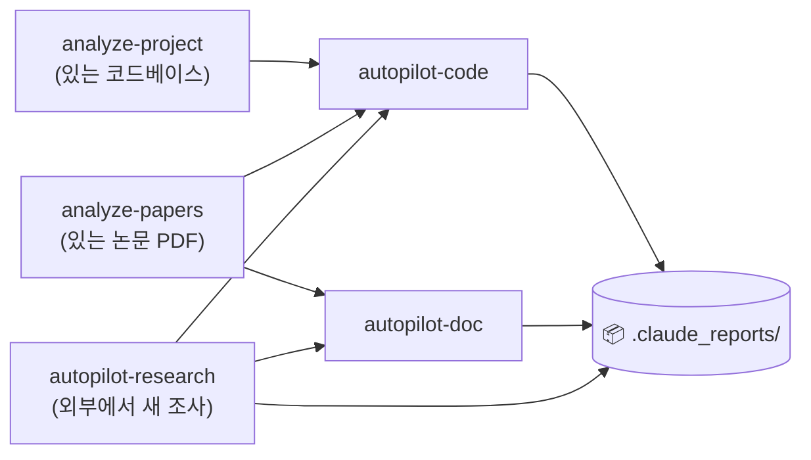
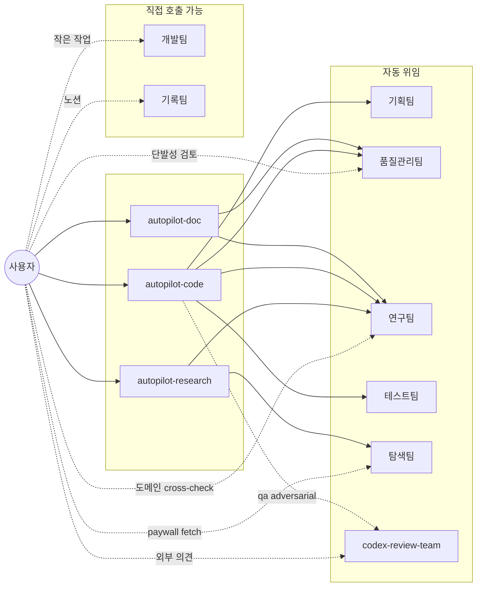

# Claude Setting

> Source: `~/.claude/skills/*/SKILL.md` + `~/.claude/agents/*.md`
> 마지막 sync: 2026-05-06 16:30 KST (`/sync-skills` 자동) — 직접 편집 금지.
> Notion 대문: [Agents/Skills](https://www.notion.so/34987c2bb75380d68df4d6ce4d469bff) (본 README와 동일 콘텐츠)

---

## 📊 워크플로우

세 가지 자료 수집 스킬(`analyze-project`, `analyze-papers`, `autopilot-research`)은 같은 레벨 — 손에 든 자료(코드/논문)가 이미 있는지(`analyze-*`) vs 외부에서 새로 조사해야 하는지(`autopilot-research`)에 따라 선택. 그 결과를 `autopilot-code` / `autopilot-doc`이 참조해 코드 변경·문서 생성을 수행.

---

## 🔬 연구 라이프사이클 — 단계별 사용 가이드

연구는 단순한 직선 흐름이 아닙니다. 각 단계마다 **사용자 자산** / **자동화 가능 영역** / **수동 영역**이 다릅니다.

| 단계 | 사용자 자산 | 자동화 (skill/agent) | 수동 영역 |
|---|---|---|---|
| **1. 분야 조사** | (없음) | `/autopilot-research <주제>` → `research/` | — |
| **2. 기반 논문 정독** | 받은 PDF | `/analyze-papers` → `docs_paper/` | — |
| **3. 코드베이스 파악** | 코드 | `/analyze-project` → `docs_code/` | — |
| **4. 가설·실험 설계** | 본인 idea (memo) | `/autopilot-doc --mode proposal --refs <idea_dir>` (research artifact 폴더 + 본인 메모 함께) | — |
| **5. 코드 구현** | 코드베이스 | `/autopilot-code --mode dev --user-refine "<task>"` (debug/audit 모드도 동일) | — |
| **6. 실험 실행·결과 수집** | 실험 결과 (logs, ckpt, plots) | **자동화 없음** | 사용자가 직접 실행. 결과 정리 후 `Agent(기록팀)`로 노션 로깅, 또는 본인 폴더에 모음 |
| **7. 논문 초안** | 본인 결과 + research artifact + 본인 노트 | `/autopilot-doc --mode write --refs <combined_dir> --user-refine` → 전략 + 초안 markdown 생성 | **최종 작성은 사용자가 마무리** (실험 표·그림 수동 삽입, LaTeX 빌드, 인용 정리) |
| **8. 발표자료** | 논문 + research artifact | `/autopilot-doc --mode presentation --refs <combined_dir> --user-refine` | 슬라이드 시각화 마무리 |
| **9. 리뷰 대응** | reviewer comments | `/autopilot-doc --mode rebuttal --refs <reviewer_comments> --user-refine` | 추가 실험 필요 시 5–6단계 재진입 |
| **10. Camera-ready** | 최종 논문 | `/autopilot-doc --mode write --refs <기존_doc_dir> --user-refine` (write mode 재사용) | 최종 빌드 |

> **핵심 갭**: 6번(실험 실행)은 Claude가 대신할 수 없음 — 코드 구현(5)과 결과 정리(7) 사이에 사용자 본인이 실험을 돌리고, 결과를 모아 다음 skill의 `--refs`에 함께 넣어 줘야 합니다. 실험 결과 정리·기록은 `Agent(기록팀)`로 위임 가능.

> **`--refs` 사용 팁**: 논문 작성·발표자료 같은 '본인 자료가 핵심'인 단계에서는 단일 폴더에 (a) `autopilot-research`의 artifact_dir, (b) 본인 결과 표·그림, (c) 본인 노트를 함께 모아 두고 그 폴더를 `--refs`로 지정. 두 종류의 자료가 모두 들어가야 강한 draft가 나옵니다.

---

## ⚡ 자주 쓰는 명령

| 상황 | 명령 |
|---|---|
| **코드베이스 / 논문 PDF 분석** | `/analyze-project` · `/analyze-papers` |
| **새 분야 조사** | `/autopilot-research <주제> --depth medium` |
| **새 기능 개발** | `/autopilot-code --mode dev --user-refine "<task>"` (pause 후 `--from refine <plan>`) |
| **코드 사후 감사** | `/autopilot-code --mode audit <plan-name>` |
| **디버그** | `/autopilot-code --mode debug "<error / log path>"` |
| **연구 제안** | `/autopilot-doc --mode proposal --refs <idea_dir> --user-refine` |
| **논문 초안·camera-ready** | `/autopilot-doc --mode write --refs <combined_dir> --user-refine` |
| **발표자료** | `/autopilot-doc --mode presentation --refs <combined_dir> --user-refine` |
| **리뷰 응답** | `/autopilot-doc --mode rebuttal --refs <reviewer_comments> --user-refine` |
| **분야 서베이 작성** | `/autopilot-doc --mode survey --refs <research_dir> --user-refine` |
| **paper review (논문 reviewer 입장)** | `/autopilot-doc --mode review --refs <paper_dir> --review-format openreview --user-refine` |

---

## 🎯 Agent 직접 호출 — autopilot 우회 패턴

매번 autopilot 풀파이프를 돌릴 필요는 없습니다. 작은 작업·단발성 검토는 agent를 직접 부르는 게 빠릅니다.

| 상황 | 직접 호출 | autopilot 대비 |
|---|---|---|
| 코드 한 블록 정리·rename | `Agent(개발팀)` | plan 안 만들어도 됨 |
| 작성 중인 발표자료/논문 초안 **타당성·논리 검토** | `Agent(연구팀)` | research artifact 안 만들고 cross-check만 |
| 코드/문서 **diff 단발성 리뷰** | `Agent(품질관리팀)` | run-test loop 없이 리뷰만 |
| 외부 의견(Codex) 빠른 추가 | `Agent(codex-review-team)` | `--qa adversarial`보다 가볍게 |
| **노션 페이지·DB 갱신, 실험 결과 로깅** | `Agent(기록팀)` | "노션에 기록해" 한 줄로 |
| 특정 paywall 논문 1편 fetch | `Agent(탐색팀)` | autopilot-research 안 돌리고 단발성 |
| 단계별 테스트만 실행 | `/run-test <plan>` skill | autopilot-code 전체 X |

**원칙**: agent 단독 호출은 **plan/log 산출물이 남지 않으므로** 그때그때만 쓰고, 추적이 필요한 작업은 autopilot으로. 기획팀은 직접 호출 거의 X — `/init-plan` 사용.

---

## 📋 Skills

| Skill | 역할 | 주요 옵션 |
|---|---|---|
| `analyze-project` | 코드 → `docs_code/` | (없음) |
| `analyze-papers` | PDF → `docs_paper/` | (없음) |
| `autopilot-research` | 논문 조사 + 9개 보고서 | `--depth shallow/medium/deep` · `--qa` · `--from search/analyze/report` |
| `autopilot-code` | 코드 dev/audit/debug | `--mode dev/audit/debug` · `--qa` · `--from plan/refine/execute/test/report` · `--user-refine` |
| `autopilot-doc` | 문서 strategy + draft (markdown) | `--mode rebuttal/write/review/survey/report/proposal/presentation` · `--refs <dir>` · `--qa` · `--from analyze/strategy/strategy-refine/draft/draft-refine/finalize` · `--user-refine` |
| `sync-skills` | 본 README + 노션 대시보드 동기화 | `--check` · `--readme-only` · `--notion-only` · `--force` |

> sub-skill (`init-plan`, `refine-plan`, `init-doc-strategy`, `refine-doc-strategy`, `execute-plan`, `run-test`, `final-report`)은 autopilot 내부에서 자동 호출 — 직접 사용은 pause 재개 시점에만.

### 핵심 옵션 3가지

- **`--user-refine`** (autopilot-code dev / autopilot-doc) — 연구팀 메모 직후 pause. 같은 문서에 `<!-- memo: ... -->`를 직접 추가한 뒤 출력된 `--from <stage>` 명령으로 재개.
- **`--from <stage>`** — pause 또는 중간 실패 후 특정 단계부터 재개. stage 이름은 위 표.
- **`--qa light/standard/thorough/adversarial`** — 리뷰 강도. `adversarial`은 Codex 외부 리뷰 추가 (autopilot-code).

---

## 🤝 Agents

| Agent | 모델 | 자동 호출자 | 사용자 직접 호출 시 |
|---|---|---|---|
| 기획팀 (plan-team) | opus | init-plan / refine-plan | 거의 없음 (init-plan 통해서) |
| 품질관리팀 (qa-team) | opus | 모든 autopilot의 review loop | 단발성 코드/문서 diff 리뷰 |
| 연구팀 (research-team) | opus | autopilot-research / -code / -doc | 단발성 도메인 cross-check, 발표자료 타당성 검토 |
| 테스트팀 (test-team) | opus | run-test | 보통 `/run-test` skill로 |
| 탐색팀 (browser-team) | sonnet | autopilot-research | 단발성 paywall 페이지 fetch |
| codex-review-team | opus | `--qa adversarial` | 단발성 Codex 외부 의견 |
| 개발팀 (dev-team) | sonnet | (autopilot 내부) | **작은 리팩토링/정리** ("이 함수 이름 바꿔줘") |
| 기록팀 (record-team) | sonnet | (없음) | **Notion 작업** ("노션에 기록해", 실험 결과 로깅) |

호출 구조 다이어그램

---

## 🔁 동기화

- `/sync-skills` — README + 노션 대시보드 갱신
- `/sync-skills --check` — drift 확인만 (쓰기 X)

GitHub: [dmlguq456/claude_setting](https://github.com/dmlguq456/claude_setting)
