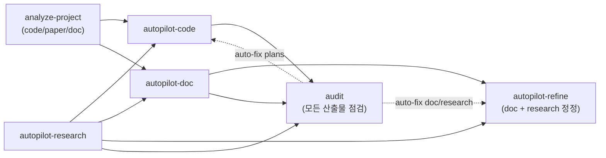
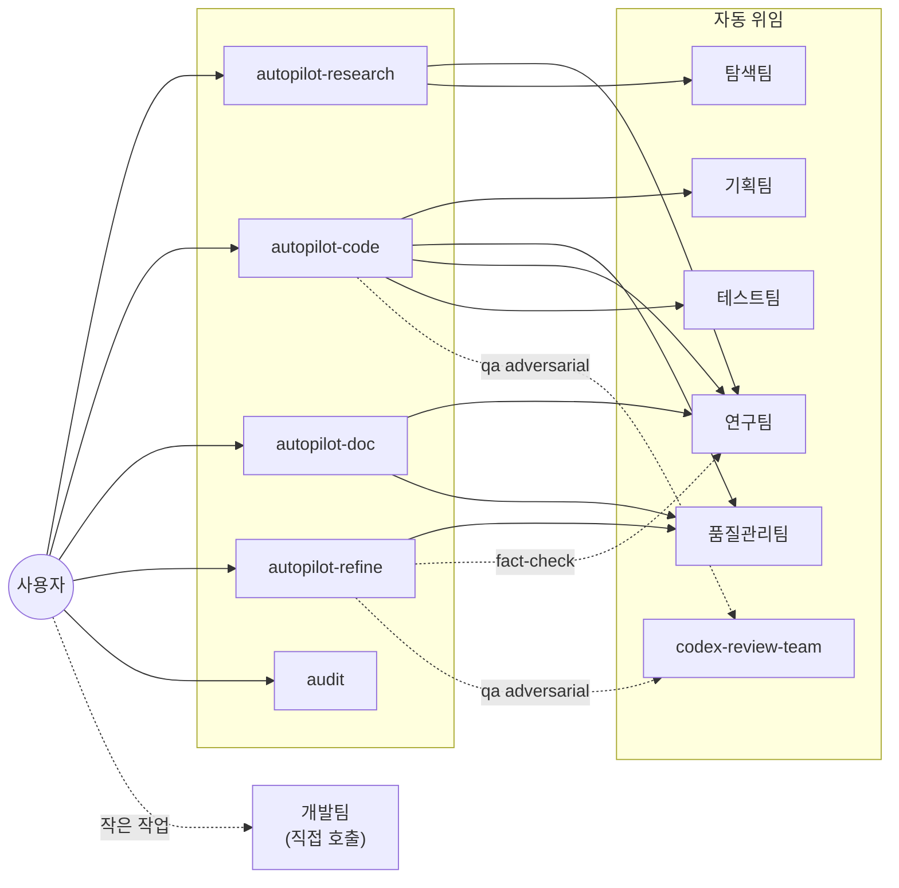

# Claude Setting

> Source: `~/.claude/skills/*/SKILL.md` + `~/.claude/agents/*.md` (`/sync-skills` 자동 갱신 — 직접 편집 금지)
> Notion 대문: [Agents/Skills](https://www.notion.so/34987c2bb75380d68df4d6ce4d469bff)  ·  운영 가이드: [`notion_guide.md`](notion_guide.md)

---

## 📊 워크플로우

> Claude는 프로젝트 루트에서 실행. `.claude_reports/`는 현재 dir에 생성. cross-project는 `cd <other>` 후 별도 세션. 외부 `--refs` flag 없음 — 모든 입력은 `.claude_reports/` 영속 산출물에서 자동 발견.

- **`analyze-project`** — `--mode code` (default 코드베이스) / `--mode paper` (논문 PDFs cards) / `--mode doc` (reviewer comments·템플릿·샘플)
- **`autopilot-research`** — 외부 분야 새 조사 (검색 + 분석)
- **`autopilot-code` / `autopilot-doc`** — 위 영속 산출물을 implicit 자동 발견
- **`autopilot-refine`** — research/doc 산출물 사후 정정 (prompt 또는 사용자 메모 단일 entry, diff preview→confirm→version)
- **`audit`** — 모든 산출물의 facts/style/structure 점검. `--report-only` 없으면 issue 발견 시 fix skill 자동 트리거 (doc/research → refine, plans → code)

> **3-tier 산출물 컨벤션** ([SKILL_OUTPUT_CONVENTION.md](SKILL_OUTPUT_CONVENTION.md)): T1 root = 메인 산출물 / T2 named subdir = 검토 자료 (`strategy/`, `cards/`, `dev_logs/` 등) / T3 `_internal/` = audit·raw·versions. 사용자는 보통 T1만 보면 됨.

---

## 🧭 활용 갈래 — 5 카테고리

각 갈래 **독립 사용**. 갈래 간 chaining은 `.claude_reports/` 영속 산출물의 implicit 인지.

### A. 사전 조사 & 분석

| 입력 | skill | 산출 |
|---|---|---|
| 외부 분야 조사 (논문·기술표준·시장) | `/autopilot-research <주제> --mode academic\|technology\|market` | `research/{topic}/` (9/7/5 보고서) |
| 보유한 논문 PDF | `/analyze-project --mode paper` | `analysis_project/paper/` — cards + overview |
| 기존 코드베이스 | `/analyze-project [--mode code]` | `analysis_project/code/` — 모듈 매핑 |
| 기타 doc 자료 (reviewer comments·templates·sample) | `/analyze-project --mode doc` (cwd 자동 발견) 또는 `--mode doc <folder>` (외부 override) | `analysis_project/doc/{name}/` |

### B. 코드 개발 & 디버그

연구 실험·서비스·라이브러리·CI 도구 무관 동일 사용.

| 작업 | skill |
|---|---|
| 새 기능 개발 (plan→execute→test) | `/autopilot-code --mode dev --user-refine "<task>"` |
| 디버그 (에러·로그 기반 root-cause) | `/autopilot-code --mode debug "<error>"` |

> 코드 산출물의 사후 감사는 `/audit <plan>` (갈래 D).

### C. 문서 작성

공통 패턴: **strategy + draft markdown** 산출 → 사용자 최종 마무리. 산출물은 `documents/{date}_{name}/`. 입력 자료는 갈래 A 산출물에서 implicit 자동 발견.

| 모드 | 용도 | 명령 |
|---|---|---|
| `write` | 논문·camera-ready·기술 블로그·책 챕터 | `/autopilot-doc "<task>" --mode write [--format-ref <template>] --user-refine` |
| `presentation` | 학회 발표·세미나·강의 | `/autopilot-doc "<task>" --mode presentation [--format-ref <slide_template>] --user-refine` |
| `rebuttal` | 학회 reviewer 응답 | `/autopilot-doc "<task>" --mode rebuttal [--format-ref <venue_guidelines>] --user-refine` |
| `review` | reviewer 입장 peer review (template REQUIRED) | `/autopilot-doc "<task>" --mode review --format-ref <venue_review_template> --user-refine` |
| `proposal` | grant·사업 제안서 | `/autopilot-doc "<task>" --mode proposal [--format-ref <funding_template>] --user-refine` |
| `report` | 기술 보고서·분기 보고·post-mortem | `/autopilot-doc "<task>" --mode report [--format-ref <internal_template>] --user-refine` |

> **`--format-ref`**: 학회/저널/랩별 가이드라인 path. 생략 시 `analysis_project/doc/{matching}/formats/` 자동 탐색. `review`만 hard-fail.

### D. 사후 점검 (audit)

`/audit`는 산출물을 **수정 없이** 다각도 점검 후, 기본값으로 fix flow 자동 트리거. 일반 워크플로우는 _점검(D) → 정정(E)_ 순서.

| 입력 | 명령 |
|---|---|
| 산출물 경로/fuzzy 이름 | `/audit <artifact>` (type 자동 인식 + auto-scope, 보고서 + auto-fix) |
| 특정 측면만 강조 (override 1순위) | `/audit <artifact> --scope facts\|style\|structure\|cross-ref\|coverage` |
| Code plan 정적-only | `/audit <plan> --read-only` (테스트 실행 없음) |
| 점검만 (auto-fix 없이) | `/audit <artifact> --report-only` |

- **D vs E**: audit = 점검 후 (default) fix skill 자동 dispatch / refine = 직접 수정 흐름
- **Auto-scope (default)**: `--scope` 미명시 시 audit이 artifact 특성(mode / refine 횟수 / status)을 보고 적절한 aspect 자동 선택. 사용자 명시는 1순위 override.
- aspect는 type별: documents (facts/style/structure/cross-ref/coverage) · research (cards 정합성/Tier/coverage/cross-card) · plans (test/lint/code review/TODO)
- **Auto-fix 흐름**: doc/research → `autopilot-refine` (갈래 E), plans → `autopilot-code --mode dev`

### E. 사후 정정 (refine)

C로 만든 문서 + A의 research 보고서는 _routine한 사후 정정_이 큰 비중. `/autopilot-refine` 단일 entry가 prompt와 메모 두 입력 모두 처리. 일반적으로 D의 audit 결과 또는 사용자 직접 prompt로 진입.

| 입력 | 명령 |
|---|---|
| 자연어 prompt | `/autopilot-refine "<prompt>"` (artifact fuzzy match) |
| 산출물 안 또는 별도 파일 메모 | `/autopilot-refine --memo <file> "<artifact hint>"` (prompt 자리에 artifact 식별자) |
| 검수만 (적용 X) | `/autopilot-refine "<prompt>" --review-only` |

- 대상: `.claude_reports/{documents,research}/*` — code는 `/refine-plan` 또는 `/autopilot-code`
- 적용 시 `_internal/versions/v{N}/` 스냅샷 + `pipeline_summary.md` 통합 history
- QA: 기본 `--qa quick` (1-pass). 중요 산출물은 `light` → `standard` (+ fact-checker) → `thorough` (2× parallel) → `adversarial` (+ Codex)

### 자주 쓰는 chaining

- **A → C** (implicit): `autopilot-research <topic>` → autopilot-doc이 `.claude_reports/research/*` 자동 발견
- **A → B** (implicit): `analyze-project [--mode code]` + research → autopilot-code init-plan에서 자동 발견
- **B → C** (manual): autopilot-code 결과(`plans/{...}/dev_logs/`)는 autopilot-doc이 _자동 인지 안 함_. `/analyze-project --mode doc plans/{...}` 1회로 doc 자료화 후 `report`/`write` 모드 진행.
- **C/A → D → E**: 누적 산출 후 `/audit`(D)로 drift 점검 → 기본값 auto-fix chain이 `/autopilot-refine`(E)로 전달

> **`--user-refine`**: dev/doc 모드에서 연구팀 메모 직후 pause → 사용자가 직접 `<!-- memo: ... -->` 추가 → `--from <stage>` 명령으로 재개.

---

## 🎯 직접 호출 — autopilot 우회

작은 작업·단발성 검토는 agent 또는 sub-skill을 직접 호출.

| 상황 | 호출 | 종류 |
|---|---|---|
| 코드 한 블록 정리·rename | `Agent(개발팀)` | agent |
| 작성 중인 자료 타당성·논리 검토 | `Agent(연구팀)` | agent |
| 코드/문서 diff 단발성 리뷰 | `Agent(품질관리팀)` | agent |
| 외부 의견(Codex) 빠른 추가 | `Agent(codex-review-team)` | agent |
| 노션 페이지·DB 갱신 | 메인 컨텍스트에서 Notion MCP 직접 ([`notion_guide.md`](notion_guide.md)) | MCP |
| paywall 논문 1편 fetch | `Agent(탐색팀)` | agent |
| PDF figure 일괄 추출 | `Agent(탐색팀, mode="extract_pdf_figures")` | agent |
| 인터넷 reference 그림 검색 | `Agent(탐색팀, mode="web_reference")` | agent |
| 산출물 다각도 점검 (수정 X) | `/audit <artifact> --report-only` | skill |
| 단계별 테스트만 | `/run-test <plan>` | skill |

> agent 단독·sub-skill 직접 호출은 plan/log가 안 남으므로 그때그때만. 추적 필요한 작업은 autopilot으로.

---

## 📋 Skills

| Skill | 역할 | 주요 옵션 |
|---|---|---|
| `analyze-project` | code/paper/doc 자료 → `analysis_project/`에 영속화 | `--mode code/paper/doc` · `[<scope>]` · `--skip-qa` |
| `autopilot-research` | 분야 조사 — mode별 보고서 | `--mode academic/technology/market` · `--depth shallow/medium/deep` · `--qa` · `--from search/analyze/report` · `--no-clarify` |
| `autopilot-code` | 코드 dev/debug | `--mode dev/debug` · `--qa` · `--from plan/refine/execute/test/report` · `--user-refine` |
| `autopilot-doc` | 문서 strategy + draft (markdown) | `--mode rebuttal/write/review/report/proposal/presentation` · `--format-ref <path>` · `--qa` · `--from analyze/strategy/strategy-refine/draft/draft-refine/finalize` · `--user-refine` · `--no-clarify` |
| `audit` | **갈래 D** — multi-aspect 점검 + 기본 auto-fix chain. type 자동 인식 (plans/research/documents) + scope 자동 판단 (artifact 특성 기반). | `<artifact_path>` · `--scope auto(default)/facts/style/structure/cross-ref/coverage/all` (명시 = override 1순위) · `--read-only` · `--report-only` · `--no-fact-check` |
| `autopilot-refine` | **갈래 E** — doc/research 사후 정정 (prompt + memo 통합 entry) | `"<prompt>"` 또는 `--memo <file>` · `--qa` · `--review-only` · `--no-fact-check` · `--no-style-audit` |
| `sync-skills` | 본 README + 노션 대시보드 동기화 | `--check` · `--readme-only` · `--notion-only` · `--force` |

> sub-skill (`init-plan`, `refine-plan`, `init-doc-strategy`, `refine-doc`, `execute-plan`, `run-test`, `final-report`)은 autopilot 내부 자동 호출.

### 핵심 옵션

- **`--user-refine`** — autopilot-code dev / autopilot-doc에서 연구팀 메모 직후 pause. `<!-- memo: ... -->` 추가 후 `--from <stage>` 재개.
- **`--from <stage>`** — pause/실패 후 특정 단계부터 재개.
- **`--qa quick/light/standard/thorough/adversarial`** — 리뷰 강도.
  - `quick` = 1-pass + refine skip (fastest, autopilot-refine의 default)
  - `light` = quality reviewer 1× (sonnet)
  - `standard` = quality reviewer (opus) + **fact-checker** (sonnet, parallel — _doc/research/refine만_, code는 없음)
  - `thorough` = quality reviewer 2× parallel + fact-checker
  - `adversarial` = standard + Codex 외부 리뷰 (camera-ready·grant 등). **autopilot-code · autopilot-refine 전용** — autopilot-doc/research는 thorough까지만
- **`--no-clarify`** — autopilot-research/doc Step 0 Scope Clarification skip.
- **`--report-only`** (audit) — 점검만, auto-fix chain 없이.
- **`--no-fact-check`** / **`--no-style-audit`** (autopilot-refine, audit) — Stage B.5 / Stage C aspect skip (override-resistant: 이 두 flag만이 fact-check 비활성화 경로, ad-hoc prompt로는 불가).

---

## 🤝 Agents

| Agent | 모델 | 역할 | 자동 호출자 | 직접 호출 |
|---|---|---|---|---|
| 기획팀 (plan-team) | opus | 구현 plan 문서 작성·갱신 (source code 분석 기반 step-by-step) | init-plan / refine-plan | 거의 X |
| 품질관리팀 (qa-team) | opus | 코드/문서/plan diff 리뷰 — 구조적 한국어 feedback (🔴/🟡/🟢) | 모든 autopilot review loop | 단발성 diff 리뷰 |
| 연구팀 (research-team) | opus | _user proxy_ — paper knowledge + 도메인 expertise + audit-aligned axes (task type별 multi-axis 분담 가능) | autopilot-research/code/doc/refine | 도메인 cross-check, 작성 중인 자료 타당성 검토 |
| 테스트팀 (test-team) | opus | graduated verification tests — syntax → import → smoke → functional → integration | run-test | `/run-test`로 |
| 탐색팀 (browser-team) | sonnet | Playwright screenshot-based fetch (paywall/SPA) + PDF figure 추출 + WebFetch reference 그림 | autopilot-research | paywall fetch · figure 추출 (`mode=extract_pdf_figures`) · reference 그림 (`mode=web_reference`) |
| codex-review-team | opus | Codex CLI delegated review (review / adversarial-review / task) — 외부 hostile reader 관점 | `--qa adversarial` | 외부 의견 빠른 추가 |
| 개발팀 (dev-team) | sonnet | refactor / rename / cleanup / 작은 리팩토링 — 기능 보존 우선 (interactive propose+confirm 또는 auto 모드) | (autopilot 내부 execute-plan) | 작은 작업 직접 호출 |

> Notion 작업은 sub-agent 위임 X (MCP 도구 접근 제약). 메인 컨텍스트에서 `mcp__claude_ai_Notion__*` 직접 호출 ([`notion_guide.md`](notion_guide.md)).

호출 구조 다이어그램

---

## 🔁 동기화

- `/sync-skills` — README + 노션 대시보드 갱신
- `/sync-skills --check` — drift 확인만

GitHub: [dmlguq456/claude_setting](https://github.com/dmlguq456/claude_setting)
