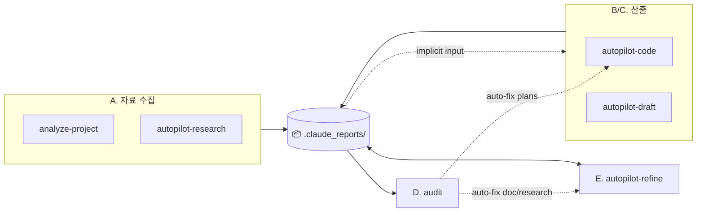

# Claude Setting

> 🇰🇷 한국어: [`README.ko.md`](README.ko.md)

> Source: `~/.claude/skills/*/SKILL.md` + `~/.claude/agents/*.md` (auto-refreshed by `/sync-skills` — do not edit directly)
> Notion entry: [Agents/Skills](https://www.notion.so/34987c2bb75380d68df4d6ce4d469bff)  ·  Operating guide: [`notion_guide.md`](notion_guide.md)

---

## 📊 Workflow

> Claude runs from the project root. `.claude_reports/` is created in the current dir. For cross-project work, `cd <other>` and start a separate session. No external `--refs` flag — every input is auto-discovered from persistent artifacts under `.claude_reports/`.

### Skill invocation flow


Five categories — **A. Research & analysis** (`analyze-project` / `autopilot-research`) / **B. Code development & debug** (`autopilot-code`) / **C. Document drafting** (`autopilot-draft`) / **D. Post-hoc inspection** (`audit`) / **E. Post-hoc correction** (`autopilot-refine`).

### Artifact I/O (`.claude_reports/` view)



Every artifact accumulates under `.claude_reports/` (`analysis_project/{code,paper,doc}/`, `research/{topic}/`, `documents/{date}_{name}/`, `plans/{date}_{name}/`). Downstream skills pick them up implicitly via the dashed edges. **D (audit)** only _reads_ OUT (inspection + auto-fix dispatch); **E (refine)** is _read+write_ on OUT (modification + version accumulation).

> **3-tier artifact convention** ([CONVENTIONS.md §5](CONVENTIONS.md#5-skill-output-convention-3-tier-t1t2t3)): T1 root = main artifact / T2 named subdir = review material / T3 `_internal/` = audit·raw·versions. The user normally only needs T1.

Artifact locations, scope boundaries, and common pitfalls live in the global [`CLAUDE.md`](CLAUDE.md) "Drift-Free Essentials" section.

---

## 🗣️ Usage

Two entry points — _natural language_ and _slash_. Same behavior.

### (1) Natural-language utterance

When an utterance arrives, the main Claude's first turn step is to branch between _skill invocation candidate vs direct handling_ (global [`CLAUDE.md`](CLAUDE.md) §6 Pre-check). If it's a skill candidate, Claude reads the context (cwd / `.claude_reports/` artifacts / utterance), assembles skill + options + task description, and asks for confirmation with **a one-line summary + expanded options + selection rationale**. yes / amend ("make it qa thorough", "drop X") / cancel. No response → after 10-30 minutes the recommended option proceeds autonomously.

Only the four high-ceremony skills (`autopilot-code` / `autopilot-draft` / `autopilot-research` / `autopilot-refine`) require confirmation. `audit` / `notes` / `analyze-project` invoke immediately. Detailed rules in global [`CLAUDE.md`](CLAUDE.md) §6.

| User utterance | Main Claude's confirmation (natural-language summary) |
|---|---|
| "ICML camera-ready 마무리 도와줘" | autopilot-draft in paper mode, polish the camera-ready body (qa standard) |
| "이 에러 디버그해봐" | autopilot-code in debug mode, root-cause analysis + fix (qa light) |
| "diffusion 분야 최근 동향 조사해줘" | autopilot-research in academic mode, depth medium, last 1 year (qa light) |
| "이 문서 v2 로 정리" | autopilot-refine major-level (qa quick, auto-apply) |
| "X 기능 새로 만들어줘" | autopilot-code in dev mode, plan→execute→test→report (qa standard) |
| "이번 발표 자료 만들어줘" | autopilot-draft in presentation mode, slide markdown draft (qa standard) |

### (2) Direct slash command

When you want to specify options explicitly or skip the confirmation step, type the slash directly. Direct input is _explicit intent_ → invoke immediately without confirmation. Option combinations, defaults, and QA-level semantics live in each SKILL.md's `argument-hint` / `## Usage` (linked from the §4 Skills table below).

```
/autopilot-code     --mode dev|debug --qa quick|light|standard|thorough|adversarial "<task>"
/autopilot-draft    --mode paper|presentation|doc [--user-refine] "<task>"
/autopilot-research <topic> --mode academic|technology|market --depth shallow|medium|deep
/autopilot-refine   "<prompt>" [--qa ...] [--review-only | --memo <file>]
/audit              <artifact> [--scope facts|style|structure|cross-ref|coverage]
/notes              [show | add <category> <text> | resolve <hint> | decide <text>]
```

The five QA levels (quick / light / standard / thorough / adversarial) are defined in [`CONVENTIONS.md`](CONVENTIONS.md) §1.

---

## 📋 Skills

| Skill | Role |
|---|---|
| [`analyze-project`](skills/analyze-project/SKILL.md) | code/paper/doc material → persisted under `analysis_project/` |
| [`autopilot-research`](skills/autopilot-research/SKILL.md) | Domain research — per-mode reports (academic/technology/market) |
| [`autopilot-code`](skills/autopilot-code/SKILL.md) | Code dev/debug — plan → execute → test → report |
| [`autopilot-draft`](skills/autopilot-draft/SKILL.md) | Document strategy + draft (paper/presentation/doc, markdown only) |
| [`autopilot-refine`](skills/autopilot-refine/SKILL.md) | doc/research post-hoc correction — major ceremony, prompt + memo unified entry |
| [`audit`](skills/audit/SKILL.md) | Multi-aspect inspection of artifacts + default auto-fix chain |
| [`notes`](skills/notes/SKILL.md) | Per-project notes — single `.claude_reports/NOTES.md` file |
| [`sync-skills`](skills/sync-skills/SKILL.md) | Syncs this README + Notion dashboard |

> Sub-skills (`init-plan`, `refine-plan`, `init-doc-strategy`, `refine-doc`, `execute-plan`, `run-test`, `final-report`) are called internally by autopilot. The user does not invoke them directly.

Detailed options (`--mode`, `--qa`, `--from`, `--user-refine`, etc.) live in each SKILL.md. The single source for the five QA levels is [`CONVENTIONS.md`](CONVENTIONS.md) §1.

---

## 🤝 Agents

| Agent | Model | Role |
|---|---|---|
| [기획팀](agents/plan-team.md) | opus | Authoring and updating implementation plan documents (step-by-step, grounded in source code) |
| [품질관리팀](agents/qa-team.md) | opus (light: sonnet) | Code/document/plan diff review — structured Korean feedback (🔴/🟡/🟢) |
| [연구팀](agents/research-team.md) | opus (fact-check: sonnet) | User proxy — paper knowledge + domain cross-check + audit-aligned axes |
| [테스트팀](agents/test-team.md) | opus | Graduated verification tests (syntax → import → smoke → functional → integration) |
| [탐색팀](agents/browser-team.md) | sonnet | Playwright fetch (paywall/SPA) + PDF figure extraction + reference figures |
| [codex-review-team](agents/codex-review-team.md) | Codex CLI (GPT-5) + opus orchestrator | Review from an external hostile-reader perspective (auto-engaged on `--qa adversarial`) |
| [개발팀](agents/dev-team.md) | sonnet | refactor / rename / cleanup — behavior-preservation first |
| [편집팀](agents/editorial-team.md) | opus | Inspection and editing of user-facing documents (translate / polish / audit-only) |

**Direct invocation** — for small tasks or one-off reviews, route through `Agent(개발팀)` / `Agent(품질관리팀)` / `Agent(연구팀)` / `Agent(편집팀)` to bypass autopilot. Since no plan/log is left, use autopilot when the work needs to be traceable.

> Notion work is not delegated to sub-agents (MCP tool access restriction). The main Claude calls `mcp__claude_ai_Notion__*` directly — see [`notion_guide.md`](notion_guide.md).

---

## ⚙️ Operating rules

Auto-invocation patterns have a single source of truth in the global [`CLAUDE.md`](CLAUDE.md):

- **§6 autopilot-\* invocation Pre-check** — first turn-step branch decision + automatic option assembly + natural-language summary confirmation + §5 autonomous-progress rule
- **Domain trigger table** — Notion work / doc·research major-level edits / QA·model invariant work / session start

The natural-language trigger signals for the four high-ceremony autopilot-* skills at a glance:

| Skill | Trigger signals (natural-language utterance) | Default option recommendation |
|---|---|---|
| `autopilot-code` | "X 기능 만들어줘" / "X 디버그해봐" / "이 에러 고쳐줘" / any code-change intent | `--mode dev/debug` auto-inferred · `--qa standard` (default) |
| `autopilot-draft` | "발표 자료 만들어줘" / "논문 본문 작성" / "rebuttal 응답 작성" / "보고서 작성" | `--mode paper/presentation/doc` auto-inferred · `--qa standard` |
| `autopilot-research` | "X 분야 조사" / "동향 알려줘" / "literature review" / "표준 비교" | `--mode academic/technology/market` auto-inferred · `--depth medium` · `--qa light` |
| `autopilot-refine` | major-level edits to a doc/research artifact (3-criteria — explicit user signal "major"/"v{N+1}"/"전면 재작성" / structural ≥200 lines / pre-external-review ceremony) | `--qa quick` (default) · auto-apply (only STRUCT halts) |

The _detailed trigger, top-priority override, and skip conditions_ for each skill live as a single source in its SKILL.md `## Default Invocation Rule` section — auto-synced by `/sync-skills`.

---

## 🔁 Sync

- `/sync-skills` — refresh this README + the Notion dashboard
- `/sync-skills --check` — drift inspection only

GitHub: [dmlguq456/claude_setting](https://github.com/dmlguq456/claude_setting)
