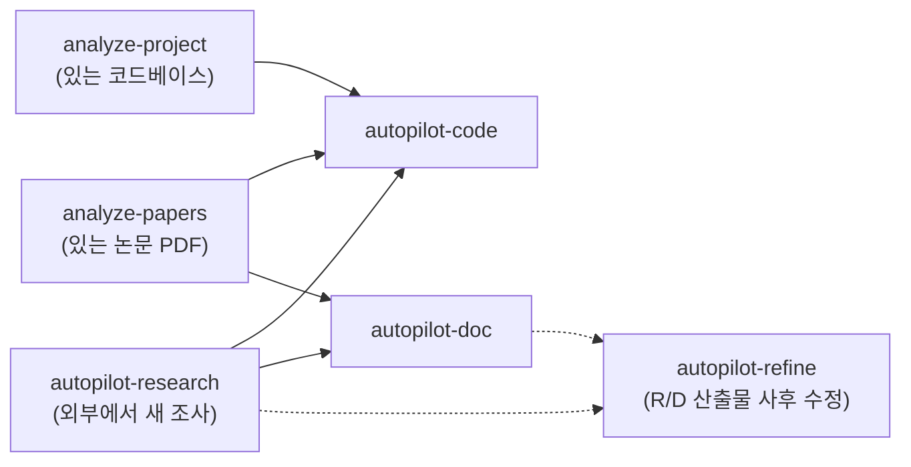
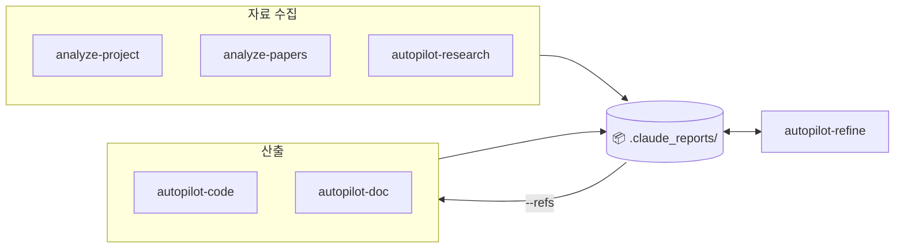
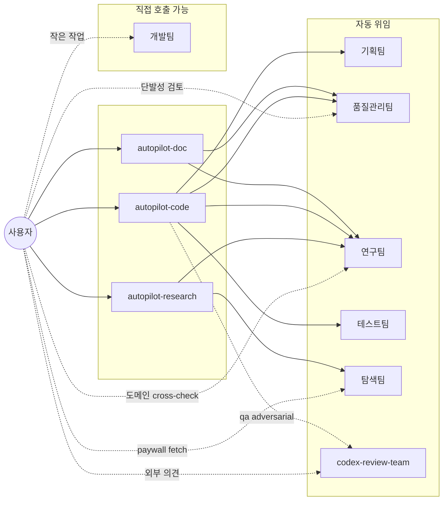

# Claude Setting

> Source: `~/.claude/skills/*/SKILL.md` + `~/.claude/agents/*.md`
> 마지막 sync: 2026-05-07 KST (`/sync-skills` 자동) — 직접 편집 금지. (latest: 워크플로우를 2개 다이어그램으로 분리 — skill 흐름 + 산출물 I/O)
> Notion 대문: [Agents/Skills](https://www.notion.so/34987c2bb75380d68df4d6ce4d469bff) (본 README와 동일 콘텐츠)
> Notion 운영 가이드: [`notion_guide.md`](notion_guide.md) (페이지 타입 템플릿 + workspace 구조)

---

## 📊 워크플로우

### Skill 호출 흐름 (어떤 skill이 어떤 skill에 자료를 넘기나)

세 가지 자료 수집 스킬(`analyze-project`, `analyze-papers`, `autopilot-research`)은 같은 레벨 — 손에 든 자료(코드/논문)가 이미 있는지(`analyze-*`) vs 외부에서 새로 조사해야 하는지(`autopilot-research`)에 따라 선택. 그 결과를 `autopilot-code` / `autopilot-doc`이 참조해 코드 변경·문서 생성을 수행. autopilot-refine은 research/doc 산출물에 대한 사후 정정 루프(점선).

### 산출물 I/O (`.claude_reports/` 관점)

> 모든 skill 산출물은 `.claude_reports/` 하위 5개 폴더에 누적 (`docs_code/`, `docs_paper/`, `research/`, `documents/`, `plans/`). 자료 수집 결과는 산출 단계의 `--refs`로 전달. autopilot-refine만 read+write 양방향.

> **산출물 사후 수정**: research/doc 산출물의 routine 정정·refine은 `/autopilot-refine "<prompt>" [--refs <artifact_dir>]` (prompt-driven, 자동 파일 체계 파악, diff preview, 버전 + CHANGELOG, 기본 `--qa quick`). `--refs` 생략 시 prompt 키워드로 fuzzy match. file-memo 기반 `/refine-doc`은 deferred review가 필요할 때만 opt-in. code 산출물은 `/refine-plan` / `/autopilot-code` 사용.

---

## 🧭 활용 갈래 — 3 카테고리

세 갈래는 **독립적으로** 사용. "논문 한 줄짜리 라이프사이클"이 아니라 다양한 코드·문서 산출물을 각각 만들 수 있음. 갈래 간 chaining은 `--refs`로.

### A. 사전 조사 & 분석 (input gathering)

조사·분석 결과는 후속 갈래(B/C)의 `--refs` 입력으로 사용.

| 입력 | skill | 산출 |
|---|---|---|
| 외부 분야 조사 — 논문 / 기술표준 / 시장 동향 | `/autopilot-research <주제> --mode academic\|technology\|market` | `research/{topic}/` — 9 / 7 / 5개 markdown 보고서 |
| 보유한 논문 PDF 정독 | `/analyze-papers` | `docs_paper/` — 논문별 cards + overview |
| 기존 코드베이스 파악 | `/analyze-project` | `docs_code/` — 모듈 매핑 + 구조 분석 |

### B. 코드 개발 & 감사 (code deliverables)

**연구 실험뿐 아니라 실제 서비스 / 제품 / 라이브러리 / 사이드 프로젝트 / CI·빌드 도구** 개발에도 동일하게 사용. task description만 명확하면 도메인 무관.

| 작업 | skill | 산출 |
|---|---|---|
| 새 기능 / 신규 모듈 개발 (plan → execute → test) | `/autopilot-code --mode dev --user-refine "<task>"` | `plans/{date}_{name}/` — 코드 + dev/test logs |
| 사후 감사 (지난 변경의 risk / quality 점검) | `/autopilot-code --mode audit <plan>` | audit log + recommendations |
| 디버그 (에러·로그 기반 root-cause 추적) | `/autopilot-code --mode debug "<error>"` | debug log + 원인 + fix |

### C. 문서 작성 (document deliverables)

모든 모드 공통 패턴: **strategy + draft markdown** 산출 → 사용자가 최종 작성·빌드·디자인 마무리. 산출물은 `documents/{date}_{name}/`. **첫 positional arg = `<task description>`** (research/code와 동일하게 작업의 _구체적 의도·목표·범위_를 한 줄로. `--refs`는 자료 폴더, task 설명과 _별개_).

| 모드 | 용도 (예시) | 명령 (`--format-ref` optional, review만 필수) |
|---|---|---|
| `write` | 논문 / camera-ready / 백서 / 기술 블로그 / 책 챕터 / 일반 글쓰기 | `/autopilot-doc "<task: 무슨 글, 어떤 청중, 어떤 메시지>" --mode write --refs <dir> [--format-ref <venue_paper_template>] --user-refine` |
| `presentation` | 논문 발표 / 사내 세미나 / 컨퍼런스 키노트 / 데모 데이 / 강의 | `/autopilot-doc "<task: 발표 주제, 청중, 시간>" --mode presentation --refs <dir> [--format-ref <slide_template>] --user-refine` |
| `rebuttal` | 학회 reviewer 응답 (sub-type 3종은 format-ref/task에 명시) | `/autopilot-doc "<task: paper 제목, 학회·라운드, 강조점>" --mode rebuttal --refs <reviewer_comments> [--format-ref <venue_rebuttal_guidelines>] --user-refine` |
| `review` | 본인이 reviewer 입장 (peer review) | `/autopilot-doc "<task: paper 제목, 평가 관점>" --mode review --refs <paper_dir> --format-ref <venue_review_template> --user-refine` |
| `proposal` | 연구 grant (NRF/NSF) / 사업 제안 / 내부 프로젝트 제안 | `/autopilot-doc "<task: 무엇을 제안, 누구에게>" --mode proposal --refs <idea+research_dir> [--format-ref <funding_body_template>] --user-refine` |
| `report` | 기술 보고서 / 시장 분석 / 분기 보고 / 사고 분석 (post-mortem) | `/autopilot-doc "<task: 무엇에 대한 보고, 청중>" --mode report --refs <dir> [--format-ref <internal_template>] --user-refine` |

> **task vs --refs의 역할 분리**: `<task>`는 _목표·의도·범위·청중_을 명확히 (Step 0 Scope Clarification에 사용). `--refs`는 _참고 자료 폴더_ (cards / PDFs / 본인 결과 등). 둘 다 강할수록 strategy + draft 품질이 올라감 — `--refs`만 강하면 자료는 풍부한데 _무엇을 만들지_가 모호해서 첫 draft에서 사용자가 다시 잡아줘야 함.

> **`--format-ref <path>` (universal flag)**: 모든 모드에서 사용 가능한 단일 path 인자. 학회·저널·연도·랩마다 다른 _개별 가이드라인 / 템플릿 / 샘플 / format-spec 파일_을 path로 전달. **built-in preset 없음** (venue마다 매년 다르므로).
>
> **Resolution 순서**: (1) explicit `--format-ref <path>` → (2) `--refs` 폴더에서 키워드 자동 탐색 (`guidelines`/`template`/`format`/`cfp`/`instructions`/`submission`/...) → (3) 모드별 fallback:
> - `review`: **hard fail** — reviewer guideline 없이 진행 X
> - `rebuttal`: Step 0에서 사용자에게 prompt (format-ref 제공 / task에 inline 명시 / generic layout 동의)
> - `write` / `presentation` / `proposal` / `report`: warn-and-fallback (generic layout으로 진행, 품질 저하 경고)
>
> **rebuttal sub-type 3종**은 format-ref 파일 또는 task description에 명시 (별도 flag 없음):
> - _meta-only_: AC/SAC 단일 응답. 짧고 압축적
> - _reviewer-dialogue_: 다회 왕복 (OpenReview 토론)
> - _response-with-revision_: rebuttal + paper 수정본 업로드 (ACL ARR / 저널 major revision)
>
> 단순화 원칙: sub-type별 별도 flag 두지 않고 _venue가 발행한 가이드 문서 1개_에 모든 정보를 담아 `--format-ref`로 전달.

### 자주 쓰는 chaining 패턴

- **A → C**: 분야 조사 결과 (research artifact_dir) 를 doc의 `--refs`로 전달 → 논문/발표/제안서/보고서
- **A → B**: 외부 표준 조사 + 코드베이스 파악 → autopilot-code의 plan 단계 motivation·constraint 으로 사용
- **B → C**: 코드 변경 / 실험 / 운영 결과 정리 → doc의 `report` 또는 `write` 모드로 narrative화
- **외부 (사용자 본인 자료)**: Claude가 만들 수 없는 영역 — 실험 결과·표·그림·데이터·노트는 사용자가 폴더에 모아 doc의 `--refs`에 함께 전달

> **`--refs` 사용 팁**: 단일 폴더에 (a) research artifact, (b) 본인 결과 / 데이터 / 그림, (c) 본인 노트를 함께 모아 두고 그 폴더를 `--refs`로 지정. 두 종류 자료가 모두 들어가야 강한 draft가 나옵니다.

> **`--user-refine` 패턴**: dev/doc 모드에서 연구팀 메모 직후 pause → 사용자가 직접 `<!-- memo: ... -->` 추가 → 출력된 `--from <stage>` 명령으로 재개. 미세 컨트롤이 필요할 때.

---

## 🎯 Agent 직접 호출 — autopilot 우회 패턴

매번 autopilot 풀파이프를 돌릴 필요는 없습니다. 작은 작업·단발성 검토는 agent를 직접 부르는 게 빠릅니다.

| 상황 | 직접 호출 | autopilot 대비 |
|---|---|---|
| 코드 한 블록 정리·rename | `Agent(개발팀)` | plan 안 만들어도 됨 |
| 작성 중인 발표자료/논문 초안 **타당성·논리 검토** | `Agent(연구팀)` | research artifact 안 만들고 cross-check만 |
| 코드/문서 **diff 단발성 리뷰** | `Agent(품질관리팀)` | run-test loop 없이 리뷰만 |
| 외부 의견(Codex) 빠른 추가 | `Agent(codex-review-team)` | `--qa adversarial`보다 가볍게 |
| **노션 페이지·DB 갱신, 실험 결과 로깅** | 메인 컨텍스트에서 Notion MCP 도구 직접 호출 ([`notion_guide.md`](notion_guide.md) 참조) | sub-agent X (MCP 도구 접근 제약) |
| 특정 paywall 논문 1편 fetch | `Agent(탐색팀)` | autopilot-research 안 돌리고 단발성 |
| 단계별 테스트만 실행 | `/run-test <plan>` skill | autopilot-code 전체 X |
| **이미 만든 research/doc 산출물의 prompt 기반 정정** | `/autopilot-refine "<prompt>" [--refs <dir>]` skill | refine-doc memo 안 쓰고 chat에서 diff confirm |

**원칙**: agent 단독 호출은 **plan/log 산출물이 남지 않으므로** 그때그때만 쓰고, 추적이 필요한 작업은 autopilot으로. 기획팀은 직접 호출 거의 X — `/init-plan` 사용.

---

## 📋 Skills

| Skill | 역할 | 주요 옵션 |
|---|---|---|
| `analyze-project` | 코드 → `docs_code/` | (없음) |
| `analyze-papers` | PDF → `docs_paper/` | (없음) |
| `autopilot-research` | 분야 조사 — mode별 보고서 (academic 9 / technology 7 / market 5) | `--mode academic/technology/market` · `--depth shallow/medium/deep` · `--qa quick/light/standard/thorough` · `--from search/analyze/report` · `--no-clarify` |
| `autopilot-code` | 코드 dev/audit/debug | `--mode dev/audit/debug` · `--qa quick/light/standard/thorough/adversarial` · `--from plan/refine/execute/test/report` · `--user-refine` |
| `autopilot-doc` | 문서 strategy + draft (markdown) | `--mode rebuttal/write/review/report/proposal/presentation` · `--refs <dir>` · `--format-ref <path>` (universal — review 필수, 나머지 mode는 권장; 자동 탐색 fallback) · `--qa quick/light/standard/thorough` · `--from analyze/strategy/strategy-refine/draft/draft-refine/finalize` · `--user-refine` · `--no-clarify` |
| `autopilot-refine` | autopilot family — research/doc 산출물 prompt 기반 사후 수정 (auto-discover 파일 체계 → diff preview → 적용 + 버전 + CHANGELOG). code 제외. | `"<prompt>"` · `--refs <artifact_dir>` (생략 시 prompt에서 fuzzy match) · `--qa quick(default)/light/standard/thorough` · `--review-only` (검수만) · `--memo <file>` (memo fallback) |
| `sync-skills` | 본 README + 노션 대시보드 동기화 | `--check` · `--readme-only` · `--notion-only` · `--force` |

> sub-skill (`init-plan`, `refine-plan`, `init-doc-strategy`, `refine-doc`, `execute-plan`, `run-test`, `final-report`)은 autopilot 내부에서 자동 호출 — 직접 사용은 pause 재개 시점에만. `autopilot-refine`은 autopilot family의 4번째 멤버 (사후 수정 전용 top-level skill).

### 핵심 옵션 4가지

- **`--user-refine`** (autopilot-code dev / autopilot-doc) — 연구팀 메모 직후 pause. 같은 문서에 `<!-- memo: ... -->`를 직접 추가한 뒤 출력된 `--from <stage>` 명령으로 재개.
- **`--from <stage>`** — pause 또는 중간 실패 후 특정 단계부터 재개. stage 이름은 위 표.
- **`--qa quick/light/standard/thorough/adversarial`** — 리뷰 강도.
  - `quick` (NEW): **fastest path** — refine 단계 전부 skip + QA review loop **1라운드** 강제 종료 (issue 잔존 시에도 unresolved.md / 미해결 이슈 섹션에만 기록 후 통과). autopilot-code는 test-failure 시 retry도 skip. `--user-refine`은 silently ignored. autopilot 종료 후 `/autopilot-refine`으로 따로 사후 수정 권장. (`autopilot-refine`의 default qa도 quick.)
  - `light`: quality reviewer 1× (sonnet) 단독.
  - `standard`+: doc/research 파이프라인은 quality reviewer (opus) **+ fact-checker (sonnet, parallel)** — fact-checker는 cards/PDFs verbatim 대조로 venue/year/metric/citation 검증을 narrow하게 수행. autopilot-code는 fact-checker 없음.
  - `thorough`: doc은 quality 2× parallel + fact-checker 1× / research도 동일 / code는 quality 2× parallel.
  - `adversarial` (autopilot-code): standard + Codex 외부 리뷰 추가.
- **`--no-clarify`** (autopilot-research / autopilot-doc) — Step 0 Scope Clarification 강제 skip. 모호한 query라도 사전 질문 없이 즉시 진행.

> **Step 0 Scope Clarification**: query가 모호하거나 mode multi-match일 때 autopilot이 2-4개 sharp question을 던지고 사용자 답변을 받아 진행. 충분히 구체적인 query는 자동 skip. 매번 묻지 않으니 부담 없음.

---

## 🤝 Agents

| Agent | 모델 | 자동 호출자 | 사용자 직접 호출 시 |
|---|---|---|---|
| 기획팀 (plan-team) | opus | init-plan / refine-plan | 거의 없음 (init-plan 통해서) |
| 품질관리팀 (qa-team) | opus | 모든 autopilot의 review loop | 단발성 코드/문서 diff 리뷰 |
| 연구팀 (research-team) | opus | autopilot-research / -code / -doc | 단발성 도메인 cross-check, 발표자료 타당성 검토 |
| 테스트팀 (test-team) | opus | run-test | 보통 `/run-test` skill로 |
| 탐색팀 (browser-team) | sonnet | autopilot-research | 단발성 paywall 페이지 fetch |
| codex-review-team | opus | `--qa adversarial` | 단발성 Codex 외부 의견 |
| 개발팀 (dev-team) | sonnet | (autopilot 내부) | **작은 리팩토링/정리** ("이 함수 이름 바꿔줘") |

> **Notion 작업**은 sub-agent로 위임하지 않음 — sub-agent runtime의 MCP 도구 접근 제약 때문. 메인 컨텍스트에서 `mcp__claude_ai_Notion__*` 도구를 직접 호출하고, 운영 가이드는 [`notion_guide.md`](notion_guide.md) 참조.

호출 구조 다이어그램

---

## 🔁 동기화

- `/sync-skills` — README + 노션 대시보드 갱신
- `/sync-skills --check` — drift 확인만 (쓰기 X)

GitHub: [dmlguq456/claude_setting](https://github.com/dmlguq456/claude_setting)
