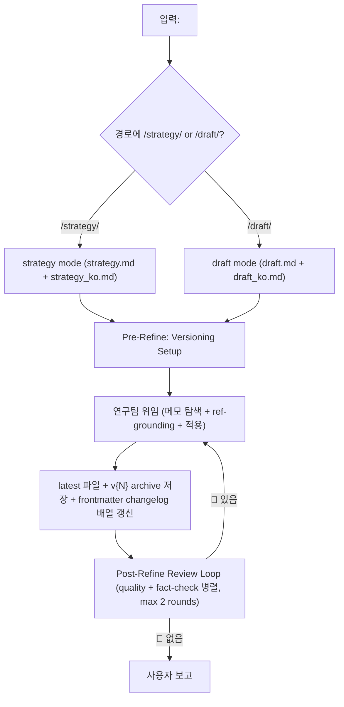

# draft-refine

> 본 README 는 `SKILL.md` 의 GitHub 표시용 mirror. 권위 있는 동작 명세는 `SKILL.md`.

> **Paragraph Cohesion Pre-Check (모든 mode, 2026-05-20)**: paste-ready block을 추가·rewrite하는 memo 적용 전 target paragraph **전체 narrative flow** 분석 + 4-step self-check — (1) substance 이미 명시 여부 / (2) paragraph axis 단절 여부 / (3) §-level cross-section redundancy / (4) edit type (응집성 순 EDIT in-line > REPLACE > INSERT > DROP). 기존 mutation이 pre-check 실패 (예: 후행 trailing INSERT가 prior sentence와 substance 중복) → polish 대신 **EDIT/REPLACE/DROP로 재작성**. 상세 — `draft-strategy/SKILL.md` ## Paragraph Cohesion Pre-Check (single source of truth) + `SKILL.md` Other rules.

> **Paper mode camera-ready 특이 룰** (2026-05-19): 새 mutation 추가 또는 기존 mutation refine 시 **natural-integration rule** 적용 (위 Pre-Check 통과 후 추가 gate). Single gating question — *"1-2 sentence inline rewrite로 자연 통합 가능한가?"* YES → M15-style inline rewrite. NO → drop (refine으로 polish 대신 entry 폐기). Rebuttal-format 잔존 mutation 발견 시 폐기. 상세 — `SKILL.md` Other rules.

## 개요
autopilot-draft의 refine 단계 서브스킬. 사용자 메모 또는 review 피드백을 strategy 또는 draft에 반영. **versioned output** + **mandatory ref-grounding** (메모마다 source re-read).

## 호출 흐름


## 1. 메모 탐색
한국어 파일에서 다음 형식 탐색:
- `<!-- memo: ... -->` (표준 메모 태그)
- `<!-- ... -->` (HTML 주석 — 단 **legacy** `<!-- CHANGELOG (auto-managed by draft-refine ... -->` block은 메모가 아님; frontmatter `changelog:` 배열로 **마이그레이션 후 삭제** — 아래 §4 참조)
- `// ...` (인라인 주석)
- `[memo] ...` (대괄호 주석)
- `(**...**)` (괄호 주석)
- 기타 사용자 주석 표시

## 2. Mandatory Ref-Grounding (핵심)
각 메모마다 *적용 전에* 필수:
1. 메모가 가리키는 source 식별:
   - Paper analyses (`<artifact-root>/analysis_project/paper/*.md`) — citation / venue / score / dataset 사실 (single source of truth)
   - Strategy document — narrative arc / outline 정합성
   - Analysis files — audience / key messages / visual strategy
   - Original PDFs — paper 본문 재독이 필요한 nuanced 주장 (paper analyses 부족 시만)
2. **Source 재독** (메모 주장만 믿지 말 것)
3. 메모 vs source 대조:
   - 메모 = source 일치 → 메모대로 적용
   - 메모 ≠ source 충돌 → **메모 override**, 원본 텍스트 유지, changelog에 충돌 기록
   - source 모호 → 적용하되 `[CAUTION: source ambiguous]` 표시
4. Changelog에 source 검증 기록: `[verified analysis_project/paper/2020_Hu_DCCRN.md]` 형식

> 사용자 메모가 *틀린 경우* silent하게 전파하지 않음 — source가 진실의 출처.

## 3. Versioned Output
- Modern convention: `{artifact_root}/_internal/versions/v{N}/{strategy,draft}/`
- Legacy: `{ko_path.parent}/{ko_path.stem}_v{N}.md` 형제 (artifact가 이미 그 패턴 사용 시만)
- `latest` 파일 (현재 vN) + `v{N-1}` archive 양쪽 저장
- 이전 버전은 **immutable** — 절대 수정 X
- 첫 refine 시 현재 상태를 v1으로 스냅샷 후 작업이 v2로 진행

## 4. Changelog (frontmatter `changelog:` 배열, 자동 관리)

변경 이력은 **frontmatter 안의 YAML 배열**로 저장. 절대 파일 최상단 `<!-- CHANGELOG -->` HTML 주석으로 두지 않음.

**왜 이 형식이 강제인가**:
- HTML 주석을 frontmatter 위에 두면 `---`가 line 1을 차지하지 못해 markdown previewer (VS Code / GitHub / Obsidian / Jupyter)가 frontmatter 인식 실패 → `---`가 horizontal rule로, YAML key가 본문 글자로 렌더 → 미리보기 깨짐.
- YAML 배열은 구조화 데이터라 audit / 다운스트림 tool이 파싱 가능.
- Previewer가 frontmatter를 알아서 숨겨주므로 본문이 깔끔하게 보임.

**불변 규칙**: 파일은 반드시 `---` (frontmatter open)으로 line 1 시작. 그 앞에 HTML 주석·빈 줄·본문 어느 것도 못 옴.

**형식**:
```yaml
---
{기존 domain key 보존: type, venue, status, date, tone, ...}
changelog:
  - version: v{N}
    date: "{YYYY-MM-DDTHH:MM}"
    applied: X
    overridden: Y
    entries:
      - |
        [Slide N | Section X] [verified <source>]: <one-line description>
      - |
        [Slide N | Section X] [OVERRIDDEN — memo conflicted with <source>]: <reason>
  - version: v{N-1}
    {이전 entry 보존}
---
```

- `changelog:`는 frontmatter 의 **마지막** key (domain key 가독성 유지)
- 새 v{N+1} entry는 *기존 entries 위에* prepend (newest first)
- 각 entry는 literal block scalar (`|`) 사용 — backtick/backslash/콜론/대괄호/이모지 escaping 불필요
- **Legacy 마이그레이션 (필수)**: 기존 `<!-- CHANGELOG (auto-managed by draft-refine ... -->` HTML block이 있으면 같은 refine pass에서 frontmatter 배열로 변환 후 HTML block 삭제 (ko/en 양쪽)
- 사용자가 직접 편집 금지 — autopilot이 관리

## 5. Post-Refine Review Loop
연구팀 작업 후 **품질관리팀이 quality + fact-checker 병렬 검수** (최대 2 rounds).

| Level | 조건 | Quality reviewer | Fact-checker (parallel) |
|---|---|---|---|
| Quick | `--qa quick` only | 1× fast reviewer, spot-check만 | skip (`--qa quick`는 autopilot에서 refine entirely skip — manual invoke 시만) |
| Light | ≤3 sections 변경 | 1× fast reviewer | skip |
| Standard | 4+ sections 변경 | 1× deep reviewer | 1× fast fact-checker |
| Thorough | major overhaul / new evidence | 2× deep reviewers parallel | 1× fast fact-checker |

- **Quality reviewer**: narrative arc / cohesion / strategy 반영 / rebuttal 시 모든 reviewer point 응답
- **Fact-checker**: `analysis_project/paper/*.md` verbatim 대조

🔴 발견 시 연구팀 재호출 (max 2 rounds). 2 rounds 후에도 🔴 잔존 → `## 미해결 이슈` 섹션에 기록 + `[FACT-RESIDUAL]` 태그.

## 다른 skill과의 관계
```mermaid
flowchart LR
    INIT["draft-strategy"] -->|v1 (initial)| STR["strategy.md"]
    STR -->|메모 추가| RD["draft-refine (strategy mode)"]
    RD -->|v2, v3, ...| STR
    STR -->|draft 생성| DRAFT["draft.md"]
    DRAFT -->|메모 추가| RD2["draft-refine (draft mode)"]
    RD2 -->|v2, v3, ...| DRAFT
```

`draft-strategy`는 v1 (initial)만 만들고, 모든 후속 수정은 `draft-refine`이 담당.

---
*원본: `<agent-home>/skills/draft-refine/SKILL.md`*
