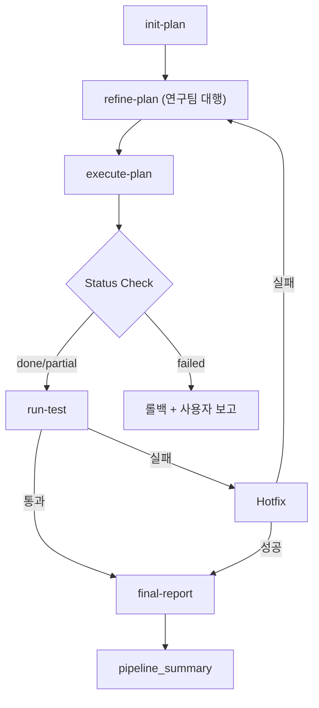
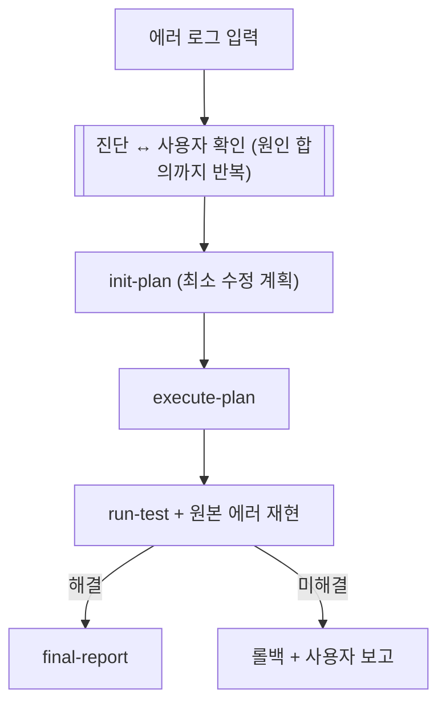

# autopilot-code

> 본 README는 Notion 페이지 [🔧 autopilot-code](https://www.notion.so/32787c2bb75381d48170dae1e5074b5c)의 미러. `/sync-skills`로 양방향 동기화. 권위 있는 동작 명세는 `SKILL.md`.

> **autopilot-code**: dev/debug 2개 모드의 통합 코드 파이프라인. 기존 3개 독립 파이프라인(autopilot-dev, autopilot-audit, autopilot-debug)을 `--mode`로 통합한 후 audit 모드는 별도 `/audit` skill로 분리 (갈래 D). 현재 autopilot-code는 dev/debug만 담당.

## 파이프라인 워크플로우

**커맨드**: `/autopilot-code --mode dev|debug <args> [--from <step>] [--qa light|standard|thorough|adversarial] [--user-refine]`

> 모드 미지정 시 dev로 기본 설정 + 경고 메시지

### --mode dev — 개발

> Hotfix 2회 실패 시: 소스코드 롤백 → 실패 컨텍스트를 `plan_ko.md`에 메모 → refine-plan으로 루프백 (최대 1회). 재시도도 실패하면 롤백 + 사용자 보고.

### --mode debug — 디버그

> 진단 우선 — 코드 수정 전에 반드시 사용자 확인. 환경 문제(config, 누락 파일 등)는 수정 대신 환경 수정 단계를 안내.

## 모드별 비교

|  | dev | debug |
|---|---|---|
| 입력 | 태스크 설명 | 에러 설명 / 로그 |
| 전처리 | 없음 | 메인이 직접 진단 |
| refine-plan | 연구팀 대행 리뷰 | 스킵 |
| run-test 재시도 | hotfix 2회 + retry 1회 | 1회 + 원본 에러 재현 |
| 롤백 범위 | 전체 | fix 변경만 |
| --from 지원 | plan/refine/execute/test/report | 미지원 (항상 진단부터) |
| --qa adversarial | 지원 | thorough로 다운그레이드 |

## 서브스킬 상세
- [init-plan](init-plan/README.md)
- [refine-plan](refine-plan/README.md)
- [execute-plan](execute-plan/README.md)
- [run-test](run-test/README.md)
- [final-report](final-report/README.md)

> **Plan Resolution** (canonical): execute-plan, run-test, final-report, refine-plan 4개 skill이 동일한 검색 알고리즘을 공유.
> 1. `.md` 접미사 → 그대로
> 2. 디렉토리 경로 → `/plan/plan.md` 추가
> 3. 퍼지 검색 → `_audit`/`_fix_` 없는 폴더 우선, 복수 시 사용자 확인
> 4. 스킬별 예외 (run-test: 직접 테스트 fallback / refine-plan: 양어 동시 resolve)

## QA Scaling

| Level | 조건 | 품질관리팀 구성 |
|---|---|---|
| Light | ≤3 files, 기계적 변경 | 1팀 (Sonnet) |
| Standard | 4-10 files, 단일 모듈 범위 | 1팀 (Opus, 기본값) |
| Thorough | >10 files, cross-variant, 아키텍처 | 2-3팀 병렬 (Opus) |
| Adversarial | cross-variant + Codex 가용 (**dev 모드 전용**) | Thorough + Codex adversarial-review |

> autopilot-code는 fact-checker reviewer 미적용 (doc/research 파이프라인과 달리 cards/PDFs 대조할 ground-truth source가 없으므로 quality reviewer만 운용. adversarial 레벨은 Codex 외부 리뷰로 이를 대체).

**스킬별 예외**:
- **run-test**: 항상 Thorough (병렬 2팀 강제). `--qa` 플래그도 무시
- **final-report**: 높은 임계값. Thorough에서도 병렬화 없음

## 핵심 설계 원칙
1. 에이전트는 프로젝트에 독립적 — 프로젝트 정보는 CLAUDE.md와 에이전트 memory에
2. 모든 상태는 파일에 저장 — 대화가 끊겨도 체크리스트로 복구 가능
3. 3중 품질 게이트 — 계획 리뷰, 코드 리뷰, 테스트 리뷰
4. commit only, no push — push는 사용자가 수동 결정
5. 점진적 테스트 — syntax → import → smoke → functional → integration
6. 변경 기록 보존 — final_report로 왜(why)와 인사이트(insight) 기록
7. 도메인 지식 통합 — 연구팀이 paper analyses 기반으로 계획을 리뷰
8. 1 파이프라인, 다중 모드 — autopilot-code가 dev/debug를 `--mode`로 통합
9. QA Scaling — 변경 규모에 따라 품질관리 강도 자동 조절
10. 스킬 간 인터페이스는 계약 — 키워드 라우팅, 파일 스키마, 변수 패턴은 암묵적 계약
11. 루프 제어는 코드처럼 — 자연어 제약 대신 카운터 변수, 증가 조건, 종료 조건 명시
12. 역할 밖 위임 금지 — 에이전트의 Mode Selection에 정의되지 않은 작업은 핸들러 추가 후 위임

## 변경 이력 (요약)
- **2026-04-10**: autopilot-code 통합 — 기존 3개 독립 skill(autopilot-dev, autopilot-audit, autopilot-debug)을 `--mode` 파라미터로 통합. 동작 100% 호환.
- **2026-05-06**: fact-checker reviewer는 doc/research에만 적용, code에는 미적용 명시.
- **2026-05-12**: audit 모드는 별도 `/audit` skill로 분리됨 (갈래 D).

---
*원본: `~/.claude/skills/autopilot-code/SKILL.md`*
