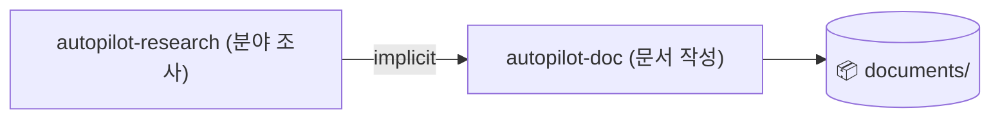

# autopilot-doc

> 본 README는 Notion 페이지 [📄 autopilot-doc](https://www.notion.so/33e87c2bb75381338b82d75e34bb04c9)의 미러. `/sync-skills`로 양방향 동기화. 권위 있는 동작 명세는 `SKILL.md`.

> **Paper mode camera-ready / major revision 특이 룰** (2026-05-19): reviewer concern → paper-body mutation 변환 시 **natural-integration rule** 적용. Single gating question — *"1-2 sentence inline rewrite로 자연 통합 가능한가?"* YES → M15-style inline rewrite. NO → drop / Appendix defer (rebuttal-format은 본문 mutation 금지). 상세 — `SKILL.md` Mode-Specific Draft Structure `### paper` 끝.

## 전체 구조


> 참고 자료(PDFs, 리뷰어 코멘트, format spec 등)를 분석하고 문서 작업의 **전략 + 초안**을 markdown으로 산출하는 파이프라인. 6개 모드 모두 strategy + draft 생성. 외부 자료 조사가 필요하면 **autopilot-research**를 먼저 돌려 그 산출물을 implicit 자동 발견하게 함.

## 명령 형식
```
/autopilot-doc "<task description>" [--mode rebuttal|paper|review|report|proposal|presentation] [--qa quick|light|standard|thorough] [--user-refine] [--no-clarify] [--from analyze|strategy|strategy-refine|draft|draft-refine|finalize]
```

| 플래그 | 설명 |
|---|---|
| `<task description>` | 첫 positional arg — 작업의 목표·의도·범위·청중 한 줄 |
| `--mode` | 6개 모드 중 하나. 생략 시 task description에서 자동 추론 |
| `--qa` | quick / light / standard / thorough (default) — fact-checker는 standard+에서 parallel sonnet으로 추가 |
| `--user-refine` | 연구팀 메모 직후 pause. 사용자가 직접 `<!-- memo: ... -->` 추가 후 `--from <stage>` 재개 |
| `--no-clarify` | Step 0 Scope Clarification 강제 skip |
| `--from <stage>` | pause/실패 후 특정 단계 재개 (analyze / strategy / strategy-refine / draft / draft-refine / finalize) |

> **`--refs` flag 없음**: 입력은 `.claude_reports/{analysis_project,research}/*`에서 implicit 자동 발견. 사전에 `/analyze-project --mode {paper|doc}` 또는 `/autopilot-research`로 materialize.
> **`--format-ref` flag 없음**: format spec(venue/journal/lab 가이드라인)은 `analysis_project/doc/{matching}/formats/`에서 자동 발견. `/analyze-project --mode doc <folder>` 사전 처리.

## 6개 모드

| 모드 | 용도 | 산출물 |
|---|---|---|
| rebuttal | 학회 reviewer 응답 | 포인트별 응답 strategy + draft |
| paper | 학술 논문 / camera-ready / major revision / 백서 / 책 챕터 / 기술 블로그 | 섹션별 outline + draft (markdown) |
| review | 본인이 reviewer 입장 (peer review) | review draft (format spec 기반 섹션 구성) |
| report | 기술 보고서 / 시장 분석 / 분기 보고 / post-mortem | 분석 framework + draft |
| proposal | 연구 grant / 사업 제안 / 내부 프로젝트 제안 | 문제 정의 + 접근법 + draft |
| presentation | 논문 발표 / 사내 세미나 / 컨퍼런스 키노트 | slide-by-slide markdown (PPTX export 미지원) |

> 모든 모드 공통 패턴: strategy + draft markdown 산출 → **사용자가 최종 작성·빌드·디자인 마무리**.

## Format spec auto-discovery (no flag)
학회·저널·연도·랩마다 다른 _개별 가이드라인 / 템플릿 / 샘플 / format-spec 파일_을 사전에 `/analyze-project --mode doc`으로 처리해 두면, autopilot-doc이 `analysis_project/doc/{matching}/formats/`에서 자동 발견. **built-in preset 없음** (venue마다 매년 다르므로).

**Resolution 순서**:
1. Auto-discovery in `analysis_project/doc/{matching}/formats/`
2. 0 candidates → 모드별 fallback

| 모드 | format spec 미존재 시 |
|---|---|
| review | **Hard fail** — reviewer guideline 없이 진행 X |
| rebuttal | Step 0 prompt — materialize 후 retry / inline 선언 / generic 동의 |
| paper / presentation / proposal / report | warn-and-fallback (generic layout으로 진행) |

**rebuttal sub-type 3종** (format spec 또는 task description에 명시, 별도 flag 없음):
- *meta-only* — AC/SAC만 보는 단일 응답
- *reviewer-dialogue* — reviewer 다회 왕복 (OpenReview 토론)
- *response-with-revision* — rebuttal 본문 + paper 수정본 (ACL ARR / 저널 major revision)

## QA Scaling
Quality reviewer + fact-checker가 **parallel**로 동작 (standard+).

| Level | Quality reviewer | Fact-checker (parallel) |
|---|---|---|
| quick | 1× (sonnet), 1-pass, refine entire skip | skip |
| light | 1× 연구팀 (sonnet) | skip |
| standard | 1× 연구팀 (opus) | 1× 연구팀 fact-check (sonnet) |
| thorough (default) | 2× 연구팀 (opus) — Domain Expert + Methodology / Content Expert + Quality | 1× 연구팀 fact-check (sonnet) |

**Fact-checker**는 `analysis_project/paper/*.md` verbatim 대조로 venue/year/metric/citation을 narrow하게 검증. _창의적 판단이 아닌 매칭 작업_이라 sonnet으로 충분.

> Strategy review (Step 3) + Draft review (Step 5) 두 곳에서 동일 패턴.

## Step 0: Scope Clarification
query가 모호하거나 mode multi-match일 때 autopilot이 2-4개 sharp question을 던지고 사용자 답변을 받아 진행. 충분히 구체적인 query는 자동 skip. `--no-clarify`로 강제 skip 가능.

## 서브스킬 (2개)
- [init-doc-strategy](init-doc-strategy/README.md)
- [refine-doc](refine-doc/README.md)

> 서브스킬은 autopilot-doc 내부에서 자동 호출. 직접 사용은 pause 재개 시점에만.

## 산출물 구조
```
.claude_reports/documents/{YYYY-MM-DD}_{short-name}/
├─ pipeline_summary.md       (T1)
├─ draft/                    (T1)
│  ├─ draft.md
│  └─ draft_ko.md
├─ strategy/                 (T2)
│  ├─ strategy.md
│  └─ strategy_ko.md
├─ analysis/                 (T2)
│  ├─ reviewer_analysis.md   (rebuttal)
│  ├─ ref_analysis.md
│  └─ material_index.md
└─ _internal/                (T3)
   ├─ strategy_reviews/
   ├─ draft_reviews/
   └─ versions/v{N}/strategy|draft/
```

## 핵심 설계 원칙
1. 6개 모드 = 6개 deliverable 카테고리. 모드별 strategy + draft 패턴 일관
2. Format spec auto-discovery (no flag). venue가 발행한 가이드라인 1개에 sections / length / tone / sub-type 모두 포함
3. Fact-checker 병렬 검수. quality reviewer는 narrative / coverage, fact-checker는 venue/year/citation 매칭
4. 인용 무결성. discovered_inputs / paper analyses / format spec에 실재하는 자료만 참조
5. Refine 단계는 versioned + ref-grounded
6. 양어 문서. 영어(실행용) + 한국어(전달용) 쌍
7. `--user-refine` 패턴. 연구팀 메모 직후 pause → 사용자 직접 메모 추가 → `--from <stage>` 재개
8. Source discovery는 별도 파이프라인 (autopilot-research)로 분리

## autopilot-research와의 chaining


학술/산업/시장 조사가 필요하면 autopilot-research를 먼저 돌리면 그 산출물(`research/{topic}/`)을 autopilot-doc이 implicit 자동 발견.

---
*원본: `~/.claude/skills/autopilot-doc/SKILL.md`*
