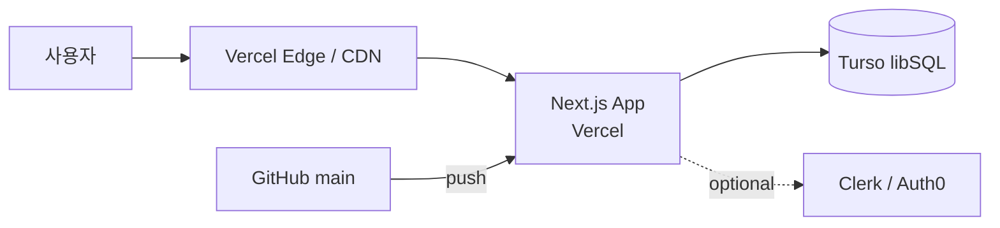

> 산출물 폴더: `.claude_reports/specs/<name>/` (CONVENTIONS.md §5 3-tier).

## Purpose — _요구사항·청사진 작성_ entry

본 skill 은 _코드 작업이 아닌_ 자리 담당. _무엇을 만들지·어떻게 정돈할지·공개 자리 어떤 API_ 같은 _spec 청사진_ 결정:

| Mode | 자리 | spec 의 핵심 |
|---|---|---|
| **app** | 사용자 대상 앱 (Next.js / Expo 등) | 피처·시나리오·API Contract·data model·ui flow + 스택·scaffolding·skeleton |
| **library** | 공개 라이브러리·패키지 (npm·pip·crate) | 공개 API (export 함수·class·type) + 사용 예시 + 호환성·versioning + module 구조 |
| **api** | 백엔드 API 서비스 (UI 없음) | endpoint·body·error·auth·rate limiting + 데이터 모델 |
| **cli** | 명령줄 도구 | 명령·옵션·서브 명령·input/output·exit code |
| **research** | 연구·실험 코드 정돈·재현성 | entry point (train·eval) + 실험 설정 (configs) + 재현 명령 + 예상 metric + baseline 비교 |

복합 mode (예: `library + cli`, `research + cli`) 자연 — 한 프로젝트가 _여러 측면_ 가지면 _복합 PRD_ 자연. PRD 가 _공통 + mode 별 섹션_ 으로 구성.

> 코드 작업 자체 (실제 함수·class·API 구현·리팩터링·디버그) 는 **autopilot-code** 가 담당 — `specs/<name>/` 컨텍스트 자동 감지로 spec Read 후 그 청사진 따라 구현.

## 흐름 안에서 본 skill 의 자리

```
사전:    autopilot-research (외부 조사) + analyze-project (기존 코드 분석)
           ↓
청사진:   autopilot-spec  ← 본 skill. mode 별 PRD + (app mode 만) scaffolding·skeleton
           ↓
시각:    autopilot-design  ← (옵션, UI 자리만)
           ↓
구현:    autopilot-code  ← spec 자동 Read, 그 청사진 따라 구현 (반복)
           ↓
보강:    autopilot-spec --mode setup-only  ← (가끔, app mode 만) ship 첫 setup·env·domain·migration deploy 안내
```

## Default Invocation Rule (메인 Claude 자동 라우팅)

본 skill 은 글로벌 [`CLAUDE.md`](../../CLAUDE.md) §6 "autopilot-* 호출 패턴" 의 _컨펌 의무_ 적용 대상.

### Trigger 신호 (자연어 발화 예시)

| mode | 발화 |
|---|---|
| **app** | "X 앱 만들어줘" / "Y 서비스" / "PRD 부터" |
| **library** | "X 라이브러리로 정리" / "npm 패키지로 만들자" / "공개 API 정리" |
| **api** | "X API 서버 만들자" / "endpoint 정리" |
| **cli** | "X CLI 도구" / "명령줄 옵션 정리" |
| **research** | "X 연구 코드 정돈" / "재현성 준비" / "학회 공개 코드 준비" |
| **복합** | "라이브러리 + CLI 도구로" / "연구 코드 + 재현 가능 CLI" |
| **보강 setup (app)** | "Vercel 셋업" / "배포 준비" / "env 변경·domain 연결" |

### Default 옵션 권장값

- `--mode`: **`auto`** (default) — 발화·기존 코드·산출물 검사로 자동 추론 (단일 또는 복수)
- `--qa`: `standard` (high-stakes 신호 시 thorough 자동 상향)
- `--user-refine`: **off** (사용자 명시 시만 on)

### Override 1순위 — autopilot 우회

- 코드 작업 (구현·리팩터링·디버그) — `/autopilot-code` 직접 (spec 자동 Read)
- 디자인만 — `/autopilot-design` 직접
- 작은 작업 (한 파일 수정·rename) — `Agent(개발팀)` 직접
- `/autopilot-spec <args>` slash 직접 입력 — 컨펌 skip

## Language Rule
- Think in English internally. Write user-facing output in Korean.
- Code identifiers, file paths, technical terms stay in English.

## Argument Parsing

### --mode (auto-detect default)

| 값 | 의미 |
|---|---|
| `auto` (default) | 발화·코드 단서로 자동 추론. 단일 또는 복수 mode |
| `app` | 앱 spec — PRD + 스택 + scaffolding + skeleton |
| `library` | 라이브러리 spec — 공개 API + 사용 예시 + 호환성·versioning + module 구조 |
| `api` | API 서비스 spec — endpoint + auth + 데이터 모델 |
| `cli` | CLI spec — 명령·옵션·input/output |
| `research` | 연구 코드 spec — entry + configs + 재현 명령 + 예상 metric |
| `app,library` 등 콤마 | 복수 mode — 한 PRD 안 mode 별 독립 섹션 |
| `setup-only` (app mode 한정) | 보강 setup — ship 첫 setup·env·domain·migration deploy 안내 |

### --qa
- `quick` / `light` / `standard` (default) / `thorough` — [CONVENTIONS.md §1](../../CONVENTIONS.md)

### --user-refine
- PRD 작성 후 사용자 메모 받고 refine loop (`_internal/refine_v{N}.md` 백업)

## Mode 자동 추론 단서 (`auto` 기본)

| 단서 | 추론 mode |
|---|---|
| `package.json` 의 `bin` 필드 / `setup.py` 의 `entry_points` / `pyproject.toml` 의 `[project.scripts]` | **cli** |
| `package.json` 의 `main` / `exports` / `pyproject.toml` 의 `[project]` + `__init__.py` 의 명시 export | **library** |
| `argparse` / `click` / `commander` / `typer` import | **cli** |
| `configs/*.yaml` + 학습·평가 metric 출력 / `*.ipynb` | **research** |
| Next.js / Expo / SvelteKit / Astro / Vite + React framework | **app** |
| FastAPI / Express / Hono + UI 없음 | **api** |
| 발화 키워드 | 발화 mode |

자동 추론 결과는 _컨펌 한 줄_ 로 사용자 확인 후 진행:

```
=== mode 추론 ===
- 발화 "정돈·공개" + 기존 코드 분석:
  · train.py / eval.py + argparse  → cli ✓
  · configs/ + 학습 metric 출력      → research ✓
  · models/__init__.py 의 export    → library ✓ (옵션)

복합 mode: research + cli (+ library 옵션) — 이대로 진행?
(진행 / 수정 — mode 추가·제거 / 단일 mode 선택 / 중단)
```

## Context Auto-Detection (신규 vs 재진입 자동 분기)

본 skill 은 호출 자리에서 _발화 + cwd_ 검사로 자동 분기:

### 1단계 — pipeline_state.yaml 자동 검사

| 감지 조건 | 처리 |
|---|---|
| `.claude_reports/specs/<name>/pipeline_state.yaml` 부재 | **신규** — Step 1 부터 처음. 산출 `specs/<name>/` 신설 |
| `.claude_reports/specs/<name>/pipeline_state.yaml` 존재 | **재진입** — `phases:` 상태 read + 발화 의도 분류 후 해당 step 부터 refine v{N+1} |

`<name>` 추출 — 발화 (예: `"X 앱의 Y 수정"` → name=X) 또는 cwd (현재 dir 의 specs/<name>/ 한 자리만 발견 시 그것) 또는 사용자 명시.

### 2단계 — 발화 → step 자동 분류 (재진입 자리)

| 발화 신호 | 추론 step | 흐름 |
|---|---|---|
| "스택 바꾸자" / "Vercel 대신 Cloudflare" / "framework 교체" | Step 2 (스택 후보 재선정) | refine v{N+1} + 이후 step 무효화 |
| "Y endpoint 추가" / "data model 의 X entity 필드 변경" / "ui flow 의 X 화면" | Step 3a (PRD 핵심 mode) | refine + 묶음 갱신 (api_contract / data_model / Component diagram) |
| "Component diagram 손보자" / "Deployment 자리 추가" | Step 3b (Architecture Diagrams) | refine v{N+1} |
| "복합 mode 추가 — Y mode 도" / "이 spec 에 cli 도 같이" | Step 3c (복합 mode 다른 섹션) | refine + mode 추가 |
| "skeleton 다시 — ref 바꾸자" / "ref repo 다른 자리" | Step 4 Phase 0 (ref source) | Phase 1·1.5·2·3 재실행 |
| "skeleton 의 train.py 수정" / "scaffold 결과 손보자" | Step 4 Phase 2 (개발팀 new-lib) | Phase 2·3 재실행 |
| "Vercel 셋업" / "배포 셋업" / "env 변경" / "도메인 연결" | Mode B `setup-only` (아래 모드 B 절) | setup mode 자리 |

### 3단계 — 자동 컨펌 한 화면

```
=== autopilot-spec 호출 자리 ===
프로젝트: <name>
산출물: specs/<name>/ (발견 — 기존 spec) 또는 (부재 — 신규)
phases (재진입 시): spec=done, scaffolding=done, dev=in_progress
발화: "<사용자 한 줄>"
→ 추론: <step / 신규> 자리 — refine v{N+1} (재진입 시)

진행? (진행 / 다른 step 으로 / 새 spec 으로 / 중단)
```

신규 vs 재진입 분류는 _명시 옵션 (`--from`) 없이도_ 동작 — 사용자 발화 + cwd 자동 판단. 사용자가 명시적 `--from <step>` 입력하면 그대로.

### refine v{N+1} 백업

각 step refine 시 자동 백업:
- `specs/<name>/_internal/refine_v{N}.md` (각 refine round 의 변경 사항 narrative)
- `specs/<name>/01_spec/PRD_v{N}.md` 등 (이전 버전 스냅샷, 필요 자리만)

## Procedure

> **본 skill 의 default — 중간 컨펌 다회** (2026-05-26 변경): spec 자체가 _사용자 의도 결정 자리_ 라 _전반적 상호작용_ 이 본질. Step 1 / 2 / 3a / 3b / 3c / 4a / 4b / 5 자리에 사용자 검토 자리 (총 6-8 자리). 사용자 _빠른 진행_ 발화 ("쭉 진행" / "ok 다 진행" / "다 알아서") 시 _일괄 컨펌_ 으로 자동 축소 (3a-3c 한 묶음 / 4a-4b 한 묶음 → 실제 컨펌 3-4 자리).

### Step 1: 정보 수집 + 중간 컨펌

**1-1. 프로젝트 name 추출** — 발화·cwd·기존 `package.json`·`pyproject.toml` 등.

**1-2. mode 자동 추론** — 위 단서 표 적용.

**1-3. 기존 자산 분석** — `analyze-project` 산출물 (`.claude_reports/analysis_project/code/`) 발견 시 자동 인용. 부재 시 cwd 코드 직접 검사. `similar_models.md` / `experiment_conventions.md` 가 있으면 scaffold Phase 0 의 ref source 후보로 기록.

**1-4. autopilot-research 결과 자동 import** — `.claude_reports/research/` 발견 시 reference 패턴·외부 baseline 인용. `code_resources/` (외부 ref repo) + `07_resources.md` (pre-trained ckpt) 가 scaffold Phase 0 의 외부 ref source 후보.

**1-5. (app mode 만) 환경·스택 후보 정리** — Node / pnpm / Docker 확인, 스택 후보 2-3 안.

**1-6. 수집 결과 한 화면 컨펌**:

```
=== 정보 수집 결과 ===
프로젝트 name:    <name>
mode 추론:       <list> (근거: <증거>)
기존 자산:       analyze-project 산출 <found/not-found> — similar_models / experiment_conventions / code 모듈 분석
외부 research:   research/<topic>/ 발견 시 — code_resources (외부 ref) + 07_resources (pre-trained ckpt) 인용 자리 N
(app mode 만) 환경: Node / pnpm / Docker

이 자료들로 진행? (진행 / 수정 — 자료 추가 또는 제외 / 중단)
```

### Step 2: 한 화면 컨펌

```
=== Spec 결정 자리 ===
프로젝트 name:    <name>
mode (추론):     <mode list> (근거: <증거>)
사전 자료:       autopilot-research / analyze-project 발견 — 인용 자리 N

(app mode 만 추가) 환경 / 스택 후보:
  Node ✓ / pnpm ✓ / Docker ✗
  스택: 1. Next.js+Prisma+Turso  2. Expo+tRPC  3. SvelteKit+Drizzle
  → 권장 1순위 (근거: <발화>)

이대로 진행? (진행 / 수정 — mode·스택 변경 / 중단)
```

### Step 3: PRD 작성 — 3 자리 분할 (중간 컨펌)

`specs/<name>/01_spec/PRD.md` 를 한 번에 다 쓰지 않고 _3 자리로 분할_ 각자리 사용자 검토. _빠른 진행_ 발화 시 자동 일괄.

#### Step 3a: 공통 + 핵심 mode 섹션 작성 → 컨펌

- _공통_ (module 구조 / 의존성 / 언어·런타임 / License)
- _핵심 mode 섹션_ (해당 mode 의 첫 번째 — app 의 피처·시나리오·API Contract / library 의 공개 API / api 의 endpoint / cli 의 명령·옵션 / research 의 entry·configs·metric)

```
=== PRD 초안 (공통 + 핵심 mode) ===
<산출 path>
주요 결정: <3-5 bullet>

이 초안 ok? (진행 / 수정 — 섹션 단위 refine / back-jump Step 2 / 중단)
```

#### Step 3b: Architecture Diagrams 작성 → 컨펌

해당 mode 자리만 — app / api 의 Component + Deployment 기본 포함. 그 외 mode 와 옵션 diagrams (ER / Sequence / Activity / State / Class) 는 사용자 명시 요청 시.

```
=== Architecture Diagrams ===
Component diagram (mermaid): <요약 — 노드·관계 한 줄>
(app / api 만) Deployment diagram: <호스팅·DB·외부 service 한 줄>

다이어그램 ok? (진행 / 수정 — 노드 추가·제거 / back-jump / 중단)
```

#### Step 3c: (복합 mode 시) 다른 mode 섹션 작성 → 컨펌

복합 mode (예: `research,cli`) 자리에서 _두 번째 mode 섹션_ 추가 작성. 단일 mode 면 본 단계 skip.

```
=== PRD 추가 mode 섹션 ===
mode: <두번째>
주요 결정: <3-5 bullet>

ok? (진행 / 수정 / back-jump Step 3a / 중단)
```

PRD 본문 형식 (공통 + mode 별 섹션 + Architecture Diagrams) 는 아래:

```markdown
# <Project Name> Spec

## 공통
- Module 구조
- 의존성
- 언어·런타임 버전
- License

## [app] (해당 mode 만)
### 피처 목록 (P0/P1/P2)
### 사용자 시나리오 (3-5개)
### 비기능 요구
### 데이터 모델 초안 (entity·관계·migration plan)
### API Contract (백·프론트 공유 — endpoint·body·error·auth)
### 화면 흐름 (UI 있을 시)

## [library] (해당 mode 만)
### 공개 API (export 함수·class·type)
### 사용 예시 (README 자리)
### 호환성·versioning (semver 정책)
### Module 구조 (src/{io, core, utils}/ 같은)

## [api] (해당 mode 만)
### Endpoint (POST /api/X / GET /api/Y / ...)
### Body / Response shape
### Error code
### Auth (token / OAuth / API key)
### Rate limiting

## [cli] (해당 mode 만)
### 명령 (train / eval / serve / ...)
### 옵션 (--config / --resume / --output / ...)
### Input/Output 형식
### Exit code

## [research] (해당 mode 만)
### Entry point (train.py / eval.py / 명령 예시)
### 실험 설정 (configs/*.yaml 구조)
### 재현 명령 (학습·평가·테스트)
### 예상 metric (PSNR / Acc / SI-SDR / 등)
### Baseline 비교

## Architecture Diagrams (해당 mode 자리만 — 기본: app / api)

### Component diagram (mermaid)
시스템의 _모듈 단위 구성·의존_ 한눈. mode 별:
- app: frontend / backend / DB / external service 의 의존
- api: router / handler / repository / model / external service 의 의존
- library (옵션): 공개 module 의 내부 의존
- 그 외 mode 는 _기본 X_ — 복잡 자리만 사용자 명시 요청

### Deployment diagram (mermaid, app / api mode 만)
시스템의 _물리 배포 자리_ 한눈. ship setup 의 시각 형태:
- 호스팅 (Vercel / Fly / Railway / Cloudflare)
- DB host (Turso / Supabase / Neon / RDS)
- 외부 service (Stripe / Auth0 / Cloudflare R2)
- CDN
- CI/CD trigger (GitHub push → provider)
- 사용자 진입점 (domain)

예 (app mode — 가사관리 앱 자리):


### 옵션 diagrams (사용자 명시 요청 또는 복잡 자리 자동 추론 시만)
- **ER diagram** — data_model.md 의 시각 보강 (entity 5+ 자리)
- **Sequence diagram** — 복잡한 인증·트랜잭션·webhook 순서 자리
- **Activity diagram** — 복잡한 checkout / login flow / research pipeline
- **State diagram** — 도메인이 상태 모델 강한 자리 (order / payment / 게임 turn)
- **Class diagram** — library mode 의 공개 API 시각화 (textual 공개 API 로 충분한 자리는 skip)

본 옵션 diagrams 는 _기본 생성 X_ — 사용자 명시 요청 (`/autopilot-spec --add-diagram <type>`) 또는 자동 추론 (entity 5+ / 도메인 상태 모델 인지 / 복잡 flow 등) 자리만.
```

mode 가 단일이면 _해당 섹션만_, 복수면 _각 섹션 독립_.

### Step 3.5: 묶음 갱신 logic (PRD 변경 자리)

PRD 의 textual 자리와 Architecture Diagrams 가 _drift 빠지지 않게_ — 변경 발생 자리에서 _영향 받는 모든 자리 한 트랜잭션_ 갱신. 변경 종류 → 영향 매핑:

| 변경 종류 | 영향 자리 (모두 일관 갱신) |
|---|---|
| 새 API endpoint 추가·body·error 변경 | `01_spec/api_contract.md` + Component diagram + (옵션) Sequence diagram |
| 새 DB entity·필드 추가·migration | `01_spec/data_model.md` + (옵션) ER diagram + Component diagram (backend 자리) |
| 새 UI 화면·flow 변경 | `01_spec/ui_flow.md` + (옵션) Activity diagram + Component diagram (frontend 자리) |
| 새 외부 service 통합 (Stripe / Auth0 / S3 등) | `01_spec/api_contract.md` (auth) + **Deployment diagram** + `05_ship/deploy_record.md` + `.env.example` |
| 스택 교체 (DB·framework 등) | `00_init/stack_decision.md` (refine v{N}) + **Component diagram** + **Deployment diagram** |
| 도메인 상태 모델 추가 (order / payment 등) | `01_spec/data_model.md` + (옵션) State diagram |

**호출 자리**:
- autopilot-spec refine 자리에서 사용자 의도 변경 시 → 영향 자리 자동 list → 사용자 confirm → 일괄 갱신
- autopilot-code 가 spec 영향 변경 감지 자리에서 → 묶음 갱신 plan 보여주고 사용자 confirm → autopilot-spec back-jump 호출

**Deployment diagram 의 자동 갱신** — ship 자리 변경 빈도 낮음 (provider 교체·env 추가·domain 연결 자리만). autopilot-spec setup-only 호출 자리에서 _deploy_record.md + Deployment diagram_ 한 묶음.

### Step 4: Scaffolding + Skeleton 코드 생성 (mode 5종 통일)

mode 5종 모두 scaffold 단계 통일 — 빈 자리에서도 _뼈대 + skeleton_ 까지 spec 단에서 완성, 이후 autopilot-code 는 _layout 위 logic 추가_ 자리만 담당. _기존 repo 최대 활용_ — autopilot-research 의 외부 ref 또는 사용자 코드베이스의 내부 유사 모델이 1순위, generic skeleton 은 마지막 fallback.

#### Phase 0: ref source 결정 + 컨펌

자료 우선순위 (높을수록 우선):

| 순위 | source | 자리 |
|---|---|---|
| 1 | 내부 — `analysis_project/code/similar_models.md` 또는 사용자 `--ref <path>` 명시 | 같은 코드베이스 안 가장 유사 자리 — 컨벤션 정합 100% |
| 2 | 외부 — `research/{topic}/code_resources/` (autopilot-research 의 repo 카드) 또는 `07_resources.md` (pre-trained ckpt URL) 또는 사용자 `--ref <url>` 명시 | research 산출. paper 의 official repo / HF transformers / espnet / lightning 등 |
| 3 | Generic skeleton fallback | 1·2 모두 부재 자리만. 사용자 컨펌 후 진행 |

> **컨벤션 prepend 우선순위** — `analysis_project/code/experiment_conventions.md` (1순위 — per-project source of truth) + `~/.claude/user_profile/07_coding_convention.md` (2순위 — cross-project default, per-project 부재·빈 자리만 보강) 가 _ref source 우선순위와 독립_ 으로 매번 read. Phase 2 (개발팀 new-lib prompt) 에 prepend — 충돌 자리는 per-project 우선, 본 프로젝트의 실제 컨벤션 침범 X.

```
=== ref source 결정 ===
mode: <list>
ref 1순위 (내부): <similar_models 추천 또는 --ref 명시 — 있으면>
ref 2순위 (외부): <research/code_resources / 07_resources 의 후보 — 있으면>
fallback: generic skeleton (위 둘 부재 자리만)

이 ref 로 진행? (진행 / 수정 — 다른 ref 명시 / 중단)
```

#### Phase 1: ref repo / ckpt 가져오기

| 자리 | 처리 |
|---|---|
| Public git repo (GitHub / GitLab) | Bash `git clone <url> /tmp/<name>_ref` 자동 |
| HF model / dataset | `huggingface-cli download X/Y` 또는 HF MCP |
| 로컬 path (similar_models / `--ref <path>`) | path 그대로 |

private repo 자리는 사용자가 자기 환경에서 미리 clone 한 후 `--ref <local-path>` 로 명시 → _로컬 path_ 자리 흡수 (본 skill 안 처리 X).

#### Phase 1.5 (신설): Pretrained ckpt 사전 동작 점검

ML / DL 자리 default — 학습·재학습 시작 _전_ 에 _ref 가 빈 자리에서 동작하는지_ 검증. _학습은 비싸니 inference 1 sample 로 먼저_ 확인.

점검 흐름:
1. ckpt URL / path 확인 (Phase 0 의 외부 ref source 또는 사용자 명시)
2. ref repo 의 inference 명령 추출 — autopilot-research 의 `07_resources` / `06_implementation` 에 _Quick verify 명령_ 누적되어 있으면 그대로 사용. 없으면 ref repo 의 README / `inference.py` / `demo.py` 자동 추출
3. 1 sample inference 실행 — Bash 직접 또는 테스트팀 _smoke_ 모드 호출
4. 통과 기준 — 에러 없이 끝남 + 출력 shape / 값 reasonable
5. 결과 보고 + 사용자 컨펌

```
=== Pretrained ckpt 사전 동작 점검 ===
ckpt: <URL or path>
inference 명령: <한 줄>
결과: ✅ 통과 (output shape <X> / 값 reasonable) | ❌ 실패 (root cause: <한 줄>)

(통과 → Phase 2 진행 / 실패 → 다른 ref / 그대로 진행 / 중단)
```

**Phase 1.5 는 ML / DL 자리 default 필수** — ckpt 자리는 _사전 검증 무조건_. 학습·재학습 비용 큰 자리라 _ckpt 가 빈 자리에서 동작_ 확인 후 진입.

자동 skip 자리 (좁게):

| 자리 | 사유 |
|---|---|
| mode `library` / `api` / `cli` 의 _코드만 가져오는 자리_ | ckpt 없으면 검증 대상 X |
| 사용자 코드베이스의 similar_models 자리 (이미 동작 확인된 내부 ref) | 재검증 무의미 |
| Disk / network 한계 자리 — ckpt 가 매우 무거움 (예: 100 GB+, 또는 사용자 환경 disk 부족) | 사용자 발화로 명시 skip 가능 (`"ckpt 너무 무거우니 검증 skip"` / `--no-verify`). 단 _default 는 검증_. ckpt size 가 사용자 환경 한계 초과 인지되면 메인 Claude 가 _skip 권유_ 한 줄 — 사용자 컨펌 |

_가벼운 ckpt_ (수십 MB ~ 수 GB 자리) 는 _사용자 발화 skip 요청 무시_ — 검증 강제. ML 자리에서 빈 자리 baseline 의 _ref ckpt 가 빈 자리에서 안 도는데 fine-tuning 시작_ 자리 사용자 보호 가치 크다.

#### Phase 2: 우리 컨벤션 으로 옮기기 (개발팀 new-lib)

```
Agent(개발팀, mode="new-lib"):
  "Mode: scaffold for {target_mode}.
   ref source: {ref_path}
   대상 폴더: specs/{name}/00_init/ + (mode 별 자리)

   ## 코드 수정 4 원칙 (필수 준수)
   1. 최소 수정 — ref 의 _필요 자리만_ 복사 후 우리 컨벤션 으로 옮김
   2. 원래 layer 1순위 — experiment_conventions.md 의 preferred layer (per-project 1순위) + user_profile/07 (cross-project default, 보강) 사용. 충돌 자리는 per-project 우선
   3. 마이너 변경 = config — model.py 수정 X
   4. 변형 prefix — fine-tuning 변형은 experiment_conventions.md 의 prefix 패턴 따름 (per-project 부재면 user_profile/07 의 패턴 — 예: _ft01_)

   ## 본 프로젝트 컨벤션 (1순위 — source of truth)
   {analysis_project/code/experiment_conventions.md 의 컨벤션 인용 — 있으면}

   ## 사용자 cross-project default (2순위 — per-project 부재·빈 자리만 보강)
   {user_profile/07 의 model 폴더 / config / prefix / preferred layer / framework 인용 — per-project 와 충돌 시 per-project 우선}

   ## mode 별 scaffold 산출물
   {mode_specific_outputs}

   ## 안 함
   - 새 layer 도입 (preferred layer list 외)
   - ref repo 의 _불필요 자리_ (다른 dataset 전용 / 다른 task / experiment 자국)
   - 라이브러리화·정련 (autopilot-code 영역)

   Return: 생성 파일 list + 한국어 요약."
```

mode 별 scaffold 산출물:

| mode | 산출물 |
|---|---|
| **app** | (현행) `create-next-app` + `prisma/schema.prisma` + 빈 page routes + 기본 layout |
| **library** | `pyproject.toml` / `setup.py` + `src/<pkg>/__init__.py` 의 공개 API skeleton + ref 의 export 구조 |
| **api** | `app/main.py` (FastAPI) 또는 `index.ts` (Express) + router skeleton + ref 의 middleware·auth 구조 |
| **cli** | `cli.py` (argparse / typer) entry + 명령·서브명령 skeleton + ref 의 명령 구조 |
| **research** | `train.py` / `eval.py` / `config.yaml` / `model/<name>/` skeleton + ref 의 training loop·model layer 구조 (preferred layer 만 + inference 가능 자리까지) |

복합 mode (`research,cli`) 면 _두 자리 모두 scaffold_.

#### Phase 3: skeleton 결과 컨펌

```
=== Scaffold 결과 ===
mode: <list>
ref source: <내부 / 외부 / generic>
생성 파일:
  <list>

(app mode) scaffolding 명령: create-next-app 등 실행됨 ✓
(research mode) Phase 1.5 ckpt 점검 결과: ✅ 통과 / ❌ 실패 / skip

(진행 — Step 5 spec 완성 / 수정 — scaffold 다시 / back-jump Phase 0 / 중단)
```

### Step 5: [CONFIRM Gate — refine 진입 가능]

```
Spec 완성:
  mode: <list>
  주요 결정: <요약 3-5 bullet>

(진행 — autopilot-design 또는 autopilot-code / 수정 — refine v2 / 중단)
```

`--user-refine` on 또는 사용자 _수정_ 발화 시 PRD refine loop.

## Mode B — `setup-only` (app mode 한정 보강)

이미 `specs/<name>/` 있고 _ship 첫 setup·env·domain·migration deploy 안내_ 자리:

### Step 1: 현재 상태 점검
- `pipeline_state.yaml` 의 stack 검증
- `git remote -v` (GitHub 연결)
- 기존 `vercel.json`·`.github/workflows/`·`.env.example` 발견 여부
- git working tree clean 검증

### Step 2: 사용자 발화 분류

| 신호 | 처리 |
|---|---|
| "배포 셋업" / "Vercel" | **ship 첫 setup** |
| "env 변경" | env 보강 |
| "도메인" | DNS 안내 |
| "migration 운영 배포" | DB migration deploy 안내 (destructive 위험) |

### Step 3: ship 첫 setup (가장 흔함)

**3-1. 호스팅 선정** — 사용자 confirm:

| 스택 | 권장 |
|---|---|
| Next.js | Vercel |
| Next.js + heavy backend | Fly.io |
| 정적 | Cloudflare Pages |
| 컨테이너 | Railway |
| Mobile (Expo) | EAS Build |

**3-2. `.env.example`** — 실제 값 없음, 키만

**3-3. CI/CD 셋업** — `.github/workflows/deploy.yml` (사용자 confirm 후)

**3-4. 도메인** (옵션) — DNS 안내

**3-5. 배포 명령 안내** — `vercel login` / `vercel link` / `vercel deploy --prod` — 사용자 직접 실행

**3-6. `05_ship/deploy_record.md` 작성**

## Forbidden Zones (명시 요청 없이 X)

- 실제 배포 명령 (`vercel deploy`, `fly deploy` 등) — 안내만
- 결제 정보·credit card 등록
- DNS 직접 변경
- 도메인 구매
- 환경변수 _실제 값_ 입력 (사용자 dashboard 직접)
- production DB migration 자동 실행

## CONFIRM Gate 응답 분기 (모든 Gate 공통)

| 응답 | 처리 |
|---|---|
| **진행** | 다음 단계 또는 종료 |
| **수정** | 현 단계 refine v2 (`_internal/refine_v{N}.md` 백업) |
| **back-jump** | 이전 단계 재실행 + 하위 무효화 |
| **중단** | 멈춤, `pipeline_state.yaml` 상태 보존 |

발화 모호 시 옵션 다시 물음 (임의 추측 X).

## Pipeline state 관리

`specs/<name>/pipeline_state.yaml`:

```yaml
project_name: <name>
created: <date>
mode: [library, cli, research]   # 또는 단일 [app]
(app mode 만) stack:
  framework: <chosen>
  db: <chosen>
phases:
  spec: done                    # PRD 완성
  (app mode 만) scaffolding: done
  (app mode 만) skeleton: done
  design: pending               # autopilot-design 진행 시 done
  dev: in_progress              # autopilot-code 가 누적
  (app mode 만) ship_setup: pending
last_updated: <timestamp>
```

autopilot-code 가 본 폴더 안 `dev_log/` 에 누적.

## Return Format

```
.claude_reports/specs/<name>/ -- ✅ spec completed (mode: <list>)
```

다음 단계 안내:
- spec 완료 → "autopilot-design (시각 자리) 또는 autopilot-code (구현·정돈)"
- (app mode) setup 완료 → "이후 push 만으로 자동 deploy"

## Update memory

- 사용자 자주 만나는 mode 조합 (예: research + cli)
- mode 자동 추론 단서 보강
- 스택·언어 선호
- ship setup 자주 만나는 함정

## Examples

### 예시 1 — 가사관리 앱 (단일 app mode)

```
/autopilot-spec "할 일 + 가계부 가사관리 웹 앱"
→ mode auto → app 추론
→ PRD: 피처·시나리오·API Contract·data model·ui flow
→ 스택: Next.js + Prisma + Turso
→ scaffolding + skeleton
→ specs/가사관리/01_spec/PRD.md
```

### 예시 2 — TF-Restormer 연구 코드 정돈 (복합 research + cli)

```
/autopilot-spec "TF-Restormer 정돈·재현성 준비"
→ mode auto → research + cli 추론 (configs/ + argparse + ipynb 단서)
→ PRD 공통: module 구조, 의존성, license
→ PRD [research]: entry / configs / 재현 명령 / 예상 metric
→ PRD [cli]: train.py / eval.py 명령·옵션
→ specs/TF-Restormer/01_spec/PRD.md (코드 생성 X — autopilot-code 가 본 spec 따라 정돈)
```

### 예시 3 — npm 라이브러리 (복합 library + cli)

```
/autopilot-spec "audio-utils — Node 라이브러리 + CLI 도구"
→ mode auto → library + cli
→ PRD [library]: 공개 API (loadAudio / saveAudio / ...) + 사용 예시 + semver
→ PRD [cli]: au-tool 명령 + 옵션
→ Phase 0: ref source — Phase 1: github clone 한 ref repo → Phase 2: src/{io,core,utils}/ 의 export skeleton + cli entry (Phase 1.5 skip — 코드만 가져오는 자리)
→ specs/audio-utils/01_spec/PRD.md + 00_init/scaffold/ (skeleton)
```

### 예시 4 — ASR Conformer baseline (research + cli, Phase 1.5 ckpt 검증)

```
/autopilot-spec "Conformer ASR baseline — fine-tuning 시작 자리"
→ mode auto → research + cli (configs / argparse / metric 단서)
→ Step 1: 정보 수집 — research/asr-conformer/ 의 code_resources (espnet, transformers) 인용 자리 N. similar_models 부재 (빈 코드 자리) → 외부 ref 1순위
   "위 자료들로 진행?" → 진행
→ Step 2: mode + 스택 (PyTorch + lightning) 컨펌
→ Step 3a: PRD [research] entry / configs / metric (WER / CER) → 컨펌
→ Step 3b: Component diagram (data → encoder → decoder → metric) → 컨펌
→ Step 3c: PRD [cli] train / eval / serve 명령 → 컨펌
→ Step 4 Phase 0: ref source — espnet asr1 recipe + HF transformers Conformer ckpt → 컨펌
→ Step 4 Phase 1: git clone espnet + huggingface-cli download nvidia/conformer-asr-small → /tmp/asr_ref
→ Step 4 Phase 1.5: ckpt 사전 동작 점검
   inference 명령: research/asr-conformer/07_resources 에 누적된 Quick verify 명령
   결과: ✅ sample WAV 1 개 → 텍스트 출력 정상 → Phase 2 진행
→ Step 4 Phase 2: 개발팀 new-lib
   - model/Conformer/ 폴더 (preferred layer 만 — MHSA / Conv / FFN)
   - train.py / eval.py / config.yaml skeleton (lightning)
   - cli.py (typer — train / eval / inference 서브명령)
→ Step 4 Phase 3: 결과 컨펌
→ Step 5: spec 완성 → 다음 — /autopilot-lab "ASR fine-tuning Common Voice ko"
```
