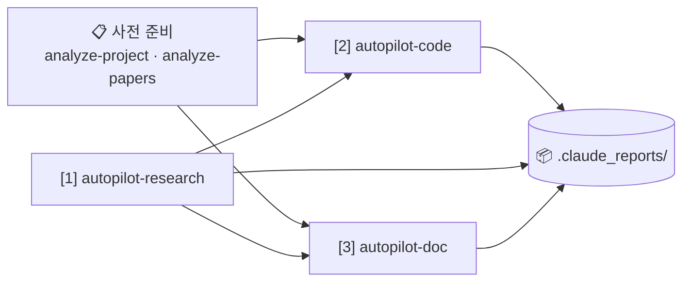
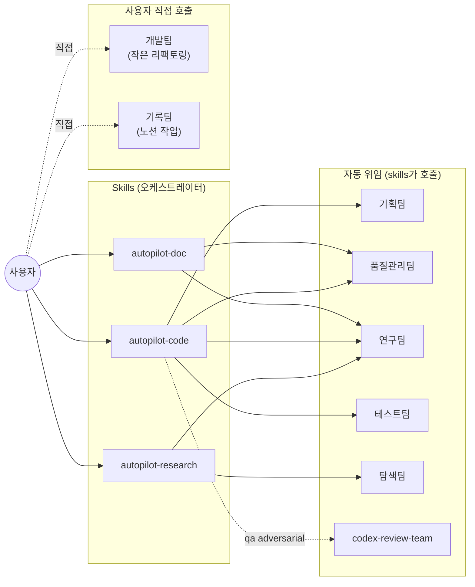

## Language Rule
- 사용자 응답은 한국어로.

## Purpose
스킬·에이전트를 수정한 후 매번 GitHub과 Notion에 일관된 정보가 반영되어 있는지 확인하는 도구.

**Source of Truth**: `~/.claude/skills/*/SKILL.md` + `~/.claude/agents/*.md` (frontmatter)
**파생 산출물**: GitHub README.md, Notion 대문 페이지 상단 대시보드

이 스킬은 Source of Truth로부터 README와 노션 대시보드를 재생성한다. 사용자가 두 파생물을 직접 편집해서는 안 된다 (자동 생성 표지 있음).

## Targets

### 입력
- **Skills**: `~/.claude/skills/*/SKILL.md` (현재 12개: autopilot-research/code/doc, init-plan, refine-plan, execute-plan, run-test, final-report, init-doc-strategy, refine-doc, analyze-project, analyze-papers, sync-skills 자기 자신)
- **Agents**: `~/.claude/agents/*.md` (현재 8개: 기획팀/품질관리팀/개발팀/테스트팀/연구팀/탐색팀/기록팀/codex-review-team)

자동 발견: `ls ~/.claude/skills/*/SKILL.md ~/.claude/agents/*.md`. 위 목록은 현재 알려진 항목.

각 파일에서 추출:
- frontmatter `name`, `description`, `argument-hint` (skills only), `tools`, `model`
- argument-hint 파싱 → 옵션 값 (예: `--mode dev|audit|debug`, `--from analyze|strategy|...`)

### 출력
1. **GitHub**: `~/.claude/README.md` (repo: `git@github.com:dmlguq456/claude_setting.git`, root: `~/.claude/`)
2. **Notion 대문**: `Agents/Skills` 페이지 (id: `34987c2b-b753-80d6-8df4-d6ce4d469bff`)
   - **상단 대시보드 영역**(자동 갱신): H1 `# 전체 워크플로우` ~ 첫 `<columns>` 직전까지
   - **하단 세부 영역**(보존, 갱신 X): `<columns>` 안의 Skills/Agents 서브페이지 링크들 + 페이지 하단 메모
3. **상태 파일**: `~/.claude/skills/.sync_state.json` — 각 입력 파일의 SHA-256, 마지막 README/Notion sync 시각

## Argument Parsing
- `--check`: drift만 보고하고 종료. 쓰기 작업 X.
- `--readme-only`: README.md만 갱신, Notion은 건드리지 않음.
- `--notion-only`: Notion 대문 상단만 갱신, README는 건드리지 않음.
- `--force`: SHA가 같아도 재생성 (포맷 일괄 적용·서식 수정에 사용).

기본(인자 없음): drift 감지 → 변경 있으면 README + Notion 모두 갱신.

## Pipeline

### Step 1: Discover + hash
```bash
ls ~/.claude/skills/*/SKILL.md ~/.claude/agents/*.md
```
각 파일:
- SHA-256 (`shasum -a 256 <file> | awk '{print $1}'`)
- frontmatter 파싱 (간단한 YAML 파서: 첫 `---` ~ 두 번째 `---`)

### Step 2: Read sync state
`~/.claude/skills/.sync_state.json` 로드. 없으면 빈 dict.

스키마:
```json
{
  "version": 2,
  "last_readme_sync": "ISO8601",
  "last_notion_sync": "ISO8601",
  "items": {
    "skills/autopilot-code": {"sha256": "...", "synced_at": "ISO8601"},
    "agents/research-team": {"sha256": "...", "synced_at": "ISO8601"}
  }
}
```

### Step 3: Drift report
**신규 / 변경 / 삭제 / 동일** 4 분류. 한국어 출력:
```
Sync 상태 (2026-05-06 12:34 KST)
─────────────────────────────────────
Skills:  변경 3 / 신규 0 / 삭제 0 / 동일 9
Agents:  변경 0 / 신규 0 / 삭제 0 / 동일 8

[변경된 항목]
  ✏️  skills/autopilot-code   (마지막 sync: 2026-04-21)
  ✏️  skills/autopilot-doc    (마지막 sync: 2026-04-21)
  ✏️  skills/init-plan        (마지막 sync: 2026-04-21)

마지막 README sync: 2026-04-21 09:08
마지막 Notion sync: 2026-04-21 01:26
```

`--check`이면 종료.

### Step 4: Generate dashboard sections (공통 — README와 Notion 상단 모두 사용)

#### 4a. 두 다이어그램 (워크플로우는 단순화, agent 호출은 별도)

**Diagram 1: 워크플로우** — 5노드 단순 구조. 옵션 플래그는 노드 라벨에 박지 않고 본문 prose로 풀어쓴다.


다이어그램 직후 본문에 **파이프라인별 역할 (4 paragraphs)** + **자주 쓰는 체이닝 패턴 (5 bullets)** + **사용자 개입 지점 (--user-refine, --from)** 섹션을 prose로 작성.

**Diagram 2: Agent 호출 구조** — Agents Cheat-Sheet 표 직후 `### Agent 호출 구조 (참고용)` 섹션에 박음.


> 매 sync 시 argument-hint에서 `--mode` / `--from` 옵션 값을 추출해 Diagram 1의 노드 라벨을 자동 갱신.

#### 4b. README 본문 구조 (canonical layout)

`~/.claude/README.md`가 본 sync의 단일 진실 출처(reference layout). sync 시 다음 순서로 섹션을 채운다:

1. **Header** — title + sync 시각 + Notion 대문 링크
2. **워크플로우** — Diagram 1 (위 4a)
3. **자주 쓰는 명령** — 시나리오 × 명령 표 (7행: 세미나/논문/개발/감사/디버그/리뷰/사전준비)
4. **Skills 표** — name / 역할 / 주요 옵션. 옵션 값은 각 SKILL.md의 argument-hint에서 자동 추출. sub-skill은 표 하단 한 줄로 요약.
5. **핵심 옵션 3가지** — `--user-refine`, `--from`, `--qa`. 한 줄씩.
6. **Agents** — "직접 호출 2개" 짧은 설명 + 표 (name / 모델 / 호출자) + `<details>` 안에 호출 구조 mermaid (Diagram 2)
7. **동기화** — `/sync-skills` 두 명령 + GitHub 링크

원칙:
- prose는 최소화. 표·bullet 우선.
- 같은 정보를 두 군데 반복하지 않음 (예: 옵션 값은 Skills 표에 한 번만).
- 디렉토리 구조나 파이프라인별 prose 같은 "참고용" 섹션은 넣지 않음 — 표 하나로 대체.

현행 README가 이 layout의 reference. 대규모 변경 시 README를 먼저 손보고 본 SKILL.md를 동기화.

### Step 5: Write README.md
`~/.claude/README.md`를 4b의 layout 그대로 통째로 작성. 현행 README가 reference이므로 큰 구조 변경 없이는 sync 시점 데이터(시각, SHA 기반 변경 표시 등)만 갱신한다. argument-hint 변화로 옵션 값이 바뀌었으면 Skills 표의 "주요 옵션" 컬럼을 갱신.

### Step 6: Update Notion 대문 상단 (기록팀 위임)

페이지 id: `34987c2b-b753-80d6-8df4-d6ce4d469bff`

**원칙**: Notion MCP 도구를 직접 호출하지 않고 **기록팀(record-team) 에이전트에 위임**한다. 이유:
- 자식 페이지 보존 등의 도메인 안전 규칙을 agent 시스템 프롬프트에 박아 둘 수 있음
- 메인 컨텍스트가 Notion API 응답·HTML로 오염되지 않음
- 향후 사고(2026-05-06 트래시 사고 같은) 구조적 차단

#### 6a. 기록팀 호출
```
Agent(subagent_type="기록팀"):
  "노션 대시보드 동기화 모드.

   대상 페이지: https://www.notion.so/34987c2bb75380d68df4d6ce4d469bff
   페이지 제목: Agents/Skills

   ## 작업
   페이지 상단의 대시보드 영역만 교체. 페이지 구조:
   ```
   # 전체 워크플로우 (또는 # 📊 Dashboard...)        ← 교체 대상 시작
   {대시보드 본문 — 워크플로우 + Quickstart + cheat-sheet + 가이드라인}
   ---                                              ← 교체 대상 끝 (columns 직전 구분선)
   <columns>                                        ← 보존 (절대 건드리지 X)
   ...
   </columns>
   {하단 메모, 페이지 링크, 마지막 업데이트 라인}    ← 보존 (마지막 업데이트만 날짜 갱신)
   ```

   ## 새 대시보드 콘텐츠
   다음 마크다운 블록을 시작 헤더부터 columns 직전 `---`까지 교체:

   {Step 4a Diagram 1 + 4b Quickstart + 4c Skills cheat-sheet + 4d Agents cheat-sheet + 4a Diagram 2 + 4e 통합 가이드라인}

   ## 안전 규칙 (반드시 준수)
   1. **`update_content`만 사용**. `replace_content`는 사용 금지 — 자식 페이지 삭제 위험.
   2. **`<columns>` 안의 `<page>` / `<database>` 자식 링크는 절대 삭제 X**. old_str에 그 영역을 포함시키지 말 것.
   3. **search-and-replace는 두 단계로 분리**:
      - (1) 상단 대시보드 영역 교체 (시작 헤더 ~ columns 직전 `---`)
      - (2) 페이지 하단 `*마지막 업데이트: ...*` 라인의 날짜만 갱신
   4. fetch로 현재 콘텐츠를 받아 정확한 old_str을 만든 뒤 교체. old_str은 fetch 결과의 워딩과 한 글자도 어긋나면 실패하므로 정확히.
   5. 첫 시도 실패(validation_error 등) 시 재시도하되, `allow_deleting_content`는 절대 true로 설정 X.

   완료 후 변경된 영역 요약과 페이지 URL을 한국어로 보고."
```

기록팀은 위 프롬프트의 안전 규칙을 따라 `mcp__claude_ai_Notion__notion-fetch` → `mcp__claude_ai_Notion__notion-update-page (update_content)`를 자체 실행한다.

#### 6b. 결과 확인
기록팀의 보고를 받아 변경 영역과 보존 영역을 사용자에게 한 줄로 요약. 실패 시 (예: old_str 불일치) 사용자에게 보고하고 종료 — 직접 재시도 X.

### Step 7: Update sync state
`~/.claude/skills/.sync_state.json`을 새 SHA + 시각으로 저장.

### Step 8: Final report
```
✅ Sync 완료
─────────────────────────────────────
Skills 변경: 3 (autopilot-code, autopilot-doc, init-plan)
Agents 변경: 0
README.md 갱신: ~/.claude/README.md
Notion 대문 갱신: Agents/Skills (workflow + cheat-sheets)

다음에 PR/푸시:
  cd ~/.claude && git add README.md skills/ agents/
  git commit -m "skills+agents: <변경 요약>"
  git push
```

## Hook integration (옵션)
`~/.claude/settings.json`에 다음 추가하면 세션 종료 시 drift 알림:

```json
{
  "hooks": {
    "Stop": [{
      "matcher": "",
      "hooks": [{
        "type": "command",
        "command": "find ~/.claude/skills ~/.claude/agents -name '*.md' -newer ~/.claude/skills/.sync_state.json 2>/dev/null | head -1 | grep -q . && echo '[sync-skills] drift detected — run /sync-skills' || true"
      }]
    }]
  }
}
```

자동 sync는 권하지 않음 (편집 중간마다 노션이 푸시되면 노이즈) — 명시적 호출 + drift 알림만이 권장 패턴.

## Safety Rules
- README.md는 자동 생성 표지가 있는 경우에만 덮어쓴다. 사용자 수동 편집 흔적이 감지되면 abort + 경고.
- Notion 대문 페이지의 `<page>` / `<database>` 자식 링크는 절대 삭제 금지. `update_content` 부분 교체만.
- `--force` 없이는 SHA 동일 항목은 처리 스킵.
- sync state JSON parse 실패 시 backup으로 옮기고 빈 dict로 재시작 (모든 항목을 변경으로 처리).
- Notion MCP 호출 실패 시 README 갱신은 진행, `last_notion_sync`만 갱신 보류 (다음 호출에서 재시도).
- 자기 자신(`sync-skills/SKILL.md`) 갱신도 동일하게 처리 (메타 — `sync-skills`가 자기 hash를 state에 기록).

## Task
$ARGUMENTS
