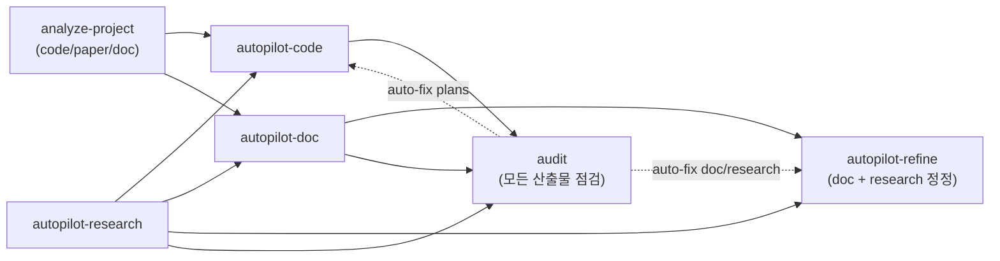
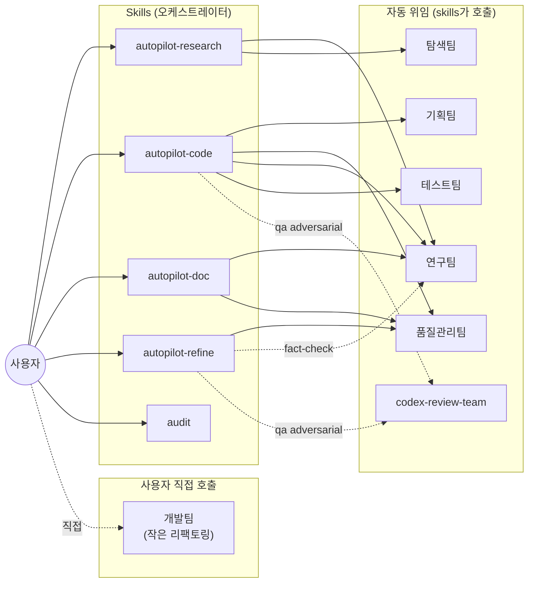

## Language Rule
- 사용자 응답은 한국어로.

## Purpose
스킬·에이전트를 수정한 후 매번 GitHub과 Notion에 일관된 정보가 반영되어 있는지 확인하는 도구.

**Source of Truth**: `~/.claude/skills/*/SKILL.md` + `~/.claude/agents/*.md` (frontmatter)
**파생 산출물**: GitHub README.md, Notion 대문 페이지 상단 대시보드

이 스킬은 Source of Truth로부터 README와 노션 대시보드를 재생성한다. 사용자가 두 파생물을 직접 편집해서는 안 된다 (자동 생성 표지 있음).

## Targets

### 입력
- **Skills**: `~/.claude/skills/*/SKILL.md` (현재 14개: analyze-project, autopilot-research, autopilot-code, autopilot-doc, autopilot-refine, audit, sync-skills, init-plan, refine-plan, execute-plan, run-test, final-report, init-doc-strategy, refine-doc — `analyze-papers`는 `analyze-project --mode paper`로 통합되어 제거됨)
- **Agents**: `~/.claude/agents/*.md` (현재 7개: 기획팀/품질관리팀/개발팀/테스트팀/연구팀/탐색팀/codex-review-team — 기록팀 제거됨, Notion 작업은 메인 Claude가 `~/.claude/notion_guide.md` 참조해 직접 수행)

자동 발견: `ls ~/.claude/skills/*/SKILL.md ~/.claude/agents/*.md`. 위 카운트는 참고용 — 실제 sync 시점에 발견된 파일 list가 진실.

각 파일에서 추출:
- frontmatter `name`, `description`, `argument-hint` (skills only), `tools`, `model`
- argument-hint 파싱 → 옵션 값 (예: `--mode dev|audit|debug`, `--from analyze|strategy|...`)

### 출력
1. **GitHub**: `~/.claude/README.md` (repo: `git@github.com:dmlguq456/claude_setting.git`, root: `~/.claude/`)
2. **Notion 대문 상단 대시보드**: `Agents/Skills` 페이지 (id: `34987c2b-b753-80d6-8df4-d6ce4d469bff`)
   - **상단 대시보드 영역**(자동 갱신): H1 `# 전체 워크플로우` ~ 첫 `<columns>` 직전까지
   - **하단 세부 영역**(보존, 갱신 X): `<columns>` 안의 Skills/Agents 서브페이지 링크들 + 페이지 하단 메모
3. **개별 skill/agent README ↔ Notion 자식 페이지** (양방향 동기화):
   - 로컬: `~/.claude/skills/{name}/README.md`, `~/.claude/agents/_notion_mirror/{name}.md`
   - Notion: 대문의 `<columns>` 영역에 링크된 자식 페이지 (UUID는 `.sync_state.json`에 매핑 저장)
   - 양방향: SHA 비교 → 다르면 last_edited_time / file mtime 비교 → newer가 source. 양쪽 모두 변경(충돌) 시 사용자 확인.
4. **상태 파일**: `~/.claude/skills/.sync_state.json` — 각 입력 파일의 SHA-256, README/Notion sync 시각, Notion 페이지 매핑

## Argument Parsing
- `--check`: drift만 보고하고 종료. 쓰기 작업 X.
- `--readme-only`: README.md (대문) + 개별 README만 갱신, Notion은 건드리지 않음.
- `--notion-only`: Notion 대문 상단 + 자식 페이지만 갱신, 로컬 README는 건드리지 않음.
- `--force`: SHA가 같아도 재생성 (포맷 일괄 적용·서식 수정에 사용).
- `--prefer-local`: 충돌 시 자동으로 local README가 source (Notion 덮어쓰기).
- `--prefer-notion`: 충돌 시 자동으로 Notion이 source (local README 덮어쓰기).

기본(인자 없음): drift 감지 → 변경 있으면 README + Notion 모두 갱신. 개별 README ↔ Notion 양방향은 newer side가 source, 충돌 시 사용자 확인.

## Pipeline

### Step 1: Discover + hash
```bash
ls ~/.claude/skills/*/SKILL.md ~/.claude/agents/*.md
```
각 파일:
- SHA-256 (`shasum -a 256 <file> | awk '{print $1}'`)
- frontmatter 파싱 (간단한 YAML 파서: 첫 `---` ~ 두 번째 `---`)

### Step 2: Read sync state
`~/.claude/skills/.sync_state.json` 로드. 없으면 빈 dict.

스키마:
```json
{
  "version": 3,
  "last_readme_sync": "ISO8601",
  "last_notion_sync": "ISO8601",
  "items": {
    "skills/autopilot-code": {
      "sha256": "...",
      "synced_at": "ISO8601",
      "readme_path": "skills/autopilot-code/README.md",
      "readme_sha256": "...",
      "readme_mtime": "ISO8601",
      "notion_page_id": "32787c2b-b753-81d4-8170-dae1e5074b5c",
      "notion_last_edited_time": "ISO8601",
      "notion_synced_sha256": "..."
    },
    "agents/research-team": {
      "sha256": "...",
      "synced_at": "ISO8601",
      "readme_path": "agents/research-team.README.md",
      "readme_sha256": "...",
      "readme_mtime": "ISO8601",
      "notion_page_id": "34987c2b-b753-818a-a2c0-cd5a9a0b3237",
      "notion_last_edited_time": "ISO8601",
      "notion_synced_sha256": "..."
    }
  }
}
```

- `sha256` / `synced_at` — SKILL.md 자체 (frontmatter parsing source)
- `readme_path` / `readme_sha256` / `readme_mtime` — 로컬 README의 동기화 상태
- `notion_page_id` / `notion_last_edited_time` / `notion_synced_sha256` — Notion 자식 페이지 매핑과 마지막 동기화 시점의 본문 SHA. `notion_synced_sha256`은 _마지막 sync 시점의 Notion 본문 hash_로, 다음 sync에서 변경 감지 기준으로 사용.

> **version migration**: v2 state JSON 로드 시 `readme_path` / `notion_page_id` 자동 채움 (skill name 기반 fuzzy lookup + Agents/Skills 대문 페이지의 columns에서 child page URL parsing).

### Step 3: Drift report
**신규 / 변경 / 삭제 / 동일** 4 분류. 한국어 출력:
```
Sync 상태 (2026-05-06 12:34 KST)
─────────────────────────────────────
Skills:  변경 3 / 신규 0 / 삭제 0 / 동일 9
Agents:  변경 0 / 신규 0 / 삭제 0 / 동일 8

[변경된 항목]
  ✏️  skills/autopilot-code   (마지막 sync: 2026-04-21)
  ✏️  skills/autopilot-doc    (마지막 sync: 2026-04-21)
  ✏️  skills/init-plan        (마지막 sync: 2026-04-21)

마지막 README sync: 2026-04-21 09:08
마지막 Notion sync: 2026-04-21 01:26
```

`--check`이면 종료.

### Step 4: Generate dashboard sections (공통 — README와 Notion 상단 모두 사용)

#### 4a. 두 다이어그램 (워크플로우는 단순화, agent 호출은 별도)

**Diagram 1: 워크플로우** — A(사전조사) → B(코드)/C(문서) → D(점검) → E(정정) 5갈래. 옵션 플래그는 노드 라벨에 박지 않고 본문 prose로 풀어쓴다.


다이어그램 직후 본문에 **파이프라인별 역할 (4 paragraphs)** + **자주 쓰는 체이닝 패턴 (5 bullets)** + **사용자 개입 지점 (--user-refine, --from)** 섹션을 prose로 작성.

**Diagram 2: Agent 호출 구조** — Agents Cheat-Sheet 표 직후 `### Agent 호출 구조 (참고용)` 섹션에 박음.


> 매 sync 시 argument-hint에서 `--mode` / `--from` 옵션 값을 추출해 Diagram 1의 노드 라벨을 자동 갱신.

#### 4b. README 본문 구조 (canonical layout)

`~/.claude/README.md`가 본 sync의 단일 진실 출처(reference layout). sync 시 다음 순서로 섹션을 채운다:

1. **Header** — title + source 안내 + Notion 대문 링크 (sync 시각/이력은 git commit으로만 추적, README 본문에 기록 X)
2. **워크플로우** — Diagram 1 (위 4a)
3. **자주 쓰는 명령** — 시나리오 × 명령 표 (7행: 세미나/논문/개발/감사/디버그/리뷰/사전준비)
4. **Skills 표** — name / 역할 / 주요 옵션. 옵션 값은 각 SKILL.md의 argument-hint에서 자동 추출. sub-skill은 표 하단 한 줄로 요약.
5. **핵심 옵션 3가지** — `--user-refine`, `--from`, `--qa`. 한 줄씩.
6. **Agents** — "직접 호출 2개" 짧은 설명 + 표 (name / 모델 / 호출자) + `<details>` 안에 호출 구조 mermaid (Diagram 2)
7. **운영 룰 (자동 호출 패턴)** — 각 SKILL.md의 `## Default Invocation Rule` 섹션을 모아 한 표로 정리 (skill 이름 / 트리거 / 자동 동작 / override 조건). 메인 Claude가 slash command 명시 없이 자동 invoke하는 패턴의 단일 reference. 해당 섹션이 없는 skill은 표에 등재 X.
8. **동기화** — `/sync-skills` 두 명령 + GitHub 링크

원칙:
- prose는 최소화. 표·bullet 우선.
- 같은 정보를 두 군데 반복하지 않음 (예: 옵션 값은 Skills 표에 한 번만).
- 디렉토리 구조나 파이프라인별 prose 같은 "참고용" 섹션은 넣지 않음 — 표 하나로 대체.
- 운영 룰 섹션(§7)은 **SKILL.md의 `## Default Invocation Rule` 섹션이 단일 source of truth** — sync 시 grep으로 추출, README 표에 자동 반영. 새 skill에 자동 호출 룰을 도입하려면 해당 SKILL.md에 같은 이름 섹션 추가 후 `/sync-skills` 실행.

현행 README가 이 layout의 reference. 대규모 변경 시 README를 먼저 손보고 본 SKILL.md를 동기화.

### Step 5: Write README.md
`~/.claude/README.md`를 4b의 layout 그대로 통째로 작성. 현행 README가 reference이므로 큰 구조 변경 없이는 SHA 기반 변경 부분만 갱신한다. argument-hint 변화로 옵션 값이 바뀌었으면 Skills 표의 "주요 옵션" 컬럼을 갱신. **sync 시각/이력은 README 본문에 쓰지 않음** (git commit log가 단일 출처).

#### Step 5b: 운영 룰 섹션 추출 (§7)

각 `~/.claude/skills/*/SKILL.md`에서 `## Default Invocation Rule` heading 하위 본문을 grep으로 추출 → README §7 "운영 룰" 표에 다음 컬럼으로 채움:

| Skill | 트리거 | 자동 동작 | Override 조건 |
|---|---|---|---|

- **Skill**: SKILL.md 디렉토리명
- **트리거**: 룰 본문 첫 문단(언제 자동 invoke되는지)을 1-2 sentence로 압축
- **자동 동작**: 어떤 명령이 자동 invoke되는지 (예: `autopilot-refine "<prompt>" --qa quick`)
- **Override 조건**: 룰 본문 "Override 1순위" 항목을 bullet 한 줄로 압축

`## Default Invocation Rule` 섹션이 없는 skill은 표 등재 X. 새 skill이 자동 호출 룰을 도입하려면 SKILL.md에 같은 이름 섹션을 추가하면 다음 sync에서 자동 반영.

### Step 5c: 개별 README ↔ Notion 자식 페이지 양방향 sync

대문 README (§5)과 별개로 **각 skill/agent의 개별 설명 페이지**가 Notion에 자식 페이지로 존재한다. 본 단계는 그것들과 로컬 `~/.claude/skills/{name}/README.md`·`~/.claude/agents/_notion_mirror/{name}.md`를 양방향 동기화한다.

#### 5c-1. README ↔ Notion 매핑 발견

각 SKILL.md / agent.md에 대해:

1. **Local README path**:
   - skill: `~/.claude/skills/{name}/README.md` — Claude Code skill loader는 `SKILL.md`만 스캔하므로 같은 폴더의 README.md는 자동 로드되지 않아 안전.
   - agent: `~/.claude/agents/_notion_mirror/{name}.md` — `_notion_mirror/` 서브디렉토리로 격리 (agent loader는 `~/.claude/agents/*.md` top-level만 스캔하므로 README가 agent로 오인되지 않음).
   - **Naming rationale**: 과거 `agents/{name}.README.md` 형태는 `*.md` glob에 매칭돼 agent loader가 잘못 로드할 위험이 있어 `_notion_mirror/{name}.md`로 격리.
2. **Notion page id**: `.sync_state.json`의 `notion_page_id` field. 없으면:
   - 대문 페이지(id `34987c2b-b753-80d6-8df4-d6ce4d469bff`)의 `<columns>` 영역을 fetch
   - `<page url="https://www.notion.so/{uuid}">{title}</page>` 패턴에서 title↔skill name fuzzy match
   - 매칭 발견 시 UUID 추출해 state에 저장. 없으면 sync 대상에서 skip + 사용자에게 안내 ("Notion 자식 페이지 없음 — 수동 생성 권장").

#### 5c-2. 변경 감지 (3-way)

각 매핑된 pair에 대해 현재 상태 hash 계산:

- `local_now_sha` — `shasum -a 256 {local_readme_path}` (없으면 null)
- `notion_now_sha` — `notion-fetch` 후 `<content>...</content>` 본문만 추출해 SHA-256
- 비교 baseline: state JSON의 `readme_sha256` (지난 sync 시점 local hash) + `notion_synced_sha256` (지난 sync 시점 notion hash)

변경 분류:

| local 변경 | notion 변경 | 처리 |
|---|---|---|
| ✅ | ❌ | local → notion push (local이 source) |
| ❌ | ✅ | notion → local pull (notion이 source) |
| ✅ | ✅ | **충돌**. `--prefer-local`/`--prefer-notion` 명시 시 자동 처리, 아니면 사용자에게 양쪽 diff 보여주고 선택 요청 |
| ❌ | ❌ | skip (동일) |
| local null + notion ✅ | — | notion → local 1회 마이그레이션 (로컬 README 신규 생성) |
| local ✅ + notion null | — | local → notion 1회 마이그레이션 (Notion 자식 페이지 신규 생성; 새 페이지 ID를 state에 저장) |

`--force` 시: 변경 감지 결과 무시하고 양쪽 모두 local → notion 방향으로 갱신 (또는 사용자가 명시한 방향).

#### 5c-3. README → Notion push

- `update_content`로 페이지 본문 교체. 본문은 ancestor-path / properties wrapper를 제외한 markdown 그대로.
- 큰 본문은 `replace_content` 유혹이 있지만 **사용 금지**. 자식 페이지 삭제 위험. 대신 두 단계:
  1. fetch 후 현재 본문을 정확히 capture
  2. `update_content`로 _전체 본문_ 단일 (old_str, new_str) 쌍으로 교체
- 페이지 본문에 `<page>` / `<database>` 자식 링크가 있으면 (예: autopilot-code 페이지의 sub-skill 링크) **그 라인은 new_str에 포함시켜 보존**.
- 성공 시 state의 `notion_synced_sha256` = new_str의 SHA, `notion_last_edited_time` = update 응답의 시각.

#### 5c-4. Notion → README pull

- `notion-fetch`로 본문 가져옴 → ancestor-path / properties wrapper 제거 → `Write`로 local README 갱신.
- 첫 마이그레이션 시 README 상단에 `> 본 README는 Notion 페이지 [{title}]({url})의 미러. /sync-skills로 양방향 동기화` 헤더 추가.
- state의 `readme_sha256` / `readme_mtime` 갱신.

#### 5c-5. 새 페이지 생성 (local-only → Notion)

local README는 있는데 Notion에 매칭 페이지 없음:

1. `mcp__claude_ai_Notion__notion-create-pages` 호출
2. parent: 대문 페이지의 `<columns>` 영역 (skill은 첫 컬럼, agent는 두 번째 컬럼). 단, 컬럼 안에 새 페이지 추가는 MCP가 직접 지원 안 할 수 있음 — 그 경우 대문 페이지 직속 자식으로 생성 후 사용자에게 "컬럼에 이동 필요" 안내.
3. 생성 응답의 page_id를 `.sync_state.json`에 저장.

#### 5c-6. 충돌 처리 (양쪽 모두 변경)

```
[충돌 감지] skills/autopilot-doc
  Local README:  마지막 수정 2026-05-12 14:30 (5분 전)
  Notion 페이지: 마지막 수정 2026-05-12 14:25 (10분 전)
  
어느 쪽을 source로 할까요?
  (a) Local (Notion 덮어쓰기)
  (b) Notion (Local 덮어쓰기)
  (c) Skip (이번 sync에서 둘 다 두기)
  (d) Diff 보기
```

`--prefer-local` / `--prefer-notion` flag로 자동화. CI/script에서 사용.

#### 5c-7. 안전 규칙

1. **content_updates는 항상 두 단계 이상으로 분리** (전체 본문 교체 + 마지막 업데이트 라인). 단일 큰 교체는 part-of-match 실패 위험.
2. **`<page>` / `<database>` 자식 링크는 항상 new_str에 포함**. 누락 시 자식 페이지 분리.
3. local README 신규 생성 시 같은 디렉토리에 `SKILL.md` 또는 `.md`가 존재하는지 먼저 확인. 잘못된 디렉토리에 생성하지 말 것.
4. Notion fetch 실패 (404 / 권한) → 해당 pair는 sync 대상에서 skip + 사용자 보고. state는 변경 안 함.
5. 본문이 매우 큰 페이지 (`>50KB`) 는 `update_content`가 실패할 수 있음. 그 경우 사용자에게 안내 + 수동 동기화 요청.

### Step 6: Update Notion 대문 상단 (메인 컨텍스트 직접 호출)

페이지 id: `34987c2b-b753-80d6-8df4-d6ce4d469bff`

**원칙**: 메인 컨텍스트에서 Notion MCP 도구를 직접 호출. 기존에는 기록팀에 위임했으나, sub-agent runtime에서 MCP 도구 미접근 이슈가 확인되어 (2026-05-06) 직접 호출로 전환. 자식 페이지 보존 등의 안전 규칙은 본 SKILL.md + `~/.claude/notion_guide.md`에 명시.

> 노션 운영 가이드 참조: `~/.claude/notion_guide.md` (페이지 타입 템플릿 + workspace 구조 + 일반 운영 규칙)

#### 6a. MCP 도구 로드

deferred tool 로드 (5c와 공유):
```
ToolSearch(query="select:mcp__claude_ai_Notion__notion-fetch,mcp__claude_ai_Notion__notion-update-page,mcp__claude_ai_Notion__notion-create-pages")
```

#### 6b. 페이지 fetch + update

```python
# 1. fetch 현재 콘텐츠
mcp__claude_ai_Notion__notion-fetch(id="34987c2b-b753-80d6-8df4-d6ce4d469bff")

# 2. update_content 두 단계로 분리:
#    - (a) 상단 대시보드 영역 교체 (시작 헤더 ~ columns 직전 `---`)
#    - (b) 페이지 하단 `*마지막 업데이트: ...*` 라인의 날짜만 갱신
mcp__claude_ai_Notion__notion-update-page(
    page_id="34987c2b-b753-80d6-8df4-d6ce4d469bff",
    command="update_content",
    properties={},
    content_updates=[
        {"old_str": "<현재 대시보드 영역의 정확한 워딩>", "new_str": "<새 대시보드 콘텐츠>"},
        {"old_str": "*마지막 업데이트: <기존 날짜>*", "new_str": "*마지막 업데이트: <새 날짜 + 변경 요약>*"}
    ]
)
```

#### 6c. 안전 규칙 (반드시 준수)

1. **`update_content`만 사용**. `replace_content`는 사용 금지 — 자식 페이지 삭제 위험.
2. **`<columns>` 안의 `<page>` / `<database>` 자식 링크는 절대 삭제 X**. old_str에 그 영역을 포함시키지 말 것.
3. **search-and-replace는 두 단계로 분리** (위 6b 참조).
4. fetch 결과의 워딩과 old_str이 한 글자도 어긋나면 실패. 정확히 복사.
5. 첫 시도 실패(validation_error 등) 시 재시도하되, `allow_deleting_content`는 절대 true 설정 X.
6. 작은 부분만 변경하면 _전체 대시보드 교체_ 대신 _변경된 줄만_ 다중 update_content 작업으로 처리 — 안전성 ↑.

#### 6d. 결과 확인

update_content 성공 응답 (`{"page_id": "..."}`)을 받으면 변경 영역을 사용자에게 한 줄 요약. 실패 시 사용자에게 보고하고 종료 — 자동 재시도는 1회까지만 (old_str 정정 후).

### Step 7: Update sync state
`~/.claude/skills/.sync_state.json`을 새 SHA + 시각으로 저장. v3 스키마 필드 모두 갱신:

- SKILL.md / agent.md: `sha256`, `synced_at`
- 로컬 README: `readme_sha256`, `readme_mtime`
- Notion 자식 페이지: `notion_page_id` (신규 매핑 시), `notion_last_edited_time`, `notion_synced_sha256`
- 전역: `last_readme_sync`, `last_notion_sync`

### Step 8: Final report
```
✅ Sync 완료
─────────────────────────────────────
SKILL.md/agent.md 변경: 3 (autopilot-code, autopilot-doc, init-plan)
README ↔ Notion 자식 페이지:
  - local → notion push: 2 (autopilot-doc, qa-team)
  - notion → local pull: 1 (browser-team)
  - 신규 매핑: 1 (audit — Notion 페이지 생성)
  - 충돌 (사용자 결정): 0
대문 페이지 갱신: Agents/Skills
README.md 갱신: ~/.claude/README.md
Notion 대문 갱신: Agents/Skills (workflow + cheat-sheets)

다음에 PR/푸시:
  cd ~/.claude && git add README.md skills/ agents/
  git commit -m "skills+agents: <변경 요약>"
  git push
```

## Hook integration (옵션)
`~/.claude/settings.json`에 다음 추가하면 세션 종료 시 drift 알림:

```json
{
  "hooks": {
    "Stop": [{
      "matcher": "",
      "hooks": [{
        "type": "command",
        "command": "find ~/.claude/skills ~/.claude/agents -name '*.md' -newer ~/.claude/skills/.sync_state.json 2>/dev/null | head -1 | grep -q . && echo '[sync-skills] drift detected — run /sync-skills' || true"
      }]
    }]
  }
}
```

자동 sync는 권하지 않음 (편집 중간마다 노션이 푸시되면 노이즈) — 명시적 호출 + drift 알림만이 권장 패턴.

## Safety Rules
- README.md는 자동 생성 표지가 있는 경우에만 덮어쓴다. 사용자 수동 편집 흔적이 감지되면 abort + 경고.
- Notion 대문 페이지의 `<page>` / `<database>` 자식 링크는 절대 삭제 금지. `update_content` 부분 교체만.
- `--force` 없이는 SHA 동일 항목은 처리 스킵.
- sync state JSON parse 실패 시 backup으로 옮기고 빈 dict로 재시작 (모든 항목을 변경으로 처리).
- Notion MCP 호출 실패 시 README 갱신은 진행, `last_notion_sync`만 갱신 보류 (다음 호출에서 재시도).
- 자기 자신(`sync-skills/SKILL.md`) 갱신도 동일하게 처리 (메타 — `sync-skills`가 자기 hash를 state에 기록).
- **개별 README ↔ Notion 양방향**: 충돌(양쪽 모두 last_sync 이후 변경) 시 자동 해결 금지 — `--prefer-local`/`--prefer-notion` 명시 또는 사용자 응답이 있어야 진행.
- **README 신규 마이그레이션**: 로컬에 README 없고 Notion에만 있는 경우 (또는 그 반대) 사용자 확인 _없이_ 자동 생성 (1회성 양방향 부트스트랩 — 그래야 #5 같은 수동 마이그레이션이 불필요).
- 본문이 매우 긴 페이지 (> 50KB) 는 update_content 실패 가능 — 사용자에게 안내하고 수동 sync 권장. state는 변경 안 함.

## Task
$ARGUMENTS
